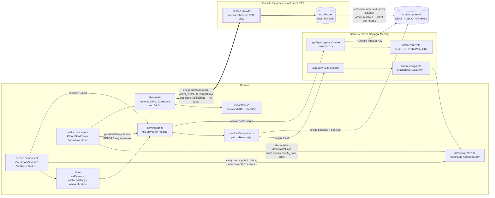
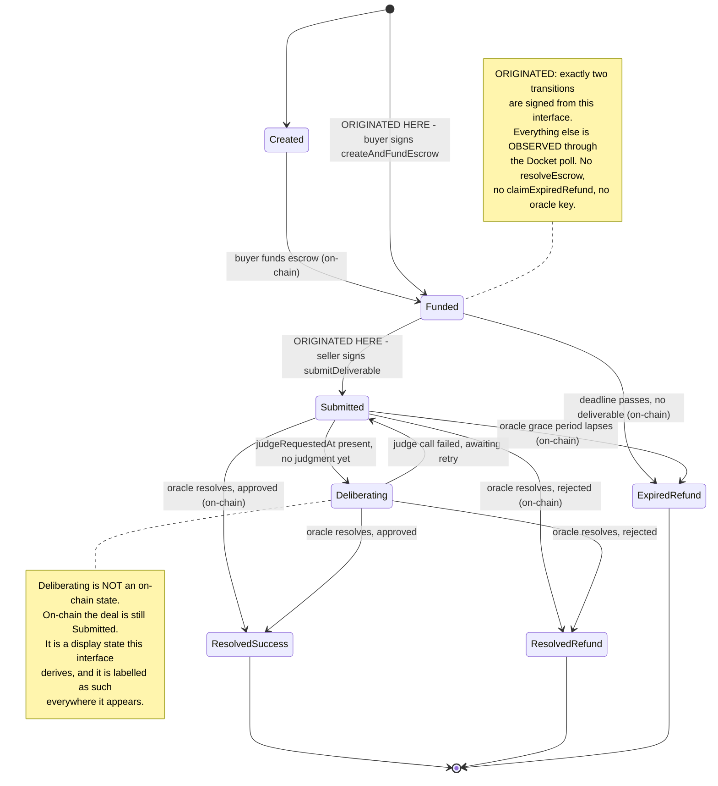

# Design Document: Arbitra Frontend

## Overview

Arbitra_Frontend is a Next.js App Router application with two roles, and it is worth naming both before anything else, because the second one arrived after the first was designed.

It is primarily the **evidence surface**. Agents act over MCP in a terminal on the left of a split screen, and this interface on the right proves what happened. Every read is a poll, nothing is pushed, and the highest-value code in the repository is a 120-line pure module that recomputes hashes in the visitor's own browser.

It is also the **origination surface**. A buyer signs `createAndFundEscrow` from the browser and a seller signs `submitDeliverable`, because the oracle has nothing to settle until a funded escrow exists on-chain (the diagnosis is in *Why the write path exists*, below). Origination is the only thing the interface initiates.

Settlement stays oracle-driven. The frontend calls no `resolveEscrow`, holds no oracle key, and learns that a deal settled the same way the audience does — the Docket poll moves it into a resolved group. So the interface originates the first two on-chain transitions and observes every one after that.

The application is organised around one seam and one asset.

The seam is `services/api.ts`. Every byte of HTTP that arrives from outside the process crosses it. Above the seam sit hooks and components that never know whether they are reading fixtures or a live backend. Below it sits an endpoint table that decides, per path, whether the request goes to a Mock_API route handler in this same deployment or to the teammate's backend. Flipping from one to the other is an environment variable, not a refactor.

The wallet is a second seam, deliberately kept separate: `lib/wallet/` is the only place an injected EIP-1193 provider is touched. It is not routed through `services/api.ts`, and it does not need to be, because it issues no `fetch` — the provider carries the JSON-RPC. The two seams therefore coexist without weakening the invariant that `fetch` appears in exactly two places.

The asset is `lib/canonicalize.ts`. It is the client-owned port of the protocol's canonicalization and hashing. It has one third-party import (`ethers`), no React, no fetch, no environment reads, and no I/O. It is the module an auditor opens first, so it is written to be read: named intermediate values, an explicit field list, and no cleverness.

The write path raised the asset's stakes rather than diluting them. `criteriaHash` is now *written* by this application with the same module that later *recomputes* it in Verify_Panel, so the two halves are one system and a bug in the Canonicalizer would show up as a self-inflicted mismatch. That link is designed for explicitly in *The load-bearing link*, below.

Everything else in this document is in service of those things staying honest.

### Deviations recorded up front

- The package name stays `@arbiter/frontend`, not the README's `@arbitra/frontend`. Renaming a workspace package mid-monorepo breaks the other workspaces' references for no user-visible gain. The deviation is recorded in `frontend/README.md`.
- Source lives under `frontend/src/` (so `src/app/`, `src/components/`, `src/lib/`). Next.js supports this natively and it preserves the shape of the original structure sketch, which teammates will be looking for.
- The original sketch's `App.tsx` becomes `src/app/layout.tsx` plus `src/app/page.tsx`. Component filenames from the sketch are preserved verbatim so the README's file map still resolves.

## Architecture

### Directory layout

```
frontend/
  package.json                     # @arbiter/frontend, engines.node >=22, next scripts
  next.config.ts
  tailwind.config.ts
  tsconfig.json
  scripts/
    check-copy.mjs                 # banned-phrase gate (R13.6)
    check-design.mjs               # forbidden visual pattern gate (R14.6/8/9/10/11)
    check-bundle.mjs               # asserts the internal key is absent from client chunks (R11.5)
  docs/
    screen-checklist.md            # per-screen R14 review checklist (R14.12)
    backend-contract.md            # generated from types.ts, handed to the backend dev
  src/
    app/
      layout.tsx                   # fonts, Navbar, trust-boundary footer
      page.tsx                     # Docket (demo home)
      globals.css                  # @theme token layer only
      deals/[dealId]/page.tsx      # Verdict_Record + Verify_Panel
      agents/page.tsx              # Trust_Explorer list
      agents/[agent]/page.tsx      # agent detail
      agents/[agent]/resolutions/page.tsx   # metric drill-down target
      activity/page.tsx            # MCP_Activity_Feed
      sandbox/page.tsx             # Injection_Sandbox
      trust-model/page.tsx         # trust boundary statement
      create/page.tsx              # Deal_Origination (buyer, wallet-signed)
      submit/page.tsx              # Deliverable_Submission (seller, wallet-signed)
      api/
        deals/route.ts
        deals/[dealId]/route.ts
        verify/[dealId]/route.ts
        judgments/[dealId]/route.ts
        reputation/[agent]/route.ts
        agents/route.ts
        mcp-activity/route.ts
        judge/route.ts
        judge-and-settle/route.ts  # server proxy, reads ARBITRA_INTERNAL_KEY
    components/
      Navbar.tsx
      StatsOverview.tsx
      CourtroomDocket.tsx
      VerdictRecord.tsx
      VerifyPanel.tsx
      AgentExplorer.tsx
      McpActivityFeed.tsx
      InjectionSandbox.tsx
      WalletButton.tsx             # connect / address / wrong-network control
      CreateDealForm.tsx           # buyer: approve then createAndFundEscrow
      SubmitWorkForm.tsx           # seller: persist then submitDeliverable
      primitives/
        MachineValue.tsx           # mono for rendered values
        FieldSet.tsx               # the only form control primitive; mono for machine-value inputs
        TransactionState.tsx       # idle | signing | mining | confirmed | reverted | rejected
        StateChip.tsx
        EvidenceExhibit.tsx
        HashStripRow.tsx
        DocketEntry.tsx
        LogLine.tsx
        AgentRow.tsx
        VerdictBanner.tsx          # the only animated component
        DrillableMetric.tsx        # the only way to render a reputation number
        CopyAffordance.tsx
        EmptyState.tsx
        ErrorState.tsx
    hooks/
      usePolling.ts                # the shared primitive
      useEscrows.ts
      useAgentReputation.ts
      useMcpActivity.ts
      useVerification.ts
      useJudgeSubmission.ts
      useWallet.ts                 # provider discovery, accounts, chain, events
      useWriteTransaction.ts       # the six-state transaction lifecycle
    lib/
      canonicalize.ts              # the client-owned port
      chain.ts                     # Arc Testnet constants: the ONLY home of 5042002 / 0x4CEF52
      wallet/
        detect.ts                  # EIP-6963 announcements, window.ethereum fallback
        request.ts                 # one typed wrapper per EIP-1193 method; no raw calls elsewhere
        chainSwitch.ts             # switch, 4902 -> add, retry
        state.ts                   # WalletState, WalletOutcome, WalletError
        errorCopy.ts               # walletErrorCopy: total over WalletError
      contracts/
        escrowAbi.ts               # hand-narrowed ABI fragments (see below)
        erc20Abi.ts                # approve, allowance, balanceOf, decimals
        escrow.ts                  # createAndFundEscrow, submitDeliverable helpers
        erc20.ts                   # allowance check + approve
        revert.ts                  # custom-error selector -> ContractErrorName
      dealId.ts                    # 32-byte non-zero identifier minting
      amount.ts                    # decimal string <-> bigint at 6 decimals, no float
      pendingSubmission.ts         # saved-but-not-submitted record, survives reload
      verify.ts                    # three-way comparison
      derive.ts                    # trust score, tiers, totals, dispute rates
      deriveState.ts               # Deliberating
      group.ts                      # docket partition
      formatMachine.ts             # truncation + copy payload
      format.ts                    # numbers, dates, USDC
      settlementLink.ts
      env.ts                        # NEXT_PUBLIC_* reads, one place
      serverEnv.ts                  # import 'server-only'; ARBITRA_INTERNAL_KEY
      errorCopy.ts                  # ApiError + contract errors -> copy
      guards.ts                     # runtime shape guards
    services/
      api.ts                       # the only network module
      endpoints.ts                 # the path table and origin routing
    fixtures/
      clock.ts                     # cycle-relative time
      timelines.ts                 # deal state timelines
      records.ts                    # verdict records, hashes computed at load
      agents.ts
      activity.ts
      engine.ts                     # Fixture_Engine entry point: snapshotAt(nowMs)
    content/
      copy.ts                       # every user-facing sentence, one module
    types.ts                        # Type_Spec, the backend contract
```

Rationale for `lib/contracts/escrowAbi.ts`: the ABI is hand-narrowed to the two functions this application calls (`createAndFundEscrow`, `submitDeliverable`), the two events it decodes (`EscrowCreated`, `DeliverableSubmitted`), and the ten custom errors it maps. It is not copied wholesale from `blockchain/artifacts/`, and it is not imported across the workspace boundary. Three reasons, in descending order of weight. First, importing an artefact makes the frontend build depend on a Hardhat compile in another workspace, which means `npm run build --workspace=@arbiter/frontend` on a clean clone would fail for a reason that has nothing to do with the frontend. Second, the omission is a safety property: `resolveEscrow` is not in the ABI, so there is no encoder for it anywhere in the client — the frontend cannot call the oracle's function even by mistake, which is Requirement 20.7 enforced structurally rather than by review. Third, forty lines of ABI fragments are readable; a 900-line artefact with `bytecode`, `linkReferences`, and `metadata` is not, and this is a codebase whose claim is that you can read it. The cost is drift: if the contract's signature changes, the frontend does not find out at compile time. That is paid for with a test that asserts each fragment's computed selector, which fails loudly if a signature moves.

Rationale for `content/copy.ts`: Requirement 13 bans phrases and Requirement 16 demands specific error voice. Both are enforceable by a scanner only if copy is findable. Scattering sentences through JSX makes the gate a fuzzy grep; centralising them makes it exact. Components import named constants, so a banned phrase can only enter through one file, and the scanner still scans the whole corpus as a backstop.

### Data flow



Three things the diagram is asserting deliberately.

First, the arrow from the screen component straight to `lib/canonicalize.ts`. The recomputed column in Verify_Panel is produced in the browser from the preimage record, with no network hop. If that arrow ever routed through `services/api.ts`, the verification claim would collapse into "the backend told us it matched."

Second, the sandbox's arrow to `app/api/judge-and-settle` is unconditional. It is the only endpoint whose origin is never `backend`, because the request must be signed with a key the browser must never hold.

Third, the write path is drawn as a separate track (the thick arrows) that never enters `services/api.ts`, and the chain's arrow back to the backend is dotted and does not touch the write components at all. Those two facts together are the write path's whole shape: the frontend pushes two transactions in and then goes back to reading. The write component's one arrow into `services/api.ts` is the deliverable-text persistence, and it points at the API seam rather than the wallet seam because it is ordinary HTTP that must complete before a signature is requested.

### Deal state machine



Two transitions are marked ORIGINATED and no others, and that count is the whole scope of the write path. `createAndFundEscrow` creates and funds in one call, so the browser-originated path enters at `Funded` and never produces a `Created` deal — `Created` remains reachable in the state union and in fixtures, because the contract's enum defines it, but this interface cannot put a deal there. Every resolution edge, and `claimExpiredRefund`, is observed only: the corresponding functions are absent from the narrowed ABI, so there is no encoder for them in the client.

`Deliberating` needs an input the contract does not have: evidence that a judge call is in flight. The deal shape therefore carries `judgeRequestedAt?: string`, documented in `types.ts` as a field the backend must supply for the state to appear. Absent that field, `deriveDisplayState` returns `Submitted` and the Deliberating group renders its empty state. This is the honest degradation: the interface never guesses that a judge is running.

```ts
export function deriveDisplayState(deal: EscrowDeal, judgment: JudgmentRef | null): DisplayState {
  if (deal.state !== 'Submitted') return deal.state;
  if (!deal.judgeRequestedAt) return 'Submitted';
  if (judgment) return 'Submitted'; // judgment landed; oracle has not resolved yet
  return 'Deliberating';
}
```

## Components and Interfaces

### 1. The data-flow seam: `services/api.ts` and `services/endpoints.ts`

#### Base URL resolution

```ts
// services/endpoints.ts
function normaliseBase(raw: string | undefined): string {
  const trimmed = (raw ?? '').trim();
  if (trimmed === '') return '';                 // '' => same-origin => app/api/*
  return trimmed.replace(/\/+$/, '');            // strip trailing slashes so joins are single-slash
}

export const API_BASE = normaliseBase(process.env.NEXT_PUBLIC_API_BASE);
export const FORCE_BACKEND = process.env.NEXT_PUBLIC_API_BASE_ALL === '1';
```

`API_BASE === ''` means every path is requested relative to the current origin, which resolves to the Mock_API route handlers in the same deployment. No conditional, no separate mock client, no `if (isMock)` anywhere above the seam. That is the whole trick: the fallback is the empty string, and the browser's relative-URL resolution does the routing.

#### The endpoint table

The backend ships four routes today. Five more are specified but unbuilt. A single `API_BASE` switch would therefore break five screens the moment the backend comes online. The table resolves that:

```ts
type Origin = 'backend' | 'local';

export const ENDPOINTS = {
  health:      { path: () => `/health`,                              origin: 'backend' },
  judge:       { path: () => `/api/judge`,                           origin: 'backend' },
  reputation:  { path: (a: string) => `/api/reputation/${encodeURIComponent(a)}`, origin: 'backend' },
  judgment:    { path: (d: string) => `/api/judgments/${encodeURIComponent(d)}`,  origin: 'backend' },

  // Specified in types.ts, not yet shipped by the backend. Flip to 'backend' when it lands.
  deals:       { path: () => `/api/deals`,                           origin: 'local' },
  deal:        { path: (d: string) => `/api/deals/${encodeURIComponent(d)}`,      origin: 'local' },
  verify:      { path: (d: string) => `/api/verify/${encodeURIComponent(d)}`,     origin: 'local' },
  agents:      { path: () => `/api/agents`,                          origin: 'local' },
  mcpActivity: { path: () => `/api/mcp-activity`,                    origin: 'local' },

  // Never 'backend': the browser must not hold the internal key.
  judgeAndSettle: { path: () => `/api/judge-and-settle`,             origin: 'local', pinned: true },
} as const;

export function resolve(endpoint: Endpoint, ...args: string[]): string {
  const path = endpoint.path(...args);
  if (endpoint.pinned) return path;
  const useBackend = endpoint.origin === 'backend' || FORCE_BACKEND;
  return useBackend && API_BASE ? `${API_BASE}${path}` : path;
}
```

`NEXT_PUBLIC_API_BASE_ALL=1` forces every non-pinned endpoint at the backend, so Requirement 2.4 is satisfied literally — one environment variable, zero component edits — while the default keeps the demo alive against a partially-built backend. The alternative, a build-time flag per route or a `MOCK=1` switch, would either require nine flags or make the mock a mode rather than a fallback; a mode is something you can forget to leave.

Path templates are exactly the shipped shapes (`/health`, `/api/judge`, `/api/reputation/:agent`, `/api/judgments/:dealId`), and identifiers are encoded at the single point where they enter a path, so `agent-b` and `0xAbC…` and anything with a slash all round-trip.

#### The client never throws

```ts
export type ApiResult<T> = { ok: true; data: T } | { ok: false; error: ApiError };

async function request<T>(url: string, guard: Guard<T>, init?: RequestInit): Promise<ApiResult<T>> {
  let res: Response;
  try {
    res = await fetch(url, { ...init, headers: { accept: 'application/json', ...init?.headers } });
  } catch {
    return { ok: false, error: { kind: 'network', base: API_BASE } };
  }
  const body = await readJsonSafely(res);            // never throws; returns undefined on bad JSON
  if (!res.ok) return { ok: false, error: toApiError(res.status, body) };
  if (!guard(body)) return { ok: false, error: { kind: 'malformed', expected: guard.name } };
  return { ok: true, data: body };
}
```

Returning a result instead of throwing is the choice. The alternative — throwing typed errors — forces a `try/catch` in every hook and, worse, loses the discriminant at the catch site, where the value is `unknown`. With a result type, `errorCopy(error)` is total over the union and the compiler tells us when a new error kind has no copy. Every response is shape-guarded before it reaches a component, so a backend that ships a field rename produces a named `malformed` error instead of a runtime crash three components deep.

`AbortController` signals are threaded through `init.signal`; an aborted fetch is distinguished from a network failure and produces no state update at all.

### 2. `lib/canonicalize.ts` — the client-owned port

This module is deliberately boring. No React, no fetch, no `process.env`, no `Date.now()`. Its only import is `keccak256` and `toUtf8Bytes` from `ethers` v6. It is unit-testable in a bare Node process, which is why the test floor can be `node:test` with no DOM.

```ts
import { keccak256, toUtf8Bytes } from 'ethers';

export type Canonicalizable =
  | string | number | boolean | null
  | Canonicalizable[]
  | { [k: string]: Canonicalizable | undefined };

/** Deterministic string form: keys ascending, no whitespace, undefined members omitted. */
export function canonicalize(value: Canonicalizable | undefined): string {
  if (value === undefined) return 'null';           // only reachable at the root
  if (value === null) return 'null';
  if (typeof value === 'string') return JSON.stringify(value);
  if (typeof value === 'number') {
    if (!Number.isFinite(value)) throw new TypeError('canonicalize: non-finite number');
    return JSON.stringify(value);
  }
  if (typeof value === 'boolean') return value ? 'true' : 'false';
  if (Array.isArray(value)) return `[${value.map((v) => canonicalize(v ?? null)).join(',')}]`;

  const keys = Object.keys(value).filter((k) => value[k] !== undefined).sort();
  const members = keys.map((k) => `${JSON.stringify(k)}:${canonicalize(value[k])}`);
  return `{${members.join(',')}}`;
}

export function hashCanonicalValue(value: Canonicalizable | undefined): Hex32 {
  return keccak256(toUtf8Bytes(canonicalize(value))) as Hex32;
}
```

Notes on the choices, because each one is a place two implementations can silently disagree and produce a false tamper alarm:

- `Object.keys(...).sort()` uses the default lexicographic comparator on UTF-16 code units. This matches `Array.prototype.sort` in the backend's JavaScript. It is not locale-aware and must not become locale-aware; `localeCompare` would produce a different order for non-ASCII keys.
- Strings go through `JSON.stringify`, which yields the same escaping rules on both sides (`\uXXXX` for control characters, `"` and `\` escaped, no escaping of `/` or non-ASCII). Hand-rolling quoting here is the single most likely source of a cross-implementation mismatch.
- Arrays preserve order. Sorting them would be wrong: `acceptanceCriteria` is an ordered list and its order is part of the agreement.
- `undefined` inside an array becomes `null`, because arrays have no members to omit — omitting would change length, which is a semantic change.
- Non-finite numbers throw rather than serialising to `null`. A silent `NaN → null` would let two different records hash identically.

#### Deadline normalisation

```ts
export function normalizeDeadline(deadline: number | string): string {
  const date = typeof deadline === 'number' ? new Date(deadline * 1000) : new Date(deadline);
  if (Number.isNaN(date.getTime())) throw new TypeError(`normalizeDeadline: unparseable ${deadline}`);
  return date.toISOString();                        // always ...Z, always milliseconds
}
```

The contract stores a Unix-seconds `uint256`; the backend's judge record may carry either. Both must land on the same string or the verdict hash diverges between layers for a deal nobody tampered with. `toISOString()` is chosen because it is the one JavaScript date serialisation with a fixed shape (`YYYY-MM-DDTHH:mm:ss.sssZ`), so it is idempotent: feeding its own output back in reproduces it exactly.

#### The verdict payload: exactly seventeen fields

```ts
export const VERDICT_HASH_FIELDS = [
  'acceptanceCriteria', 'approved', 'buyer', 'deadline', 'dealId',
  'deliverable', 'deliverableHash', 'evaluationPrompt', 'modelId',
  'modelVersion', 'rawResponse', 'reasoning', 'rubricHash', 'score',
  'seller', 'taskCategory', 'verdict',
] as const;   // 17 fields. timestamp is NOT one of them.

export function buildVerdictPreimage(record: AuditableVerdict): VerdictPreimage {
  return {
    acceptanceCriteria: record.acceptanceCriteria,
    approved:           record.approved,
    buyer:              record.buyer,
    deadline:           normalizeDeadline(record.deadline),
    dealId:             record.dealId,
    deliverable:        record.deliverable,
    deliverableHash:    computeDeliverableHash(record),
    evaluationPrompt:   record.evaluationPrompt,
    modelId:            record.modelId,
    modelVersion:       record.modelVersion,
    rawResponse:        record.rawResponse,
    reasoning:          record.reasoning,
    rubricHash:         computeRubricHash(record),
    score:              record.approved ? 100 : 0,
    seller:             record.seller,
    taskCategory:       record.taskCategory,
    verdict:            record.approved ? 'PASS' : 'FAIL',
  };
}

export const computeRubricHash      = (r: Pick<AuditableVerdict, 'acceptanceCriteria'>) =>
  hashCanonicalValue(r.acceptanceCriteria);
export const computeDeliverableHash = (r: Pick<AuditableVerdict, 'deliverable'>) =>
  hashCanonicalValue(r.deliverable);
export const computeVerdictHash     = (r: AuditableVerdict) =>
  hashCanonicalValue(buildVerdictPreimage(r));
```

Building the preimage as an explicit literal rather than picking fields off the record with a loop is the choice, and it is worth defending. A loop over `VERDICT_HASH_FIELDS` would be shorter and would drift the moment a field's derivation changes. The literal makes four things visible on one screen: which fields are copied verbatim, which are recomputed (`rubricHash`, `deliverableHash`), which are derived from `approved` (`score`, `verdict`), and which is normalised (`deadline`). `timestamp`'s absence is visible by inspection. An auditor can check the seventeen against the specification by reading down the list. `VERDICT_HASH_FIELDS` still exists as the assertion target: a test parses the canonical string and compares its key set to the tuple, so the literal and the tuple cannot drift apart silently.

`score` and `verdict` are computed from `approved` rather than read from the record on purpose. If the backend ever stored `approved: true, score: 0`, reading both would produce a hash that matches nothing; deriving both means the preimage is internally consistent by construction and the inconsistency shows up as a stored-vs-recomputed mismatch, which is exactly what the Verify_Panel exists to surface.

### 3. Three-way verification: `lib/verify.ts`

Three sources, never merged:

| Column label in UI | Source | What it means |
| --- | --- | --- |
| Recomputed here | `lib/canonicalize.ts` run in this browser on the preimage from `GET /api/verify/:dealId` | What the record's own contents hash to |
| Backend record | `AuditableVerdict.rubricHash` / `.deliverableHash` / `.verdictHash` as stored | What the backend says it computed when it wrote the record |
| On-chain | `EscrowDeal.criteriaHash` / `.deliverableHash` / `.verdictReasoningHash` | What the contract committed and the oracle cannot retroactively edit |

Three rows (rubric, deliverable, verdict) times three columns. `criteriaHash` on the deal is the on-chain counterpart of `rubricHash`; the labels state that mapping in the row header rather than leaving the reader to infer it.

```ts
export type Hex32 = `0x${string}`;

export type TripleComparison =
  | { kind: 'all-match';         value: Hex32 }
  | { kind: 'stored-differs';    recomputed: Hex32; stored: Hex32; onChain: Hex32 }
  | { kind: 'onchain-differs';   recomputed: Hex32; stored: Hex32; onChain: Hex32 }
  | { kind: 'recomputed-differs';recomputed: Hex32; stored: Hex32; onChain: Hex32 }
  | { kind: 'all-differ';        recomputed: Hex32; stored: Hex32; onChain: Hex32 }
  | { kind: 'onchain-absent';    recomputed: Hex32; stored: Hex32; storedMatches: boolean };

export function compareTriple(recomputed: Hex32, stored: Hex32, onChain: Hex32 | null): TripleComparison {
  if (onChain === null) {
    return { kind: 'onchain-absent', recomputed, stored, storedMatches: eq(recomputed, stored) };
  }
  const rs = eq(recomputed, stored), ro = eq(recomputed, onChain), so = eq(stored, onChain);
  if (rs && ro) return { kind: 'all-match', value: recomputed };
  if (ro && !rs) return { kind: 'stored-differs',     recomputed, stored, onChain };
  if (rs && !ro) return { kind: 'onchain-differs',    recomputed, stored, onChain };
  if (so && !rs) return { kind: 'recomputed-differs', recomputed, stored, onChain };
  return { kind: 'all-differ', recomputed, stored, onChain };
}

const eq = (a: Hex32, b: Hex32) => a.toLowerCase() === b.toLowerCase();
```

Case analysis is exhaustive: with three values there are exactly five equality partitions (all equal; each one odd; all distinct), plus the absent-on-chain case for a deal not yet settled. Each named kind reports a pair by name:

```ts
export const DISAGREEING_PAIR: Record<Exclude<TripleComparison['kind'], 'all-match' | 'onchain-absent'>, string> = {
  'stored-differs':     'the backend record disagrees with both this browser and the chain',
  'onchain-differs':    'the chain disagrees with both this browser and the backend record',
  'recomputed-differs': 'this browser disagrees with both the backend record and the chain',
  'all-differ':         'all three sources disagree with each other',
};
```

Naming the odd-one-out rather than an arbitrary pair is more useful diagnostically, and it is what "name which pair disagrees" is for: `stored-differs` tells you the backend's stored hash is the suspect, because the browser recomputation and the immutable on-chain commitment agree with each other.

Hash-case is normalised in the comparison because a `0xABC…` from an RPC and a `0xabc…` from `keccak256` are the same commitment; treating them as a mismatch would be a false alarm. The display shows each value as returned, so the reader sees the raw data.

The conclusion:

```ts
export interface VerificationOutcome {
  rubric: TripleComparison;
  deliverable: TripleComparison;
  verdict: TripleComparison;
  conclusion: 'tamper-evident' | 'mismatch';
  /** Displayed as an input in its own labelled cell. NOT read when computing `conclusion`. */
  backendVerifiedFlag: boolean | null;
}

export function verifyRecord(preimage: VerifyPreimage, deal: EscrowDeal): VerificationOutcome {
  const rubric      = compareTriple(computeRubricHash(preimage),      preimage.rubricHash,      deal.criteriaHash);
  const deliverable = compareTriple(computeDeliverableHash(preimage), preimage.deliverableHash, deal.deliverableHash);
  const verdict     = compareTriple(computeVerdictHash(preimage),     preimage.verdictHash,     deal.verdictReasoningHash);
  const allMatch = [rubric, deliverable, verdict].every((c) =>
    c.kind === 'all-match' || (c.kind === 'onchain-absent' && c.storedMatches));
  return {
    rubric, deliverable, verdict,
    conclusion: allMatch ? 'tamper-evident' : 'mismatch',
    backendVerifiedFlag: preimage.verified ?? null,
  };
}
```

`backendVerifiedFlag` is assigned last and read nowhere. That is the structural enforcement of Requirement 8.7: the field is in the return type so the UI can display it, and there is no code path from it to `conclusion`. In the UI it appears in the hash strip carrying the `rule/excluded` token and the label "Backend's own assessment (not used above)".

The word "verified" appears in this application in exactly one place: that label. Successful comparisons are reported as **tamper-evident**, with the scope sentence adjacent: *"These three sources agree, so the stored record matches its hash. That is all this proves. It does not show what the model received, and it does not show that the model judged honestly."*

On a 404 from `GET /api/verify/:dealId`, the hook's `data` is untouched (see the polling contract below), so any previously computed columns stay on screen, and an `ErrorState` above them reads: *"The canonical preimage for this deal is not on record, so it cannot be recomputed here. The hashes below are the ones already fetched."*

### 4. Fixture_Engine: state as a pure function of absolute time

#### The clock decision

The obvious implementation is a module-load epoch:

```ts
const EPOCH_MS = Date.now();               // rejected
const elapsed = Date.now() - EPOCH_MS;
```

This is rejected. The Mock_API route handlers execute server-side. In `next dev` there is one Node process, so a module-load epoch would be stable and would even survive a full page reload, since the epoch lives on the server rather than in the page. But the target is Vercel, where each route handler invocation may land on a different serverless instance, each with its own module-load time. Two polls 2.5 seconds apart could hit instances whose epochs differ by minutes, and the docket would show deals jumping backwards through the state machine. On stage, a deal moving from `ResolvedSuccess` back to `Funded` reads as a bug in the protocol, not a bug in the fixtures.

The chosen implementation makes state a pure function of absolute wall-clock time, modulo a fixed cycle:

```ts
// fixtures/clock.ts
export const CYCLE_MS = 48_000;            // one full demo loop
export const STEP_MS  = 6_000;             // timeline granularity: 8 steps per cycle

/** Position within the current cycle. Identical on every process, every instance, forever. */
export function cyclePosition(nowMs: number = Date.now()): number {
  return nowMs % CYCLE_MS;
}
```

Consequences, stated explicitly because they are the ones a presenter will notice:

- **Across a full page reload:** state is unchanged, because it never depended on when the page loaded. Reloading mid-deliberation lands back in deliberation.
- **Across server/client boundaries:** the client never computes fixture state. Route handlers own the clock; components receive whatever states the response contains. Server and client clocks can differ by seconds without any visible effect, because there is no client-side recomputation to disagree with.
- **Across Vercel instances and cold starts:** identical, because `Date.now() % CYCLE_MS` is instance-independent. A cold start costs latency, not coherence.
- **The trade-off:** the timeline loops every 48 seconds. A resolved deal will return to `Funded`. Rather than hide this, the docket footer states it: *"Fixture deals cycle on a 48-second timeline. Set NEXT_PUBLIC_API_BASE to read live deals instead."* Honesty about the fixture is cheaper than a presenter being surprised by it. A monotonic alternative — seeding from `Date.now()` at build time via a baked constant — was considered and rejected: it goes stale, and a deployment two days before judging would show every deal expired.

#### Timelines

```ts
// fixtures/timelines.ts
export interface Step { atMs: number; state: EscrowState; judgeRequested?: boolean }

export interface FixtureDeal {
  base: Omit<EscrowDeal, 'state' | 'judgeRequestedAt'>;
  offsetMs: number;          // phase offset so deals are not synchronised
  steps: Step[];             // ascending atMs, first entry MUST be atMs: 0
}

/** The deal the demo watches: Funded -> Submitted -> Deliberating -> ResolvedSuccess. */
export const DEAL_ALPHA: FixtureDeal = {
  base: { /* dealId, buyer agent-b -> 0x…, seller agent-c -> 0x…, USDC, 250_000000, … */ },
  offsetMs: 0,
  steps: [
    { atMs: 0,      state: 'Funded' },
    { atMs: 12_000, state: 'Submitted' },
    { atMs: 18_000, state: 'Submitted', judgeRequested: true },   // renders as Deliberating
    { atMs: 30_000, state: 'ResolvedSuccess' },
  ],
};
```

Additional fixture deals cover `Created`, a `ResolvedRefund` path, and an `ExpiredRefund` path, each with a distinct `offsetMs`, so every docket group is populated at some point in the cycle and no group is permanently empty. Because `STEP_MS` is 6 seconds and the minimum gap between steps is 6 seconds, two polls more than 3 seconds apart can straddle a step boundary — Requirement 4.4's threshold with margin.

```ts
// fixtures/engine.ts
export function stateOf(deal: FixtureDeal, nowMs = Date.now()): { state: EscrowState; judgeRequestedAt?: string } {
  const pos = (cyclePosition(nowMs) + deal.offsetMs) % CYCLE_MS;
  const step = deal.steps.reduce((acc, s) => (s.atMs <= pos ? s : acc), deal.steps[0]);
  return {
    state: step.state,
    judgeRequestedAt: step.judgeRequested ? new Date(nowMs - 2_000).toISOString() : undefined,
  };
}

export function snapshotAt(nowMs = Date.now()): EscrowDeal[] { /* map over all fixture deals */ }
```

`snapshotAt` is the Fixture_Engine's whole public surface for the docket. Every mock route handler calls it with `Date.now()` and nothing else, which is what makes the engine testable: pass any `nowMs` and assert the result.

#### Real hashes, computed at load

Hand-written hash constants in fixtures are a trap. They cannot be verified by inspection, they go stale the moment a fixture's text changes by one character, and a Verify_Panel mismatch caused by a stale constant is indistinguishable from a mismatch caused by a real bug. So the fixtures compute their hashes with the same Canonicalizer the browser runs:

```ts
// fixtures/records.ts
import { computeRubricHash, computeDeliverableHash, computeVerdictHash } from '@/lib/canonicalize';

const RAW_RECORDS: RawVerdict[] = [ /* prompts, deliverables, model responses, reasoning */ ];

/** Sealed at module load. Same inputs -> same hashes, on every process. */
export const VERDICT_RECORDS: AuditableVerdict[] = RAW_RECORDS.map((raw) => {
  const record = {
    ...raw,
    score:   raw.approved ? 100 : 0,
    verdict: raw.approved ? ('PASS' as const) : ('FAIL' as const),
    rubricHash:      computeRubricHash(raw),
    deliverableHash: computeDeliverableHash(raw),
  };
  return Object.freeze({ ...record, verdictHash: computeVerdictHash(record) });
});
```

Cost is three keccak256 calls per record at module load — microseconds — in exchange for fixtures that are correct by construction and that stay correct when someone edits a deliverable's wording.

The on-chain values in the fixture deals are populated from the same computed hashes, so an untampered fixture produces `all-match` on all three rows. Requirement 4.5's three-way match is therefore a consequence of how the fixtures are built, not something maintained by hand.

The tampered record is produced by a named, reproducible mutation rather than a typed-in constant:

```ts
/** Flip the last nibble. A real hash, off by one character: a plausible single-byte corruption. */
export function tamper(hash: Hex32): Hex32 {
  const last = hash.slice(-1);
  return (hash.slice(0, -1) + (last === '0' ? '1' : '0')) as Hex32;
}

export const TAMPERED_RECORD: AuditableVerdict = Object.freeze({
  ...VERDICT_RECORDS[1],
  verdictHash: tamper(VERDICT_RECORDS[1].verdictHash),   // stored value only; on-chain stays correct
});
```

Only the stored value is corrupted; the on-chain value stays correct. The Verify_Panel therefore classifies it as `stored-differs` — the browser and the chain agree, the backend's record does not — which is the most instructive failure to show a reviewer, and the one the trust model predicts, since backend persistence is trusted infrastructure and the chain is not.

#### Reputation and agent identity fixtures

Matching the demo terminal output exactly:

| Agent | `agent` (string form) | Address form | totalJudged | successes | successRate | Trust score | Badge |
| --- | --- | --- | --- | --- | --- | --- | --- |
| Untrustworthy seller | `agent-b` | `0xB0b…` | 4 | 1 | 0.25 | 14 | Unproven |
| Reliable seller | `agent-c` | `0xC1c…` | 5 | 5 | 1.00 | 63 | Established |

Both forms of each identifier are present, because the MCP tool calls in the terminal use `agent-b` while the contract's `seller` field is an address. `GET /api/reputation/:agent` in the Mock_API resolves either form through `resolveAgentAlias()`, so a reviewer pasting either string into the URL gets the same record. The Trust_Explorer renders the string form as the primary identifier (untruncated) and the address as a secondary machine value (truncated), which is also the pair that exercises Requirement 7.5's two branches on every agent row.

### 5. Polling: `hooks/usePolling.ts`

#### The dependency decision

Plain `useEffect` plus a self-rescheduling `setTimeout`. Not `setInterval`, and not SWR or React Query.

`setInterval` is rejected on correctness grounds, not taste: it fires on a fixed schedule regardless of whether the previous request has settled. A 4-second response on a 2.5-second interval produces overlapping requests and out-of-order responses, which on a state-grouped docket means a deal visibly flickering between groups. A self-rescheduling timeout cannot overlap by construction, because the next timer is only armed in the `finally` of the previous request.

SWR and React Query are rejected on footprint. There are three polled call sites, no cache sharing between routes, no mutations to invalidate, no pagination, no optimistic updates, and no revalidate-on-focus requirement. Against that, `usePolling` is roughly forty lines that a reviewer can read in full — which matters more here than in a typical app, because this application's entire claim is that you can read what it does and check it. Adding a data-fetching library to a page about auditability, in order to save forty lines, is the wrong trade. The migration trigger is named so the decision is revisitable: adopt SWR if two routes need to share a cache entry, or if we add mutations that must invalidate reads.

#### The contract

```ts
export interface PollResult<T> {
  data: T | null;              // last successful payload; NEVER cleared by a later failure
  error: ApiError | null;      // last failure; cleared on the next success
  isFetching: boolean;         // a request is outstanding right now
  lastUpdatedAt: number | null;
  refetch: () => void;
}

export const POLL_INTERVAL_MS = 2_500;   // within [2000, 3000]

export function usePolling<T>(fetcher: (signal: AbortSignal) => Promise<ApiResult<T>>,
                              intervalMs = POLL_INTERVAL_MS): PollResult<T> { /* … */ }
```

Behaviour, each clause traceable to a requirement:

- **Prior data stays visible.** `data` is assigned only in the `ok: true` branch. There is no `setData(null)` anywhere in the module. A failure sets `error` and leaves `data` alone, so the docket keeps its rows and the Verify_Panel keeps its hashes.
- **Failures do not stop the loop.** The next timer is armed in a `finally`, so it is armed after success, after HTTP error, and after network failure alike. The only thing that stops the loop is unmount.
- **No overlap.** One outstanding request at a time by construction; a manual `refetch()` aborts the in-flight request before starting a new one.
- **Clean unmount.** A `cancelled` ref guards every `setState`, `clearTimeout` cancels the pending timer, and `AbortController.abort()` cancels the in-flight request. An abort is recognised and produces no state update, so unmounting mid-request never sets an error.
- **No backoff.** Deliberately: a fixed 2.5-second cadence through failures means the docket recovers within one tick of the backend coming back, which is the behaviour that matters when something is being restarted between demo runs. The failure is visible on screen the whole time, so a tight retry loop is not hiding anything.

Built on it:

```ts
export function useEscrows(): PollResult<EscrowDeal[]> & { groups: DocketGroups };
export function useMcpActivity(): PollResult<McpActivityEntry[]>;
export function useAgentReputation(agent: string): Omit<PollResult<ReputationSummary>, 'lastUpdatedAt'>;  // no polling
export function useVerification(dealId: string): { outcome: VerificationOutcome | null; error: ApiError | null; isVerifying: boolean; verify: () => void };
```

`useAgentReputation` does not poll. Reputation changes only when a deal resolves, and the explorer is a reading surface, not a live monitor; polling it would add requests with no informational gain. `useVerification` is user-triggered, per Requirement 8.1.

### 6. The injection sandbox server proxy

```ts
// src/lib/serverEnv.ts
import 'server-only';

export const serverEnv = {
  get internalKey(): string | null { return process.env.ARBITRA_INTERNAL_KEY?.trim() || null; },
  get backendOrigin(): string | null { return process.env.ARBITRA_BACKEND_ORIGIN?.trim() || null; },
};
```

```ts
// src/app/api/judge-and-settle/route.ts
import { serverEnv } from '@/lib/serverEnv';
import { keccak256, toUtf8Bytes } from 'ethers';
import { PRESETS } from '@/content/presets';

export const runtime = 'nodejs';
export const dynamic = 'force-dynamic';

export async function POST(req: Request) {
  const { presetId } = await req.json();                 // the ONLY field the client controls
  const preset = PRESETS.find((p) => p.id === presetId);
  if (!preset) return json(400, { error: 'Unknown preset', field: 'presetId' });

  const key = serverEnv.internalKey;
  if (!key) return json(401, { error: 'Server is not configured with settlement authorization',
                               envVar: 'ARBITRA_INTERNAL_KEY' });

  const body = {
    dealId: keccak256(toUtf8Bytes(`sandbox:${preset.id}:${Date.now()}`)),        // 32-byte hex, unique
    acceptanceCriteria: preset.acceptanceCriteria,                                // non-empty by construction
    deliverable: preset.deliverable,
    deadline: new Date(Date.now() + 3_600_000).toISOString(),                     // always one hour ahead
    buyer: preset.buyer, seller: preset.seller, taskCategory: preset.taskCategory,
  };

  const upstream = serverEnv.backendOrigin;
  if (!upstream) return json(200, simulateJudgement(preset));   // fixture verdict, labelled as such

  const res = await fetch(`${upstream}/api/judge-and-settle`, {
    method: 'POST',
    headers: { 'content-type': 'application/json', 'X-Arbitra-Internal-Key': key },
    body: JSON.stringify(body),
  });
  return json(res.status, await res.json());
}
```

The client sends a preset identifier, nothing else. Everything the backend validates is constructed server-side, which is how the three preconditions are satisfied and why they cannot be violated by a crafted request:

- **Future deadline.** Computed as `Date.now() + 1h` at request time, so it can never be stale. A baked constant would pass in development and fail as `InvalidDuration` a week later.
- **Non-empty acceptance criteria.** Sourced from the preset constant, which is typed as a non-empty tuple of non-empty strings and asserted at module load. The client cannot supply criteria at all, so it cannot supply empty ones.
- **bytes32 deal identifier.** `keccak256` of a UTF-8 string is exactly 32 bytes, non-zero for any input, and unique per submission because the timestamp is in the preimage — so repeated sandbox runs cannot collide into `DealAlreadyExists`.

#### Why the key cannot reach the client bundle

Four independent mechanisms, listed weakest to strongest:

1. **Next.js inlining rule.** Only `NEXT_PUBLIC_`-prefixed variables are substituted into client JavaScript. `process.env.ARBITRA_INTERNAL_KEY` in server code stays a server-side lookup. This is the framework guarantee, and on its own it is a convention that survives only as long as nobody adds a `NEXT_PUBLIC_` alias.
2. **`import 'server-only'`.** Importing `lib/serverEnv.ts` from any module in a client component's import graph is a build-time error with a named module in the message. This turns the convention into a compiler-enforced rule: the key is unreachable from the client, not merely un-inlined.
3. **Single read site.** `process.env.ARBITRA_INTERNAL_KEY` appears in exactly one file. `scripts/check-copy.mjs` asserts that count, so a second read site fails the build rather than being reviewed by luck.
4. **Bundle assertion.** `scripts/check-bundle.mjs` runs after `next build`, and when `ARBITRA_INTERNAL_KEY` is present in the build environment it greps every emitted file under `.next/static/` for the literal value and for the identifier string. Any hit exits non-zero. This is the one check that inspects the actual artefact rather than reasoning about it, which is why it exists despite the first three.

Nothing here depends on remembering a rule. Two of the four are enforced by the build.

Failure copy, per Requirement 11.6 and 11.7: a 401 renders *"This deployment has no settlement authorization, so the judge ran but nothing was settled. Set ARBITRA_INTERNAL_KEY on the server to enable settlement."* A 400 renders the backend's own `error` text verbatim, and when the response carries a `field` hint, the corresponding exhibit gets the `rule/tampered` accent and an inline note attributing the rejection to that field.

Concurrency, per Requirement 11.8: `useJudgeSubmission` keys in-flight state by preset id. While `pending.has(preset.id)`, the preset's control is `aria-disabled` with `aria-busy="true"`, and the submit handler returns early. The other preset stays live, because a reviewer comparing honest against injection should not be blocked by the first request.

### 7. The wallet layer

#### Why the write path exists

Stated once, here, because it justifies everything in this section and the next.

The backend oracle was failing on settlement with `CALL_EXCEPTION / missing revert data` raised from `estimateGas` on `resolveEscrow`. The cause was not the oracle and not the call encoding. The deal existed only as a row in Prisma. `resolveEscrow` reverts when there is no funded escrow recorded under that `dealId`, and because the revert is a parameterless custom error raised during estimation, the node returned no data to decode — hence `missing revert data` rather than a named error. The oracle was being asked to settle something that had never been created on-chain.

There are two places that gap can be closed. The backend could originate the escrow itself, which means it holds a funded buyer key and signs on the buyer's behalf — a custodial arrangement that contradicts the protocol's own trust model, where the buyer's funds are the thing the contract is supposed to hold trustlessly. Or the browser originates it, with the buyer signing for themselves. The second is both truer to the protocol and cheaper to build, so the frontend became the origination surface.

This is also why the write path is not decoration on the demo. Without it, the settlement half of the protocol cannot run at all.

#### Library decision: ethers `BrowserProvider`, plus a small hand-rolled connection layer

The choice is to use **ethers v6 for everything downstream of a connected account, and hand-rolled EIP-1193 for discovery, connection, and chain switching.** No wagmi, no viem, no RainbowKit.

This deserves more care than the SWR decision earlier in this document, because the reflex that produced that answer produces a worse answer here. `usePolling` is forty lines of `setTimeout`; a wallet layer is genuinely fiddly, and the fiddliness is concentrated in exactly the places a hand-rolled implementation gets wrong — nested provider error shapes, the race between a `wallet_switchEthereumChain` resolution and the `chainChanged` event that follows it, wallets that resolve the switch with `null`, and multi-wallet injection. "Fewer dependencies" is not on its own an argument when the dependency exists to absorb known edge cases.

So the decision is split along where the risk actually sits.

**ethers takes the encoding.** ABI encoding, gas estimation, signature request, receipt waiting, and custom-error decoding are the parts where a hand-rolled implementation would be both large and silently wrong. `new BrowserProvider(injected)` wraps any EIP-1193 provider, `getSigner()` yields a signer, and `new Contract(address, abi, signer)` gives typed calls with `tx.wait(1)` for confirmation and a populated `error.revert` on failure. ethers 6.17 is already a dependency for the Canonicalizer, so this costs nothing in footprint and removes the highest-risk hand-rolled code.

**A small module takes the connection.** What remains is five provider methods (`eth_accounts`, `eth_requestAccounts`, `eth_chainId`, `wallet_switchEthereumChain`, `wallet_addEthereumChain`), two events, and the EIP-6963 announcement protocol. That surface is enumerable, so it is testable against a scripted mock provider, and it is where the app's behaviour is specific to Arc Testnet rather than generic.

Why not wagmi, concretely rather than on principle. It brings TanStack Query as a peer, which is the exact dependency this document already declined for reads — adopting it for writes would mean the read path polls by hand while the write path carries a full query cache, which is a worse outcome than either choice made consistently. Its chain registry does not contain 5042002, so the custom-chain definition gets written either way. And its connector abstraction earns its keep when there are several wallet transports; here there is one, an injected provider.

Why not RainbowKit, which is the more tempting one because it would deliver a connect modal for free. Its visual language — rounded cards, gradients, animated hover states, a branded modal — is a direct list of the patterns Requirement 14 forbids and `check-design.mjs` fails the build on. We would spend more effort overriding it than writing a connect control, and we would be shipping a component that argues against the interface's own thesis.

**Migration trigger, named so this is revisitable:** adopt wagmi + viem if a second wallet transport is needed (WalletConnect, mobile deep-linking, or a hardware path), or if a second chain is targeted. Both are cases where the connector and chain abstractions do real work. A third trigger: if `lib/wallet/` exceeds roughly 250 lines, the hand-rolled premise has failed on its own terms and the library is cheaper.

#### Provider discovery

EIP-6963 first, `window.ethereum` as a fallback.

```ts
// lib/wallet/detect.ts
export interface DiscoveredProvider {
  rdns: string;                 // 'io.metamask'
  name: string;                 // 'MetaMask'
  icon: string;                 // data URI, rendered at 16px or not at all
  provider: Eip1193Provider;
}

/** Resolves after one animation frame's worth of announcements. Never rejects. */
export function discoverProviders(): Promise<DiscoveredProvider[]>;
```

The implementation listens for `eip6963:announceProvider`, dispatches `eip6963:requestProvider`, collects announcements keyed by `info.rdns` (so a wallet announcing twice counts once), and settles on a short timer. If the set is empty it checks `window.ethereum` and, when present, returns a single entry labelled from the provider's own flags with the identifier `unknown.injected`.

`window.ethereum` alone is not sufficient, and the reason is a correctness problem rather than a completeness one. With two wallets installed, `window.ethereum` is whichever extension wrote to it last. A buyer who intends to sign with one wallet and gets the other has signed a real transaction from the wrong account, and the interface would have shown them a correct-looking address the whole time. EIP-6963 exists precisely because that ambiguity is unresolvable from `window.ethereum`.

**Multiple injected wallets:** when discovery returns more than one entry, the connect control renders the list — wallet name at the `record` step, one per row, `rule/instance` between them, no icons larger than 16px — and connects only after a choice. It does not pre-select, and it does not pick the first. When discovery returns exactly one, activating the control connects directly with no intermediate list, because a chooser with one option is friction with no information in it. When discovery returns none, no control is rendered at all; see the empty branch under Requirement 21 below.

The chosen `rdns` is written to `localStorage` as a *preference*, not as a connection. On the next visit it decides which provider to ask, not whether an account is connected.

#### Connection state, and surviving a reload honestly

```ts
export type WalletState =
  | { status: 'unavailable' }                                    // no provider discovered
  | { status: 'disconnected'; providers: DiscoveredProvider[] }
  | { status: 'connected'; address: `0x${string}`; chainId: number; rdns: string };

export const isOnArc = (s: WalletState) => s.status === 'connected' && s.chainId === ARC_TESTNET.chainId;
```

There are only three statuses, and `connected` carries the address and chain together rather than as separate optional fields, so "connected but we do not know the chain" is not representable. Wrong-network is not a fourth status — it is `connected` with a `chainId` that is not 5042002, derived by `isOnArc`. Making it a status would mean every consumer switches on four cases when the only question most of them ask is whether a write is currently possible.

**On mount the hook calls `eth_accounts`, never `eth_requestAccounts`.** This is the whole reload story and it is a one-line decision with a large consequence. `eth_accounts` is silent: it returns the accounts already authorised for this origin, or an empty array, with no popup. `eth_requestAccounts` prompts. Calling the second one on mount would mean opening the docket pops a wallet dialog at a reviewer who came to read a record — and on the fixture deployment, at a reviewer who has no deal to make at all.

So connection survives a reload when the wallet still has the origin authorised, and it does not survive when the wallet was revoked or locked, which is the truthful answer in both directions. Nothing in `localStorage` is ever treated as evidence of connection. The failure mode being avoided is the common one: an app that renders a stored address after the user disconnected in their wallet, so the interface asserts a connection that does not exist. Here the only source of truth is the provider's own answer to `eth_accounts`.

While that first silent call is outstanding the state is `disconnected` rather than a fourth "checking" status, and the connect control renders `aria-busy` for the few milliseconds involved. A flash of "not connected" is honest; a flash of a stale address is not.

#### Chain constants: one module, one occurrence each

```ts
// lib/chain.ts — the ONLY module in which these literals appear.
export const ARC_TESTNET = {
  chainId: 5042002,
  chainIdHex: '0x4CEF52',
  name: 'Arc Testnet',
  /**
   * Gas on this chain is denominated in USDC, not ETH (Requirement 12.7).
   * `decimals: 18` is the value declared to the wallet in wallet_addEthereumChain,
   * because EIP-3085 implementations reject any other value for a native currency.
   * It is NOT the ERC-20 token scale. See USDC_DECIMALS.
   */
  nativeCurrency: { name: 'USD Coin', symbol: 'USDC', decimals: 18 },
} as const;

/** The ERC-20 amount scale used for every escrow amount. Deliberately separate. */
export const USDC_DECIMALS = 6;

export const rpcUrls = () => compact([env.arcRpcUrl]);              // NEXT_PUBLIC_ARC_RPC_URL
export const blockExplorerUrls = () => compact([explorerOrigin()]); // derived from NEXT_PUBLIC_EXPLORER_TX_BASE
```

Three notes on this module, each a place the write path could go quietly wrong.

The two decimals values are the sharpest edge in the whole feature. USDC as a native gas token invites the assumption that the chain's native unit is 6 decimals, and a wallet registration declaring `decimals: 6` is rejected by MetaMask, which validates the field as 18. Worse, if the two were ever the same constant, an escrow amount would be scaled by 10^18 and a buyer would sign an approval a trillion times larger than the one displayed. So they are two named constants in one file with a comment on each, and `USDC_DECIMALS` is the only one exported to the amount helpers. The native-token decimal behaviour on Arc is unconfirmed; 18 appears in exactly one place, the add-chain payload, so if it turns out to be wrong there is one line to change.

`chainIdHex` is `0x4CEF52` exactly as the requirement states it, mixed case included, and it is used only as the argument to the two `wallet_*` methods. Every *comparison* is numeric — `chainId === ARC_TESTNET.chainId` after `Number(hexFromProvider)` — because providers return `0x4cef52`, `0x4CEF52`, and occasionally a decimal number, and a string comparison would report a chain mismatch on the correct chain. A test asserts `Number(ARC_TESTNET.chainIdHex) === ARC_TESTNET.chainId`, which catches a typo in either literal.

`blockExplorerUrls` returns an empty array when `NEXT_PUBLIC_EXPLORER_TX_BASE` is unset, and the add-chain payload omits the key entirely rather than sending `[]` or a guess. Registering a wrong explorer host in a user's wallet is worse than registering none: it persists after the demo ends and attaches a broken link to every future transaction on that chain.

#### Chain switching

```ts
// lib/wallet/chainSwitch.ts
export async function ensureArc(p: Eip1193Provider): Promise<WalletOutcome<void>> {
  const first = await request(p, 'wallet_switchEthereumChain', [{ chainId: ARC_TESTNET.chainIdHex }]);
  if (first.status !== 'failed') return first;                       // ok, or rejected — both terminal
  if (!isUnrecognisedChain(first.error)) return first;

  const added = await request(p, 'wallet_addEthereumChain', [{
    chainId:           ARC_TESTNET.chainIdHex,
    chainName:         ARC_TESTNET.name,
    nativeCurrency:    ARC_TESTNET.nativeCurrency,
    rpcUrls:           rpcUrls(),
    ...(blockExplorerUrls().length ? { blockExplorerUrls: blockExplorerUrls() } : {}),
  }]);
  if (added.status !== 'ok') return added;

  return request(p, 'wallet_switchEthereumChain', [{ chainId: ARC_TESTNET.chainIdHex }]);
}
```

The sequence is switch, then add on 4902, then switch again. Adding first would be wrong: a wallet that already knows the chain would be asked to re-register it, and some prompt for that.

`isUnrecognisedChain` is its own function because 4902 is not reliably where the provider puts it. MetaMask has historically surfaced it as `error.code === 4902`, as `error.data.originalError.code === 4902`, and once as a plain message string. The predicate checks the code at both depths and falls back to matching `/unrecognized chain|4902/i` on the message, and it is unit-tested against all three shapes. It is a small function with an ugly body, and the ugliness is confined to it.

Three outcomes the caller must handle, and the type makes all three unavoidable: the switch succeeded; the account holder rejected it (4001), which returns the interface to the state it held and renders nothing; or it failed for another reason, including `wallet_addEthereumChain` being refused, which produces `switch-unsupported` and copy naming the manual path — add chain 5042002 in the wallet's own network settings.

One race worth naming: after a successful switch, the `chainChanged` event may arrive before or after the promise resolves. Both paths write the same value into the same state, so the order does not matter, and the hook does not read `eth_chainId` again after the switch resolves. Re-reading is what creates the flicker.

#### Provider events and their cleanup

```ts
useEffect(() => {
  if (!provider) return;
  const onAccounts = (accts: string[]) => setState(accts.length === 0 ? disconnectedFrom(state) : connectedWith(accts[0]));
  const onChain    = (hex: string)     => setState((s) => (s.status === 'connected' ? { ...s, chainId: Number(hex) } : s));
  provider.on('accountsChanged', onAccounts);
  provider.on('chainChanged', onChain);
  return () => {
    provider.removeListener('accountsChanged', onAccounts);
    provider.removeListener('chainChanged', onChain);
  };
}, [provider]);
```

`accountsChanged` with an empty array means the account holder disconnected the site in their wallet, and the interface returns to `disconnected` — it does not keep the last address. The `chainChanged` handler deliberately does *not* reload the page, which is the pattern MetaMask's own documentation used to recommend; a reload on this application would discard whatever the reviewer was reading, and Requirement 19.7 asks for the update without one.

Cleanup uses `removeListener` with the same function identity, and the handlers are defined inside the effect so identity is stable for the effect's lifetime. Listeners are attached per discovered provider, not to `window.ethereum`, so switching wallets does not leave a listener behind on the previous one. This is the same discipline as `usePolling`'s unmount handling and it exists for the same reason: a listener that outlives its component writes state into a dead tree.

#### Error taxonomy: a parallel union, with rejection outside it

`ApiError` is a closed discriminated union and `errorCopy` is total over it. The wallet gets the same shape, and one addition that is doing real work.

```ts
export type WalletOutcome<T> =
  | { status: 'ok';       data: T }
  | { status: 'rejected' }                       // EIP-1193 4001. NOT an error.
  | { status: 'failed';   error: WalletError };

export type WalletError =
  | { kind: 'no-provider' }
  | { kind: 'chain-mismatch';      actual: number }
  | { kind: 'switch-unsupported' }
  | { kind: 'chain-add-refused' }
  | { kind: 'locked' }                           // provider present, no authorised account
  | { kind: 'request-failed';      method: WalletMethod; code: number | null; message: string }
  | { kind: 'insufficient-gas' }                 // names USDC, never ETH
  | { kind: 'insufficient-balance'; needed: bigint; available: bigint }
  | { kind: 'revert';              name: ContractErrorName; detail?: string }
  | { kind: 'revert-undecodable';  operation: WriteOperation }
  | { kind: 'tx-failed';           txHash: `0x${string}` };   // mined with status 0
```

**Rejection is a third arm of the outcome, not a member of `WalletError`.** Requirement 19.9 says a rejected request returns the interface to its prior state and renders no error, and the way to guarantee that is to make it impossible to route a rejection into error copy. `walletErrorCopy` accepts `WalletError`, and `{ status: 'rejected' }` carries no `error` field, so there is nothing to pass it. A developer who wants to show a message on rejection has to change the type. Compare the alternative — a `{ kind: 'rejected' }` member with copy that says nothing — which works right up until someone writes a generic `if (!ok) showError(...)` branch and every cancelled signature becomes a red panel.

`walletErrorCopy(error): { cause: string; recovery: string }` is total over `WalletError` and returns the same pair shape as `errorCopy`, so `ErrorState` renders both unions without a second component. Two entries are worth quoting because the chain's gas token makes the usual copy wrong:

- `insufficient-gas` — cause: *"This account does not hold enough USDC to pay for the transaction."* recovery: *"Gas on Arc Testnet (chain 5042002) is paid in USDC, not ETH. Fund this address with USDC."* Sending a reviewer to a faucet for ETH would be a dead end on this chain, and it is the mistake anyone with prior EVM habits will make.
- `chain-mismatch` — cause: *"This wallet is connected to chain {actual}. Arbitra settles on Arc Testnet, chain 5042002."* recovery: *"Switch networks using the control above."* The actual chain id is interpolated rather than described, because a reader who is on the wrong chain wants to know which one.

`locked` exists separately from `no-provider` because the recovery differs: one says unlock the wallet and reconnect, the other says no wallet was detected. Collapsing them produces copy that tells a reviewer with MetaMask installed that they have no wallet.

### 8. The write path

#### Two-step approve, and skipping the redundant one

`createAndFundEscrow` pulls the amount with `transferFrom`, so an allowance must exist first. That is two signatures, and the flow reads the current allowance before asking for either.

```ts
// lib/contracts/erc20.ts
export async function ensureAllowance(
  token: Address, owner: Address, spender: Address, amount: bigint, signer: Signer,
): Promise<WalletOutcome<'already-sufficient' | 'approved'>> {
  const erc20 = new Contract(token, ERC20_ABI, signer);
  const current: bigint = await erc20.allowance(owner, spender);
  if (current >= amount) return { status: 'ok', data: 'already-sufficient' };
  return sendWrite(() => erc20.approve(spender, amount));
}
```

Reading `allowance` first is a read, not a signature, so it costs a round trip and nothing else, and it removes a wallet prompt in the common case of a second deal at or below the first amount. Skipping the read and always approving would be one line shorter and would ask a buyer to sign twice when once was needed — on a demo where a reviewer is watching each prompt, an unnecessary signature request reads as the interface not knowing what it is doing.

**Exact-amount approval, not unlimited.** `approve(spender, amount)` for precisely the escrow amount. The usual argument for `MaxUint256` is fewer future prompts, and it is a reasonable argument in a wallet a user lives in. It is the wrong one here for two reasons. The first is the audience: a judge reading this transaction in a block explorer sees either "approve 250.000000 USDC" or "approve 115792089237316195423570985008687907853269984665640564039457584007913129639935", and one of those two is an advertisement for the protocol's carefulness. The second is that an unlimited approval to a hackathon contract is a real standing risk to the approver, and the interface's whole argument is about being honest regarding where trust is placed. The cost — a fresh approval per deal — is exactly the cost we want visible.

The allowance is checked against the *escrow* address from `NEXT_PUBLIC_ESCROW_ADDRESS`; when that variable is unset the form does not render a submit control at all, because there is no spender to approve.

#### `dealId` generation

```ts
// lib/dealId.ts
export function mintDealId(): Bytes32 {
  const bytes = new Uint8Array(32);
  crypto.getRandomValues(bytes);
  bytes[31] |= 1;                              // guarantees non-zero; see below
  return hexlify(bytes) as Bytes32;
}
```

32 CSPRNG bytes, with the lowest bit forced high so the value can never be `bytes32(0)` and trip `InvalidDealId`. Forcing a bit rather than looping-until-non-zero is chosen because the loop has a branch that will never execute in the universe's lifetime and therefore will never be tested; a masked bit is unconditional and costs one bit of entropy out of 256.

**Why collision is not a practical concern.** The identifier space is 2^255 after the mask. The contract reverts with `DealAlreadyExists` on reuse, so a collision is a failed transaction rather than a corrupted deal — the failure mode is safe as well as unreachable. For it to happen at all, two independently generated 32-byte random values would have to coincide; at the volume this protocol will see, the probability is far below that of the browser's CSPRNG being broken, which is the actual risk and is not one this module can mitigate.

**Why random rather than derived.** The obvious alternative is `keccak256(buyer ‖ nonce ‖ criteria)`, which is what the sandbox proxy does with a timestamp in the preimage. Derivation from the deal's own inputs is worse here for a specific reason: a buyer who resubmits the same deal after a failed transaction would derive the same identifier, and if the first transaction actually landed, the retry reverts with `DealAlreadyExists` — the exact error a fresh identifier avoids. The sandbox's scheme is fine because `Date.now()` is in the preimage; the browser path has no input guaranteed to differ, so it uses randomness directly.

**Reuse across retries is deliberate, and it cuts the other way.** The identifier is minted once per form submission and stored in the pending record, so an approve-then-create sequence that fails at the create step retries with the *same* identifier — the deal was never created, so there is nothing to collide with, and reusing it keeps the `criteriaHash` already computed and any hash already shown to the user. A new identifier is minted only on a new form submission. Requirement 20.3's "not previously submitted" is about submitted identifiers, and a reverted transaction submitted nothing.

#### The load-bearing link: `criteriaHash`

This is the passage to read if only one part of the write path gets read.

Verify_Panel's entire claim rests on comparing three independently produced values, one of which is the on-chain commitment. Until now that commitment arrived from somewhere else and the frontend only checked it. Now the frontend *writes* it. If the value written at origination were computed any differently from the value recomputed at verification, every deal this interface created would show a rubric-row mismatch, and the interface would be accusing itself of tampering.

So the write path computes it with the same function, from the same module, that Verify_Panel calls:

```ts
// CreateDealForm, at submit time
const criteria: string[] = parseAcceptanceCriteria(form.criteriaText);
const criteriaHash: Hex32 = computeRubricHash({ acceptanceCriteria: criteria });   // lib/canonicalize.ts
```

`computeRubricHash` is the identical export the Verify_Panel path uses — not a copy, not a wrapper, the same symbol. There is no second hashing function anywhere in the write path.

Three things have to hold for the equality to survive, and each is a decision rather than a hope.

**The value's shape must match.** `acceptanceCriteria` is a `string[]` in the verdict record, and array order is inside the hash by design (the Canonicalizer deliberately does not sort arrays, because criteria order is part of the agreement). The form collects free text, so `parseAcceptanceCriteria` is the single point of conversion: split on newlines, trim each line, drop empty lines, preserve order. It lives in `lib/canonicalize.ts` next to the hashing so that no second parser can appear beside it, and it is exported for tests. Hashing the raw textarea string instead — a single `string` rather than a `string[]` — would produce a different canonical form from the record's, and the mismatch would only surface at verification time, after the money moved.

**The same array must reach the judge.** Origination posts the parsed array, verbatim, to the backend alongside the `dealId`, so the judge record's `acceptanceCriteria` is that array and not a re-derivation from text. Nothing re-parses on either side. If the backend route that accepts it is not yet available, the form still writes the on-chain commitment and the interface states plainly that the criteria are committed on-chain but not yet on record for judging — a degradation that is visible, rather than a rubric row that silently disagrees later.

**The string form must be exactly what the contract stores.** `criteriaHash` is declared `string` in `IArbiterEscrow`, not `bytes32`. That is unusual and it matters: the contract stores whatever string it is handed, so the frontend chooses the encoding, and a later reader compares strings rather than words. The chosen form is **the `0x`-prefixed, lowercase, 66-character hex string that `hashCanonicalValue` returns, passed through unmodified** — no `bytes32` conversion, no `0x` stripping, no uppercasing, no IPFS CID wrapper (the field's comment mentions IPFS; this application does not use one). `deliverableHash` and `verdictReasoningHash` are `string` for the same reason and take the same form. `compareTriple` already lowercases before comparing, so a differently-cased value from an RPC still matches, but writing lowercase means the stored bytes are the same bytes the Canonicalizer produced.

`deliverableHash` is the same link on the seller's side: `computeDeliverableHash({ deliverable })` from the same module, committed by `submitDeliverable`, recomputed by Verify_Panel's deliverable row.

#### Persist before sign, and the recovery when only half succeeded

The contract stores a hash; the text lives in the backend. If the signature came first, a confirmed on-chain commitment could reference a deliverable that was never persisted — the hash would verify against nothing, and the judge would have no text to read. So persistence goes first, unconditionally.

The ordering is enforced by a type rather than by remembering it:

```ts
/** Only persistDeliverable() can produce this. There is no constructor and no cast site. */
export interface PersistedDeliverable {
  readonly dealId: Bytes32;
  readonly deliverableHash: Hex32;
  readonly persistedAt: string;
  readonly __persisted: unique symbol;
}

export async function persistDeliverable(dealId: Bytes32, text: string): Promise<ApiResult<PersistedDeliverable>>;
export async function signSubmitDeliverable(p: PersistedDeliverable, signer: Signer): Promise<WalletOutcome<TxRef>>;
```

`signSubmitDeliverable` cannot be called without a `PersistedDeliverable`, and a `PersistedDeliverable` cannot be constructed outside `persistDeliverable`. The ordering is a compile error to invert. This is the same technique as `DrillableMetric`'s required `href`, and it is used here for the same reason: a rule that lives in a reviewer's memory is a rule that holds until the reviewer is busy.

**Saved-but-not-submitted.** When persistence succeeds and the signature is rejected or the transaction reverts, the deliverable is on record and the chain does not know. The interface says exactly that — *"This deliverable is saved but not yet submitted on-chain. The judge will not see it until the submission transaction confirms."* — and offers a retry that goes straight to the signature, with no second POST.

**Where the intermediate state lives.** `lib/pendingSubmission.ts`, backed by `localStorage` under `arbitra:pending-submission:{dealId}`, holding `{ dealId, deliverableHash, persistedAt }`. Three notes on that choice. It is `localStorage` rather than component state because Requirement 20.6's retry has to survive a reload, and a rejected signature is exactly the moment someone refreshes. It is `localStorage` rather than `sessionStorage` because it should also survive closing the tab. And it deliberately does **not** store the deliverable text: the text is already persisted server-side, the hash is all the retry needs, and writing a user's work into browser storage is a data-handling decision with no upside here. On mount, `/submit` reads the store and renders the saved-but-not-submitted state for any entry it finds; the entry is deleted when a receipt confirms.

The better home for this state is the backend — an `onChainSubmittedAt` field on the deal, which would make the pending state visible across devices and to the oracle. That needs a route this workspace does not own, so it is named as the migration: move the pending record server-side when the backend exposes deal-level submission status.

#### Transaction lifecycle

```ts
export type TxState =
  | { phase: 'idle' }
  | { phase: 'awaiting-signature'; operation: WriteOperation }              // wallet prompt open
  | { phase: 'mining';    operation: WriteOperation; txHash: `0x${string}` }
  | { phase: 'confirmed'; operation: WriteOperation; txHash: `0x${string}` }
  | { phase: 'reverted';  operation: WriteOperation; txHash: `0x${string}` | null; error: WalletError }
  | { phase: 'rejected';  operation: WriteOperation };                       // returns to idle on next action
```

Six phases, and the distinction Requirement 20.8 asks for is structural: `awaiting-signature` has no `txHash` because no transaction exists yet, and `mining` cannot be constructed without one. The boundary between them is the resolution of the signature request — the moment the wallet returns a hash. They read differently on screen too, because they ask different things of the reader: *"Waiting for your wallet. Approve the request to continue."* versus *"Submitted. Waiting for the transaction to be included in a block."* The first is a prompt the reader has to act on, possibly in a window that lost focus; the second is a wait they cannot affect. Collapsing both into "Processing…" is the common shortcut and it leaves a reader staring at a spinner while a MetaMask popup sits behind the browser window.

`TransactionState.tsx` renders the phases as a two-row record, not a spinner: the operation name at the `caption` step, the phase sentence at the `body` step, and once a hash exists, the hash through the Settlement_Link treatment from Requirement 12. Mining shows the same 1px `--text-hi` progress rule the polled regions use, which is the application's only in-flight indicator. No spinner, consistent with the loading-state rule, and no animation, consistent with the motion budget.

Confirmation is `tx.wait(1)`, ethers' own receipt polling against the injected provider — not `usePolling`. Different resource, different transport, and it needs exactly one event rather than a cadence. A receipt with `status === 0` produces `tx-failed` carrying the hash, so the reader can open the failed transaction.

`rejected` is a phase rather than an error because it needs to be rendered as nothing: the form returns to its prior state with its inputs intact, and the next action clears it. It exists as a named phase only so the form knows not to treat the outcome as success.

#### Revert decoding, and what to say when there is nothing to decode

The contract signals failure with ten parameterless custom errors. Requirement 20.10 wants the mapped message; Requirement 16.5's table already holds the ten. The problem is that the failure that started this whole feature had `data: null`.

**When data is present.** Each custom error's selector is the first four bytes of `keccak256` over its signature — `keccak256("DealAlreadyExists()").slice(0, 10)`. The narrowed ABI declares all ten, so `Interface` can decode them, and ethers v6 populates `error.revert = { name, signature, args }` on a `CallExceptionError` when its interface recognises the selector. So the decode is: read `error.revert.name` first; if absent, pull the raw `data` from `error.data` and then from `error.info.error.data` (providers nest it differently), take its first four bytes, and look the selector up in a map built once at module load:

```ts
// lib/contracts/revert.ts
const SELECTORS: Record<string, ContractErrorName> = Object.fromEntries(
  CONTRACT_ERROR_NAMES.map((n) => [id(`${n}()`).slice(0, 10), n]),
);

export function decodeRevert(err: unknown, operation: WriteOperation): WalletError {
  const name = revertNameFrom(err);                            // error.revert.name, then selector lookup
  if (name) return { kind: 'revert', name };
  return { kind: 'revert-undecodable', operation };
}
```

Building the selector map from `CONTRACT_ERROR_NAMES` — the same tuple `contractErrorCopy` is total over — means the ten messages and the ten selectors cannot drift apart. A test asserts the map has ten distinct keys, which catches a name typo as a collision or a missing entry.

**When data is absent, the honest answer is a shape of message, not a name.** `revert-undecodable` is a distinct kind precisely so it cannot borrow another error's copy. A parameterless custom error raised during `estimateGas` can come back with no data at all, and there is no way to recover which one it was. Inventing a specific cause here would be the single most damaging thing the interface could do, because it would be doing confidently the thing the whole application exists to argue against.

So the copy names the candidates for that operation and says it cannot narrow further. For `createAndFundEscrow`: *"The transaction was rejected by the contract before it ran, and the node returned no reason. For this call the likely causes are an allowance below the amount, a USDC balance below the amount, a duration outside the contract's accepted range, or an identifier already in use. The interface cannot tell which from the node's response."* For `submitDeliverable`: *"…the likely causes are that this deal is not in the Funded state, that the deadline has passed, or that this account is not the seller on the deal."* Each candidate list is derived from the contract's own `require`-equivalents for that function, so it is a real enumeration rather than a hedge.

This is also why gas estimation is left on rather than bypassed with a manual gas limit. Estimation runs an `eth_call` first, so a transaction that would certainly revert fails *before* the signature prompt — the reader gets a message instead of losing a fee, and the wallet never opens. The trade is that estimation is exactly where `missing revert data` appears, which is why the undecodable branch above is a first-class state rather than a fallback.

#### Amounts

Every token amount is a `bigint` scaled to 6 decimals. No amount is ever a JavaScript `number`, per Requirement 20.11.

```ts
// lib/amount.ts
export function parseUsdcAmount(input: string): { ok: true; value: bigint } | { ok: false; reason: AmountReason } {
  const trimmed = input.trim().replace(/,/g, '');
  if (!/^\d+(\.\d{1,6})?$/.test(trimmed)) return { ok: false, reason: shapeReasonFor(trimmed) };
  const value = parseUnits(trimmed, USDC_DECIMALS);       // ethers: decimal string -> bigint, no float
  if (value === 0n) return { ok: false, reason: 'zero' };
  return { ok: true, value };
}

export const formatUsdcAmount = (value: bigint): string => formatUnits(value, USDC_DECIMALS);
```

The regex runs before `parseUnits` so the failure reasons are ours and specific — more than six decimal places gets *"USDC records amounts to six decimal places. 0.1234567 is more precise than the token can represent."* rather than ethers' internal wording. `parseUnits` does the conversion as string arithmetic, which is the point: `Number('0.1') * 1e6` is `100000.00000000001`, and `Math.round` over it works until an input where it does not. `parseFloat` never appears in this module, and neither does `*` or `/` on a user-supplied value.

`amount` crosses the API seam as a decimal string and lives in arithmetic as `bigint`, which is the convention `totalUsdcSettled` already established. The form echoes the parsed value back under the field — *"250.000000 USDC"* — from `formatUsdcAmount(parsed)` rather than from the raw input, so the reader confirms the number the contract will see and not the number they typed. A round-trip through `parseUsdcAmount` then `formatUsdcAmount` is a property test.

#### How Requirement 21 is guaranteed rather than remembered

Requirement 21 says the read path must work with no wallet installed. That is easy to satisfy on the day it is written and easy to break three commits later, so it is enforced in four places.

**Import scope.** `lib/wallet/`, `lib/contracts/`, `hooks/useWallet.ts`, and `hooks/useWriteTransaction.ts` may be imported only by an allow-list: `WalletButton.tsx`, `CreateDealForm.tsx`, `SubmitWorkForm.tsx`, `TransactionState.tsx`, `app/create/page.tsx`, `app/submit/page.tsx`, and each other. `check-design.mjs` gains a `wallet-import-scope` rule that fails the build on any other importer. A read-only screen therefore cannot acquire a wallet dependency without the build saying so, which also means no read-only screen can throw from provider code it never loaded.

**No provider construction at layout level.** `WalletButton` lives in `Navbar`, which every screen renders, so it is the one wallet-aware component on a read-only page. It calls `discoverProviders()` and nothing else until activated. Discovery never throws and resolves to an empty array when there is no wallet, so the worst case on a plain browser is a component that renders one sentence.

**The unavailable branch renders copy, not a control.** With `status: 'unavailable'` the button element is not rendered at all. In its place: *"No wallet detected in this browser. Deal creation and work submission need an injected wallet; every record on this site can be read without one."* Requirement 19.6 asks for the action the reader can take and Requirement 21.2 forbids a control that does nothing, so the resolution is to emit no control — the same resolution the degraded Settlement_Link uses, and for the same reason. On the write screens the same state renders the form fields as read-only with one sentence above them, so the shape of what would be signed is still legible.

**No read path consults wallet state.** No hook under `hooks/` other than the two wallet hooks reads `WalletState`, and no `services/api.ts` call takes an address from it. `useEscrows`, `useVerification`, `useAgentReputation`, and `useMcpActivity` are unchanged by this entire feature. The fixture deployment with `NEXT_PUBLIC_API_BASE` unset and no wallet installed renders every one of the eight read-only routes, which is Requirement 21.1 and 21.4 together and is asserted by the route integration tests.

## Design System

The brief is a court record rendered for machines, and it is now rendered as an instrument panel: near-black base, lifted panels, one saturated accent, generous padding, large light display type. That is a change of surface, not a change of argument. The evidence structure is what the panels are for, and the discipline that survives the restyle is the part that keeps this from being one more dark dashboard: monospace stays confined to machine values, every rule and border still means something specific, every container kind stays structurally distinct, every figure still traces to data the interface holds, and the boldest treatment in the application is still spent once, on the ruling.

This section is prescriptive because the failure mode is now closer than it was. A dark dashboard idiom comes with a strong gravitational pull — mono headings, middle-dot metadata strips, fabricated portfolio figures, gradient everything — and each of those pulls is answered below by name.

### Typefaces

Two families, both loaded through `next/font/google`, which downloads and self-hosts the files at build time. There is no request to a font CDN at runtime, and `next/font` emits a size-adjusted local fallback so the layout does not shift when the webfont paints.

```ts
// src/app/layout.tsx
import { Archivo, JetBrains_Mono } from 'next/font/google';

const grotesk = Archivo({
  subsets: ['latin'], display: 'swap', axes: ['wdth'],
  variable: '--font-grotesk',
});

const mono = JetBrains_Mono({
  subsets: ['latin'], display: 'swap',
  variable: '--font-mono',
});
```

**The pair is unchanged, and the reassessment that kept it is worth recording.** The dark palette changes what a typeface has to survive: light-on-dark type gains apparent weight from halation, so a face chosen for a paper register can read heavy and smeared once inverted, and hairline strokes in a display size thin out rather than thicken. Those are the two failure modes that would have justified a swap.

**Archivo** stays for prose and interface text, and it survives both. It carries a variable `wght` axis, so the correction for halation is a token change rather than a font change: body text sits at `wght 420` instead of 400 to hold the same optical weight it had on paper at 400, and the display steps run *lighter* than the old scale's top steps — `ruling` at 300, `display` at 350 — which is both the correction for inverted stroke gain and, conveniently, exactly the large-light-heading look the reference has. Its other three reasons are unchanged and unrelated to palette: true tabular figures, so amount and score columns align down a table without hacks; a large x-height that stays legible at the 11px caption and 13px record steps a dense dark table needs; and a `wdth` axis used once, on the ruling step.

The alternative considered and rejected was **Geist**, the obvious current choice for exactly this aesthetic. It is a good face and it renders cleanly inverted. It was rejected for the same reason **Inter** was rejected in the paper version, and the reason got stronger rather than weaker when the palette went dark: Geist is the house face of the platform this application deploys to and it is the default of the dark-dashboard genre, so adopting it alongside a dark dashboard palette would leave nothing in the typography that distinguishes this interface from the template. Once the palette stops carrying distinctiveness, the typeface has to. **IBM Plex Sans** was reconsidered and rejected again as too tied to a vendor system; **Space Grotesk** again as marketing-shaped.

**JetBrains Mono** stays for Machine_Identity_Data only. The selection criterion is disambiguation at small sizes, because hashes are the thing readers actually compare character by character: slashed zero, distinct `1`/`l`/`I`, and lowercase letters roughly 1.2× the height of typical monospace designs, which is why a 66-character keccak hash stays scannable at the 13px `record` step. Rejected: **IBM Plex Mono**, narrower lowercase and a less distinct zero; **Roboto Mono**, an ambiguous `0`/`O` pairing that is actively harmful when the content is hex.

**The reference uses monospace for navigation labels, section headings, and pill text. We do not, and this is the single most likely place an implementer drifts.** Requirement 14.3 is explicit: monospace is for Machine_Identity_Data *values*, and every label, heading, navigation item, status pill text, button label, and body passage renders in Archivo. Mono-as-chrome is the genre's signature move and it is a costly one here, because it destroys the only signal that tells a reader "this string is a value you can compare byte for byte". If nav items and pills are mono, a hash in mono is no longer marked as anything. The confinement is what makes the mono mean something, so the aesthetic borrowing stops at the palette.

That restriction is not a guideline: `scripts/check-design.mjs` fails the build if `font-mono` appears outside a two-file allow-list, `primitives/MachineValue.tsx` and `primitives/FieldSet.tsx`.

The second file is the write path's one concession, and it is a mechanism change rather than a rule change. The value a reviewer types into a seller-address field *is* Machine_Identity_Data — a 42-character address in Archivo is materially harder to check against a clipboard than the same address in JetBrains Mono, which is the entire reason mono exists here. An `<input>` cannot render through `MachineValue`, so `FieldSet` needs the token, and applies it only when the field's declared `valueKind` is `machine`. Prose fields — acceptance criteria, deliverable text — stay in Archivo at the `body` step.

Recorded rather than edited: Property 33's mono clause is to be read against this two-file allow-list. The property's wording is left as written because `tasks.md` references it by number.

### Type scale

Nine named steps. Every text element takes its size from one of them; there is no arbitrary `text-[15px]` anywhere, and `check-design.mjs` greps for bracket-literal font sizes.

| Step | Token | Size | Line height | Weight | Tracking | Used for |
| --- | --- | --- | --- | --- | --- | --- |
| 1 | `caption` | 11px / 0.6875rem | 16px | 600 | **+0.10em** | The caption-and-label step. Tracked all-capitals labels, column headers, source labels, status pill text |
| 2 | `meta` | 12px / 0.75rem | 18px | 400 | +0.005em | Metadata values, provenance lines, footnotes, help text |
| 3 | `record` | 13px / 0.8125rem | 20px | 400 | 0 | Docket rows, log lines, table cells, all machine values |
| 4 | `body` | 15px / 0.9375rem | 24px | 420 | 0 | Prose, exhibit bodies |
| 5 | `lede` | 18px / 1.125rem | 28px | 400 | −0.006em | One paragraph per screen, no more |
| 6 | `heading` | 21px / 1.3125rem | 28px | 550 | −0.010em | Exhibit and section headers |
| 7 | `screen` | 30px / 1.875rem | 36px | 500 | −0.014em | Screen titles |
| 8 | `display` | 40px / 2.5rem | 44px | **350** | −0.018em | Stat block figures, the home hero heading |
| 9 | `ruling` | 64px / 4rem | 64px | **300** | −0.022em | **Reserved.** The PASS/FAIL word. Once. |

**Step 1 is new in shape, not just in name.** It is the caption-and-label step Requirement 14.2 requires and the only carrier of tracking-as-a-device in the scale: `+0.10em` with `text-transform: uppercase` baked into the utility, so `text-caption` *is* the tracked-caps treatment and there is no way to apply tracked caps without taking this step's size. That is what makes Requirement 14.10 checkable rather than aspirational — see the `caption-caps` gate rule. Small, tracked, uppercase labels sitting above their values are how the reference gets its density, and they are how this interface labels a metadata pair, so the step earns its place. Non-label small text — a timestamp, a provenance sentence — takes `meta` instead, sentence case, barely tracked.

**Steps 8 and 9 are larger and lighter than the old top steps** (52px/700 became 64px/300, and a 40px/350 display step was inserted beneath it). Light weight at display size is the reference's most transferable idea and it is the correct treatment for inverted type, which gains apparent weight. The gap between step 7 and step 8 and again between 8 and 9 is deliberate and load-bearing: there is no 34px, 48px or 52px step, so nothing can creep toward the ruling step by picking the size next to it. `ruling` also carries `font-stretch: 96%` via Archivo's width axis, the only place that axis is used.

Below 480px, `screen` clamps to 24px, `display` to 30px, and `ruling` to 44px via `clamp()`, which keeps a 64px word from forcing horizontal overflow at 375px.

### Colour

A dark instrument panel: one base, three lifted surfaces, thin borders, one saturated primary accent, one violet secondary used sparingly, and a state palette of five inks. Elevation is expressed by surface tone plus a 1px border, never by shadow — Requirement 14.4 — and there are still no box shadows in the application.

#### Surfaces

| Token | Value | Elevation | Role |
| --- | --- | --- | --- |
| `--base` | `#0A0C10` | 0 | Page background |
| `--panel-1` | `#12151B` | 1 | Standard lifted panel: exhibits, stat blocks, table bodies |
| `--panel-2` | `#1A1E26` | 2 | Second lift: pill grounds, table header rows, hovered rows, the recorded-metadata panel |
| `--well` | `#0D1014` | −1 | Recessed wells, below base: raw model response, prompt transcript, log console |
| `--ruling-ground` | `#1B1E5C` | 2 | Verdict banner background. Nowhere else. |

`--well` sitting *below* `--base` is the dark-palette inversion of the paper version's `--paper-sunk`, and it does the same job: a machine transcript is recessed into the page, not raised off it, which is why the same content reads as a console here and read as a well on paper.

#### Text and borders

| Token | Value | Role |
| --- | --- | --- |
| `--text-hi` | `#F2F4F8` | Headings, ruling type, `rule/hashed` |
| `--text` | `#DCE0E8` | Body prose, machine values, table cells |
| `--text-muted` | `#98A0AE` | Metadata, provenance lines, help text, caption labels |
| `--border-rule` | `#6B7480` | Every meaning-bearing rule, border and divider in the token table below |
| `--border-panel` | `#2A303A` | Decorative panel outline only. Never the sole indicator of anything |
| `--accent` | `#2563EB` | Primary accent: filled action buttons, active navigation, focus ring |
| `--accent-text` | `#7FB0FF` | The accent when it has to be *text* or a thin stroke on a dark surface |
| `--accent-2` | `#A78BFA` | Secondary accent, sparing: `rule/derived`, the one gradient rail's far stop |
| `--ruling-ink` | `#F5F7FF` | Verdict banner text. Nowhere else. |

Two of these exist specifically because a dark palette breaks things a light one does not.

**`--accent-text` exists because `--accent` fails as text.** `#2563EB` measures 3.54:1 on `--panel-1` — fine as a 1px stroke or a filled ground carrying white text, not fine as a 13px link. Rather than let the accent be used at both jobs and quietly fail one, the token layer splits them: `--accent` may only appear as a background or a border, `--accent-text` only as a foreground. This is the pairing a dark palette most reliably gets wrong, and splitting the token is the only fix that survives a hurried commit.

**`--border-panel` is declared as decorative and is documented as failing the boundary threshold.** At 1.38:1 on `--panel-1` it is a thin dark outline in the reference's manner, and it is not a boundary a reader has to perceive: Requirement 14.4 has elevation tone plus border doing the differentiating together, and the elevation step from `--base` through `--panel-1` to `--panel-2` is the perceptible signal. Every border that *means* something — every token in the rule table — uses `--border-rule` at ≥3:1. The honest statement is that the interface has one sub-threshold line in it, that it carries no information, and that no component depends on seeing it. Asserting 3:1 for it would have been the easy lie.

#### Every permitted pairing, with its computed ratio

Requirement 15.7. Ratios are sRGB relative luminance per WCAG 2.1, computed from the hex values above; body text needs 4.5:1, large text and interface boundaries need 3:1. Any pairing not in this table is not permitted, and the two rows marked exempt state why.

| Foreground | Background | Ratio | Threshold | Role |
| --- | --- | --- | --- | --- |
| `--text-hi` | `--base` | **17.77:1** | 4.5:1 | Screen titles, hero |
| `--text-hi` | `--panel-1` | **16.60:1** | 4.5:1 | Panel headings |
| `--text-hi` | `--panel-2` | **15.16:1** | 4.5:1 | Table header text |
| `--text-hi` | `--well` | **17.32:1** | 4.5:1 | Transcript emphasis |
| `--text` | `--panel-1` | **13.81:1** | 4.5:1 | Exhibit body, machine values |
| `--text` | `--panel-2` | **12.62:1** | 4.5:1 | Table cells, hovered rows |
| `--text` | `--well` | **14.41:1** | 4.5:1 | Transcript body |
| `--text` | `--ruling-ground` | **11.44:1** | 4.5:1 | Verdict outcome sentence |
| `--text-muted` | `--base` | **7.43:1** | 4.5:1 | Metadata at the `meta` step |
| `--text-muted` | `--panel-1` | **6.94:1** | 4.5:1 | Caption labels, help text |
| `--text-muted` | `--panel-2` | **6.34:1** | 4.5:1 | Caption labels on a lifted row |
| `--text-muted` | `--well` | **7.24:1** | 4.5:1 | Log timestamp column |
| `--text-muted` | `--ruling-ground` | **5.75:1** | 4.5:1 | The banner's excluded-metadata line |
| `--ruling-ink` | `--ruling-ground` | **14.15:1** | 4.5:1 | The PASS/FAIL word |
| `--accent-text` | `--base` | **8.91:1** | 4.5:1 | Links, accent text |
| `--accent-text` | `--panel-1` | **8.32:1** | 4.5:1 | Links inside a panel |
| `--accent-text` | `--panel-2` | **7.60:1** | 4.5:1 | Links inside a lifted row |
| `--base` | `--accent` | **5.32:1** | 4.5:1 | Filled-button label, dark-on-accent |
| `--border-rule` | `--base` | **4.13:1** | 3:1 | Rules on the page ground |
| `--border-rule` | `--panel-1` | **3.86:1** | 3:1 | Rules inside a panel |
| `--border-rule` | `--panel-2` | **3.53:1** | 3:1 | Rules inside a lifted row |
| `--border-rule` | `--well` | **4.03:1** | 3:1 | Rules inside a well |
| `--border-rule` | `--ruling-ground` | **3.20:1** | 3:1 | Rules on the verdict banner |
| `--accent-2` | `--panel-1` | **6.72:1** | 4.5:1 | `rule/derived`, and derived-metric marks |
| `--accent-2` | `--panel-2` | **6.14:1** | 4.5:1 | Same, on a lifted row |
| `--accent` | `--panel-1` | 3.54:1 | 3:1 | **Border and ground only.** Below 4.5:1, so never text — that is what `--accent-text` is for |
| `--border-panel` | `--panel-1` | 1.38:1 | *exempt* | Decorative panel outline. Carries no information; elevation tone is the perceptible boundary |
| `--border-panel` | `--base` | 1.47:1 | *exempt* | Same |

Three adjustments were forced by computing rather than asserting, and they are the reason this table is worth having.

`--text-muted` began at `#7C8695`, which is the tone the reference's muted text sits at. It measures 4.96:1 on `--panel-1` but **4.53:1 on `--panel-2`** — technically passing and one rounding step from failing, on the surface where captions most often sit. It was lifted to `#98A0AE`, which holds 6.34:1 at the worst pairing. Muted text on a lifted panel is the pairing dark palettes fail most often and it failed here first.

`--border-rule` began at `#5A6472`, chosen to look like the reference's hairlines. It measures 3.05:1 on `--panel-1` but **2.78:1 on `--panel-2`**, so every rule inside a table header or a hovered row was under threshold. It was lifted to `#6B7480`, which clears 3:1 against all five surfaces including `--ruling-ground`, the tightest at 3.20:1. The visual consequence is intended and is the same one the paper version accepted: rules read as a ruled ledger rather than as a soft divider.

The filled button is **dark-on-accent, not white-on-accent.** White on `#2563EB` measures 5.17:1 and would have passed, but `--base` on `--accent` measures 5.32:1, is the higher of the two, and keeps every white-ish foreground in the application on a dark ground — which means the accent ground is not competing with `--ruling-ground` for the reading of "light type on a saturated field". The verdict banner keeps that reading to itself.

#### State colours

Five inks. Each is paired with a text label in every instance, so zero status indications rely on colour alone (Requirement 14.5, 14.6). Each pill's ground is a solid hex tint rather than an alpha over a panel, so the ratio in the table is exact rather than dependent on what the pill is sitting on.

| State | Ink token | Value | On `--panel-1` | On `--panel-2` | Pill ground | Ink on pill ground | Label text |
| --- | --- | --- | --- | --- | --- | --- | --- |
| Settled, seller paid | `--state-paid` | `#3DD68C` | **9.75:1** | **8.90:1** | `#10251C` | **8.59:1** | "Settled — seller paid" |
| Settled, buyer refunded | `--state-refunded` | `#4FB8F5` | **8.28:1** | **7.56:1** | `#0E2233` | **7.34:1** | "Settled — buyer refunded" |
| Deliberating | `--state-deliberating` | `#E8B341` | **9.54:1** | **8.71:1** | `#2A2110` | **8.28:1** | "Deliberating — off-chain" |
| Expired | `--state-expired` | `#9AA3B2` | **7.19:1** | **6.56:1** | `#1D2028` | **6.40:1** | "Expired — refundable to buyer" |
| Hash mismatch | `--state-tampered` | `#F87171` | **6.61:1** | **6.04:1** | `#2A1414` | **6.28:1** | "Mismatch" |

`StateChip` renders each as: a 1px `--border-rule` outline, the pill ground as background, a 6px leading dot in the state ink, and the label in the state ink at the `caption` step — the reference's leading-dot pill, adopted directly, with the state word inside the pill where Requirement 14.6 puts it. Every one of those pill pairings measures ≥6.2:1, so a chip passes AA whichever state it carries, and a reader with any form of colour vision deficiency reads the same information from the label.

Refunded is blue rather than red on purpose. A buyer refund is a correct protocol outcome, not an error; colouring it as failure would editorialise. Red is reserved for the one thing that genuinely indicates something is wrong: a hash mismatch.

**Refunded blue and the accent blue are deliberately different hues** — `#4FB8F5` sky against `#2563EB` indigo — because a state ink and an interactive affordance must not be confusable. When they collide, a reader learns that blue means "click" and then misreads a settled refund as a button. The state ink is lighter and cooler, it never appears as a filled ground, and the accent never appears as a state.

On `--ruling-ground` the state inks are not used as text — `#3DD68C` on `#1B1E5C` is a saturated-on-saturated pairing and lightening the ink to compensate produces exactly the neon-on-near-black result this palette is trying to avoid. Instead the verdict banner carries a 6px state rule along its top edge, where the ink sits against `--base` and measures 7.19:1 to 9.75:1 as a boundary, well over the 3:1 it needs. The banner's own text is `--ruling-ink` and states the outcome in words.

### Rules, borders, and dividers, each with a documented meaning

This is the load-bearing carry-over, and it is the reason the interface is not the reference. Seven tokens, each with a meaning; a reader who learns them can tell, at a glance and without reading a label, which displayed fields are inside the hashed verdict preimage and which are excluded from it — Requirement 14.8. The reference has no equivalent: its borders are all the same 1px line, which is exactly what makes every panel in it interchangeable. The meanings below are **unchanged**; only their appearance is retargeted from ink-on-paper to light-on-dark.

| Token | Appearance | Meaning | Applied to |
| --- | --- | --- | --- |
| `rule/hashed` | 2px solid `--text-hi`, left edge, 12px inset | "This value is bytes-for-bytes inside the hashed preimage." | The 17 verdict payload fields, wherever they render; the acceptance-criteria form field |
| `rule/excluded` | 1px dashed `--border-rule`, left edge, 12px inset | "Recorded metadata. Not in the preimage." | `timestamp`, the backend `verified` flag, block number, gas |
| `rule/derived` | 1px dotted `--accent-2`, left edge, 12px inset | "Computed by this interface. Not read from the protocol." | Trust score, badge tier, `totalUsdcSettled`, dispute rate, every home stat block, the Deliberating group header, the deadline-duration form field |
| `rule/boundary` | 3px solid `--text-hi`, then a 2px `--base` gap, then 1px solid `--border-rule`, full width | "Trust boundary. Above: enforced by the contract. Below: trusted infrastructure." | Between the on-chain column group and the other two in the hash strip; between on-chain and off-chain sections of the verdict record; at the top of the trust-model statement |
| `rule/record` | 1px solid `--border-rule` at 50% opacity, full width of its container | "Same record, next field." | Between fields inside one exhibit, one hash strip, or one form |
| `rule/instance` | 1px solid `--border-rule`, full bleed | "End of one record, start of another." | Between docket entries, between agent rows, between table rows |
| `rule/tampered` | 2px solid `--state-tampered`, left edge, 12px inset | "This value does not match its recomputation." | The specific hash strip row whose comparison is not `all-match` |

Four things about the retarget are worth stating, because each was a decision rather than a colour substitution.

**`rule/hashed` inverts from darkest to lightest.** On paper the emphatic rule was 2px of `--ink`; the emphatic rule on a near-black panel is 2px of `--text-hi`. The relation that carries meaning is "this rule is the highest-contrast line available", and that relation is preserved under inversion. `rule/excluded` correspondingly moves from a muted ink to a dashed `--border-rule`, staying the quieter of the two.

**`rule/record` is `--border-rule` at 50% opacity, and this is the one place the token layer permits a fractional line.** It has to be quieter than `rule/instance` or the ledger reading collapses, and on dark the only axis left below `#6B7480` runs under the 3:1 boundary threshold. Resolving it as an opacity of the compliant token rather than as a new darker hex keeps a single source of truth for the rule colour, and the resulting within-record separator is explicitly a decorative sibling of `--border-panel`: the field labels do the identifying, the line does the grouping. `rule/instance`, which is a genuine boundary a reader must perceive, is the full-strength token at ≥3.53:1.

**`rule/derived` moves from the deliberating amber to `--accent-2` violet**, and this is a real improvement the restyle bought. On paper, derived-metric dotted rules and the Deliberating state chip shared a hue, which meant amber ambiguously said either "off-chain state" or "computed here". Splitting them gives the violet secondary accent its one job — provenance — and leaves amber meaning exactly one thing. It also satisfies "at most one secondary accent" by actually using the secondary for something structural rather than decorative.

**The `rule/boundary` double rule is unchanged in construction and is still the only three-part rule in the system**, appearing at most twice per screen. It is the visual statement of the trust model and the one place a structural device does argumentative work: the on-chain column is separated from the other two by a heavier line than anything else on the page.

Radius and shadow: `--radius-panel: 12px` for panels and wells, `--radius-chip: 999px` for status pills, `--radius-control: 8px` for buttons and inputs. Rounded thin-bordered panels are the reference's idiom and they are adopted. **There are still no box shadows anywhere in the application** — elevation is surface tone plus border, per Requirement 14.4, and a shadow implies a floating object while a record is not a floating object. `check-design.mjs` continues to grep for shadow utilities.

### Container kinds

Eight container primitives, differentiated structurally. They share the dark panel idiom — same radius family, same border tokens, same padding rhythm — and no two share an identical token set. There is no generic `Card`, and adding one is the single change that would flatten this section into the reference.

| Kind | Component | Structure |
| --- | --- | --- |
| **Evidence exhibit** | `EvidenceExhibit` | `--panel-1`, `--radius-panel`, 1px `--border-panel`, 24px padding. Label at the `caption` step inside the top-left with a `rule/record` beneath it. Body at the `body` step, `max-width: 68ch`. Carries `rule/hashed` or `rule/excluded` on its left edge according to preimage membership. Long machine content switches ground to `--well` and step to `record`. The only kind with a prose measure. |
| **Hash strip row** | `HashStripRow` | No box at all. A 4-track grid (row label, recomputed, backend, on-chain) at a fixed 44px row height, `record` step in mono, `rule/record` between rows, `rule/boundary` before the on-chain track, `CopyAffordance` at the end of each cell. The rows *are* the container; there is no panel behind them. |
| **Docket entry** | `DocketEntry` | A 3-track ledger row (state chip, deal id + parties, amount + deadline), 52px min height, `rule/instance` between entries, **no radius and no border** — a docket entry is a row in a ledger, not a panel, and radius here is what turns a list into a stack of cards. Whole row is a `next/link`. Hover steps the ground to `--panel-2` over 120ms. |
| **Log line** | `LogLine` | Inside one continuous `--well` at `--radius-panel`, with no separators between lines. 20px line height, a fixed 76px `caption`-step timestamp column, mono body, 2ch hanging indent on wrap so the timestamp column stays clean. Reads as a console transcript. The only kind with no per-item boundary. |
| **Agent row** | `AgentRow` | Docket-entry geometry — no radius, no border, `rule/instance` between — with a right-aligned tabular numeric block whose every figure renders through `DrillableMetric` carrying `rule/derived`. Distinguished from `DocketEntry` by the numeric block, not by its frame. |
| **Stat block** | `StatBlock` | `--panel-1`, `--radius-panel`, 1px `--border-panel`, 28px padding, in a 2-up grid. One `caption`-step label, then **one** figure at the `display` step in `--text-hi` with tabular figures, then one `meta`-step provenance line in `--text-muted`. `rule/derived` on the left edge, always, because every stat on the home screen is a Derived_Metric. No sparkline, no delta arrow, no comparison-to-last-period — there is no last period, and inventing one is how the reference's numbers got fabricated. When the underlying data is absent the figure slot is replaced by an empty-state sentence at the `body` step; it never renders a dash, a zero, or a sample number. |
| **Verdict banner** | `VerdictBanner` | The only saturated surface. Full bleed, `--ruling-ground`, `--radius-panel`, 56px vertical padding, a 6px state rule along its top edge sitting on `--base`, the PASS/FAIL word at the `ruling` step in `--ruling-ink`, outcome sentence at the `lede` step in `--text`. Contains the application's single entrance motion moment. |
| **Field set** | `FieldSet` | No box, no panel, no radius on the wrapper. Label at the `caption` step above the control; control on `--panel-2` at `--radius-control` with a single 1px `--border-rule` bottom edge and no other border, so it reads as a ruled line on a form rather than a widget; `record` step in mono when `valueKind` is `machine`, `body` step in Archivo when prose; help text at the `meta` step beneath; `rule/record` between successive fields. On invalid input the field takes `rule/tampered` on its left edge and its message renders at the `meta` step in `--state-tampered`. |

The three-way split that carries the most weight: **exhibits and stat blocks are panels, docket and agent rows are not, and log lines are a single shared well.** That is the structural difference a reader perceives before reading anything — evidence is boxed, a ledger is ruled, a transcript is continuous — and it is what the reference's uniform card grid throws away.

The lifecycle rail is a component rather than a container kind: `LifecycleRail` renders the seven on-chain states as a horizontal multi-step rail, adopted from the reference, with completed segments in the terminal state's ink, the current segment in `--state-deliberating` or `--accent`, and pending segments in `--border-rule`. Every segment carries its state name at the `caption` step beneath it, so the rail is never the sole carrier of position. It advances over 200ms on a state change. It uses solid state inks and **no gradient** — see below.

#### Forms, and holding the line

The write path introduces the application's first real inputs and its first controls that move money. The rules are stated as prohibitions with their reasons, because a form is the thing every UI kit has an opinion about.

**No card per field.** A field is a label, a ruled line, and a note. Wrapping each in a bordered panel is the most common form treatment and it is wrong here for the reason the container table gives: a bordered box implies a separate object, and six inputs on one page are one document, not six objects. `rule/record` between fields does the separating, exactly as between fields inside an evidence exhibit, because it means the same thing.

**The structural rules keep their meanings inside the form.** The acceptance-criteria field carries `rule/hashed`, because what a buyer types there goes into the preimage bytes-for-bytes — the same token, same meaning, that the criteria exhibit carries on the verdict record. The deadline-duration field carries `rule/derived`, because the value committed on-chain is a deadline computed from the duration entered. Token and seller address fields carry no accent rule: they are protocol inputs, neither hashed nor derived.

**The costly action now gets a filled accent button, and that is a change from the paper version.** Previously there was no primary-button variant, because the boldest treatment was a contrast ratio and a filled button would have competed with the verdict banner for it. On dark, the boldness measure is chroma at region scale, and a control-sized accent fill does not compete with a full-bleed saturated banner — the `boldness-chroma` gate rule below makes that distinction explicit rather than trusting it. So `Button` gains a `filled` variant: `--accent` ground, `--base` label at 5.32:1, `--radius-control`, used for the one costly action in a form and for nothing else. Navigation and secondary controls stay text inside a 1px `--border-rule` box.

What still distinguishes the costly action, in the order a reader encounters it:

1. **The label names the consequence and the amount.** "Approve 250.000000 USDC" and "Sign and fund 250.000000 USDC", rendered from `formatUsdcAmount(parsed)` so the label changes as the field changes. Not "Continue", not "Submit". A reader who only reads the button knows what will happen.
2. **A consequence line directly above the action, at the `meta` step**, stating what moves and where: the amount, the escrow contract address as a truncated `MachineValue`, and *"Your wallet will ask you to sign. Gas on Arc Testnet (chain 5042002) is paid in USDC."*
3. **Rule weight above the action row.** A 2px `--text-hi` full-width rule — heavier than `rule/record`, lighter than `rule/boundary`, which keeps the trust-boundary rule unique.
4. **Order and adjacency.** The costly control is the last element in the form, alone on its row, with no sibling control beside it. Nothing to mis-click.

No confirmation dialog. The wallet's own prompt is the confirmation step, it is unskippable, and it shows the amount independently of anything this interface claims. A modal first would be ceremony a reader learns to click through, in an application that has no floating panels.

When a control is unavailable it renders `aria-disabled` with the reason in adjacent text at the `meta` step — no wallet, wrong network, escrow address not configured, amount not yet valid — never a greyed box with no explanation.

### Gradients, and where the two permitted ones go

Requirement 14.9 permits **one** gradient-treated heading phrase and **one** gradient rail or divider across the whole application, and permits zero information to be carried by gradient alone. Two decisions.

**The heading gradient goes on the home hero, not the verdict banner.** The hero reads *"Every verdict leaves a hash you can recompute."* and the phrase *"a hash you can recompute"* takes `--accent-text` → `--accent-2` at 100° through `background-clip: text`, at the `display` step. It is decorative: the full sentence is legible as one heading regardless of where the colour lands, the gradient marks no field and encodes no state, and a `@supports not (background-clip: text)` fallback renders the phrase in `--accent-text` at 8.91:1 on `--base`.

The verdict banner was the other candidate and was rejected. The banner's boldness budget under Requirement 14.13 is already spent on the `ruling` step and the application's only saturated region; adding a gradient would spend a third device in the same 200 pixels, and — the deciding reason — the banner's job is to state a binary outcome, so a treatment that varies continuously across the word PASS is working against the content. A gradient across a ruling would be decoration on the one element in the application that is pure information. The home hero has no such content, which is exactly why it can afford it.

**The rail gradient goes on the global navigation's bottom divider**, 1px, `--accent` → `--accent-2` → transparent left to right. It is decorative and separates nothing a reader needs to perceive; the nav's own `--panel-1` ground against `--base` does that. It was deliberately *not* spent on `LifecycleRail`, where a gradient would read as progress and would therefore be information carried by gradient — precisely what criterion 9 forbids. `LifecycleRail` uses solid state inks and labelled segments.

`check-design.mjs` enforces the cap by counting: gradient utilities may appear only inside the two named classes `gradient-heading` and `gradient-rail`, each declared once in `globals.css` and each referenced in at most one component file.

### Tracked capitals

Permitted at the `caption` step only — 11px, `wght 600`, `+0.10em`, uppercase — and permitted nowhere else. The utility bundles the transform with the size, so `text-caption` *is* the treatment and there is no way to get tracked caps at a heading size without writing the tracking literal, which the gate catches.

Where they are permitted: field and column labels above their values, table column headers, status pill text, source labels (`graph` / `backend`), stat block labels, and lifecycle rail segment names. Where they are forbidden: as a heading (Requirement 14.10 explicitly), as an eyebrow above a screen title, and as body or metadata text. The distinction to hold is that a tracked-caps label *labels a value that sits next to it*; the moment it stands alone as a section title, it has become a heading substitute and it is out.

### Metadata pairs

Requirement 14.11 requires labelled pairs and forbids middle-dot-joined strings. **The reference uses middle-dot metadata strips heavily and this is a deliberate divergence.** `Deal #A-1024 · Hedera Testnet · 2 hours ago` is one string, so it is one thing on the page: nothing in it is individually labelled, addressable, copyable, or checkable, and a reader cannot tell which fragment is protocol data and which is the interface's own arithmetic. That is a flat assertion in an interface whose entire claim is that its values are individually inspectable.

The replacement treatment: every metadata group renders as a `<dl>`, one `caption`-step label per `meta`-step value, laid out as a responsive 2-up or 3-up grid of pairs at ≥768px and a stacked list below. Machine values inside a pair render through `MachineValue` and keep their copy affordance. The pair grid is the reference's density with the labels put back, and it is why the caption step carries the tracking: the label is what a middle-dot strip is missing. `check-design.mjs` keeps the `middle-dot` rule.

### Motion

Requirement 14.12 as amended: one entrance moment, interactive-state transitions bounded at 200ms, no section entrance animations.

**The one entrance moment, unchanged.** When `VerdictBanner` first renders a settled verdict for a deal, the 6px state rule along its top edge draws left to right: `transform: scaleX(0) → scaleX(1)`, `transform-origin: left`, 320ms, `cubic-bezier(0.2, 0, 0, 1)`. Simultaneously — at t=0, not animated — the banner ground steps from `--panel-1` to `--ruling-ground`. One animated property, `transform`, compositor-only, no layout work. It is information-shaped motion: the thing that moves is the thing that carries the state. It is the only transition in the application permitted to exceed 200ms, and it is allow-listed by file in the `motion-duration` gate rule.

Its guards are unchanged: it fires once per mount, keyed to `dealId` via a ref, so a poll returning the same verdict does not replay it; and it fires only on the absent-or-pending → settled transition, never on initial load of an already-settled deal reached by direct URL, because arriving at a settled record from a link is not a verdict landing.

**Interactive-state transitions are now permitted, and bounded.** This is the relaxation, and it is bounded by property rather than by taste: only `background-color`, `border-color`, `color`, and `opacity` may transition, never `transform` or `box-shadow`, and never longer than 200ms.

| Where | Property | Duration |
| --- | --- | --- |
| `DocketEntry` / `AgentRow` hover | `background-color` `--base` → `--panel-2` | 120ms |
| Button hover | `background-color`, `border-color` | 120ms |
| Focus ring | `outline-color` | 0ms — instant, because a focus indicator that fades in is a focus indicator that is briefly absent |
| `StateChip` state change | `color`, `background-color` | 160ms |
| `LifecycleRail` advance | `transform: scaleX` on a completed segment | 200ms |
| Nav active item | `color`, `border-color` | 120ms |

**Still forbidden.** No fade-and-slide-up on page sections, no staggered list entrance, no scroll-triggered reveal, no `hover:scale`, `hover:translate`, `hover:rotate`, or `hover:shadow`. The distinction the gate enforces is between a transition on an interactive state — permitted, ≤200ms, non-transform except the rail — and an animation on content arriving, which remains confined to the one verdict moment.

**Reduced motion.** Under `prefers-reduced-motion: reduce` the verdict rule renders at full width immediately with `animation: none`, and every transition duration above is set to `0ms` by a single media block in `globals.css`. The state change is identical in every case; only the time is removed. The verdict outcome sentence is announced through an `aria-live="polite"` region regardless, so the information was never carried by motion.

### Where boldness is spent, measurably

Requirement 14.13 assigns the boldest single treatment to the Verdict_Record screen. Requirement 8.9 assigns it to Verify_Panel. **These are not in conflict, and the reason is nesting: Verify_Panel is a region inside the Verdict_Record screen at `/deals/[dealId]`, and the boldest treatment sits in the ruling block, which is the contiguous region containing `VerdictBanner`, the hash strip, and Verify_Panel's conclusion.** Requirement 8.9 names the region; Requirement 14.13 names the screen that contains it. One treatment satisfies both, and there is no second bold treatment anywhere. Stating the nesting here so the two criteria are not read as competing claims about where the budget goes.

The measure had to change, and this is the substantive rewrite in this subsection. On paper the measure was "the highest contrast ratio in the application", which worked because the inverted near-black block was genuinely the highest-contrast pairing available. **That inverts on dark and stops discriminating:** `--ruling-ink` on `--ruling-ground` measures 14.15:1 while `--text-hi` on `--base` measures 17.77:1, so the ordinary page ground beats the ruling block. Contrast is no longer the axis on which the ruling stands out.

The axis that does discriminate is **chroma at region scale.** The ruling block is the only large surface in the application with any saturation at all; every other surface is a near-neutral. Measured as OKLCH chroma of the background token:

| Background token | Chroma (C) |
| --- | --- |
| `--base` | 0.009 |
| `--well` | 0.010 |
| `--panel-1` | 0.013 |
| `--panel-2` | 0.017 |
| pill grounds (widest, `--state-refunded`) | 0.042 |
| **`--ruling-ground`** | **0.109** |
| `--accent` (controls only) | 0.215 |

So the verdict record owns two things exclusively, and both are machine-checkable:

1. **The `ruling` type step (64px).** It appears on the PASS/FAIL word inside `VerdictBanner` and nowhere else. `check-design.mjs` asserts `text-ruling` occurs in at most one file across `src/`.
2. **The only saturated *region*.** The gate computes the chroma of every background token declared in `globals.css`, takes the set above `C = 0.08`, and asserts each member is referenced in a `bg-` position in at most one component file, with `--ruling-ground` allowed only in `VerdictBanner.tsx` and `--accent` only in `Button.tsx`. The second half of that pairing is what keeps the rule honest: `--accent` is more saturated than `--ruling-ground`, so a rule phrased as "the most saturated background wins" would be satisfied by a button. Phrasing it as an allow-list per high-chroma token, with the region-scale token confined to the banner and the control-scale token confined to the control, is the version that means what Requirement 14.13 means. Region scale versus control scale is the distinction, and the file allow-list is how it is asserted.

Both assertions are **upper bounds** — at most one file, so zero passes. That framing is why the build stayed green from the token layer through every commit before `VerdictBanner.tsx` existed, and it is retained for exactly that reason. The exactly-once state is confirmed once the banner lands, as its own step. `src/app/globals.css` is exempt from both rules and from the mono-confinement rule, because it is the file that declares those tokens; declaration is not use.

No other screen has a display-scale ruling step or a saturated region. `/`, `/agents`, `/activity`, and `/sandbox` top out at the `display` step on `--base` and `--panel-1`. The restraint is what makes the banner land: if the docket also had a saturated hero, the ruling would just be another coloured block — which is the failure the reference actually exhibits, where the hero, the stat cards, and the CTA all carry the same accent field.

### The design gate: rule table for `scripts/check-design.mjs`

The script is shipped and wired into `prebuild` and into the `build` chain. This table is the retuned rule set. Four rules are removed because Requirement 14 no longer forbids what they caught, four are kept, two of those retuned, and four are added for the new bounded permissions.

| Rule id | Status | What it catches |
| --- | --- | --- |
| `glassmorphism` | **removed** | Backdrop blur and slash-opacity backgrounds. Requirement 14 no longer prohibits them, and the panel system uses solid tones anyway, so the rule now only forbids something nothing wants to do. |
| `gradient` | **removed** | Any occurrence of `gradient`. Replaced by `gradient-cap`, which permits two and counts them. |
| `gradient-utility` | **removed** | `bg-gradient-*` utilities. Same replacement. |
| `tracked-caps` | **removed** | `uppercase` adjacent to `tracking-`, and `tracking-wide`/`tracking-widest`. Inverted into `caption-caps`, which requires the pairing instead of forbidding it. |
| `arrow-glyph` | **removed as a prohibition** | The arrow set `→ ↗ » ›` and trailing `->` in button labels. Requirement 14 no longer forbids arrow glyphs. **The rule's machinery is retained and reused:** the recent fix that strips comments before scanning and restricts glyph matching to trailing-label position is what makes `middle-dot` accurate, and it stays. Only the arrow character class is deleted. |
| `middle-dot` | **kept unchanged** | `' · '`, `" · "`, and `join(' · ')` across `src/`, over comment-stripped source. Requirement 14.11. This is the rule the reference would fail hardest. |
| `bracket-font-size` | **kept unchanged** | `text-[…px]`, `text-[…rem]`, and bare `font-size:` in component files. Requirement 14.2 — every size comes from a named step. |
| `mono-confinement` | **kept unchanged** | `font-mono` and `--font-mono` outside the allow-list `primitives/MachineValue.tsx`, `primitives/FieldSet.tsx`, and `app/globals.css`. Requirement 14.3. Given that the reference puts mono on nav and pills, this is the rule most likely to fire during implementation, and firing is the correct outcome. |
| `hover-motion` | **kept, retuned** | Was: any `transition-` on a hover state. Now: `hover:scale`, `hover:translate`, `hover:rotate`, `hover:shadow`, `transition-transform`, `transition-shadow`, and any `shadow-` utility outside `globals.css`. Hover *transitions* are now permitted; hover **transforms and shadows** are not. The retune is what lets the 120ms background transitions in the motion table exist without a per-file exemption. |
| `motion-duration` | **added** | Any `duration-[Nms]`, `duration-N` where the resolved value exceeds 200, or `transition-duration:` over `200ms`, in any file except the allow-listed `primitives/VerdictBanner.tsx` where the 320ms entrance lives. Also flags `animate-` and `@keyframes` outside that same one file. Requirement 14.12. |
| `gradient-cap` | **added** | Gradient functions and `bg-gradient-*` utilities are permitted only inside the declarations of `.gradient-heading` and `.gradient-rail` in `globals.css`. Each class name may then be referenced in **at most one** component file. Count rule, `max: 1` per class. Requirement 14.9. |
| `caption-caps` | **added** | The positive inversion of `tracked-caps`: any `uppercase` utility must co-occur with `text-caption` on the same element, and any explicit `tracking-` literal in a component file fails outright since tracking now lives in the scale. Requirement 14.10. |
| `boldness-scale` | **kept, upper bound** | `text-ruling` appears in **at most one** file across `src/`, excluding `globals.css`. Requirement 14.13, 8.9. |
| `boldness-chroma` | **kept, retargeted and upper bound** | Replaces the old highest-contrast-surface rule, whose measure inverted on dark. Parses `globals.css` for background tokens, computes each one's OKLCH chroma, and for every token above `C = 0.08` asserts it appears in a `bg-` position in at most one file, with `--ruling-ground` allowed only in `VerdictBanner.tsx` and `--accent` only in `Button.tsx`. Requirement 14.13. |
| `rule-token` | **kept unchanged** | Each `rule/*` token appears only on the components the rule table permits, and `rule/hashed` appears only where a preimage field renders. Requirement 14.8. Extends over the form components unchanged. |

Every added and retuned rule is an **upper bound or a co-occurrence requirement, never an equality**, so an empty or partially built corpus passes and the build stays green between the commit that lands the token layer and the commit that lands the component. That framing carried the build from task 2.3 through task 10.2 and it is not being given up for a tighter assertion.

`scripts/check-copy.mjs` is **unaffected by this change.** Its rules — `no-resolve-escrow`, `chain-literals`, `verified-inference`, the two trustless-AI rules, `live-subgraph`, `self-praise`, `hardcoded-escrow`, and `internal-key-reads` — are all about claims rather than appearance, and none of them is touched. Requirement 14's restyle changes nothing about what the interface is permitted to assert.

### Per-screen review checklist

`frontend/docs/screen-checklist.md` holds a table of route × Requirement 14 criteria **1 through 14** — widened from 1–11 as the criteria list grew — with each cell marked `auto` (covered by `check-design.mjs`, naming the rule id) or `manual` (naming what to look at). A screen's work is not complete until its row is filled.

Criterion 7, container differentiation, remains the one fully-manual cell: no grep can tell whether eight kinds still read as eight kinds. Criterion 14, no placeholder figures, is `auto` in part — a review step greps the fixture and copy modules for round marketing-shaped numbers — and `manual` for the judgement of whether a rendered figure genuinely traces to held data. Everything else has at least a partial automated backstop, which keeps the checklist from becoming a ritual.

## Screens and Information Architecture

Layout is a 12-column grid with a 1200px max width and 32px gutters at ≥1024px — widened from 24px, because generous padding is the reference's most load-bearing spatial decision and dark panels need more air than paper rules did to read as separate objects. An 8-column grid at 768–1023px, single column below 768px. Panel internals get 24px to 28px of padding. All machine values use `overflow-wrap: anywhere` so a 66-character hash wraps rather than pushing the page wide at 375px.

The global nav is a `--panel-1` bar with `caption`-step items in Archivo — not mono, per Requirement 14.3 — the active item marked by `--accent-text` plus a 2px `--accent` bottom border, and the one permitted gradient rail as its bottom divider. `Wallet_Connection` sits at its right end.

Every screen opens with a `screen`-step title and exactly one `lede`-step paragraph answering the two standing questions: what happened, and can I verify it.

### `/` — Courtroom docket (demo home)

**The hero.** One `display`-step heading carrying the application's single gradient phrase: *"Every verdict leaves **a hash you can recompute**."* Beneath it one `lede`-step paragraph, then the two-up `StatBlock` grid.

**The stat blocks, and what they can honestly show.** Requirement 14.14 forbids placeholder, sample, and illustrative figures, and the reference's hero is exactly that: 1,284 escrows, $412,900 settled, 97.8% success, a trust score of 98 from 47 tasks. None of those numbers has data behind it here and none of them is adopted. What the interface actually holds is four fixture deals on a 48-second cycle and two agents — `agent-b` at 1 of 4 judgments, `agent-c` at 5 of 5 — so the stat grid shows four figures derived from exactly that, and nothing else. Every block carries `rule/derived` and a `meta`-step provenance line.

| Block | Label | Figure | Derived from | Empty state, when the figure has no data behind it |
| --- | --- | --- | --- | --- |
| 1 | Deals on record | `4` | `deals.length` from the current poll | *"No deals on record. A deal appears here when a buyer funds an escrow on Arc Testnet."* |
| 2 | Agents indexed | `2` | the agent list length | *"No agents indexed. An agent appears after its first judgment is recorded."* |
| 3 | USDC settled | sum of `amount` over deals in `ResolvedSuccess` or `ResolvedRefund`, formatted at 6 decimals | the same poll, terminal-state deals only | *"No deal has settled in the current cycle yet. A figure appears when the oracle resolves one."* — which is the state the demo home is genuinely in for the first stretch of every 48-second cycle, so this empty state is on screen regularly rather than theoretically |
| 4 | Judged deals disputed | `33.3%` — 3 failures over 9 judgments | `failures / totalJudged` summed across held reputation records (`agent-b` 3 of 4, `agent-c` 0 of 5) | *"No judgments on record. A dispute rate appears after the first deal is judged."* |

Two notes on that table. **Block 3's empty state is the common case, not the fallback**, and it is written to be readable as a normal state rather than as a failure — a demo home that says "no settlement yet" in the first seconds of a cycle and then shows a real figure is more convincing than one showing a static total. **Block 4's figure is 33.3%, not 97.8%**, and it is a dispute rate rather than a success rate because a third of the held judgments failed; presenting the same data as "66.7% success" would be the same number arranged to flatter, which is the softer version of fabricating it. There is no fifth block. A 2-up grid of four is the reference's geometry; padding it out to six with figures we do not have is how the reference got its numbers.

`StatBlock` has no delta indicator, no sparkline, and no comparison figure, because there is no prior period held anywhere in the application to compare against.

**The docket.** Below the stats, `CourtroomDocket`: seven groups in on-chain lifecycle order — `Created`, `Funded`, `Submitted`, `Deliberating`, `ResolvedSuccess`, `ResolvedRefund`, `ExpiredRefund`. Each group is a `heading`-step header with a `StateChip` and a count, then its `DocketEntry` rows separated by `rule/instance`, on `--base` with no panel around the group. Groups always render, even when empty, so a deal appearing in a group is a visible event rather than a layout reflow — the behaviour that makes the split screen readable when the terminal agent acts.

At ≥1024px the docket also renders a dense table variant: uppercase `caption`-step column headers on a `--panel-2` header row, `record`-step cells on `--base`, `rule/instance` between rows, hover to `--panel-2` over 120ms. This is the reference's data table, adopted, with mono confined to the deal-id and address cells.

The `Deliberating` header carries `rule/derived` and the sentence: *"Off-chain state. On-chain these deals are still Submitted; a judge call is in flight."*

Each entry links to `/deals/{dealId}`. The docket footer names the fixture cycle when `NEXT_PUBLIC_API_BASE` is unset, and names `NEXT_PUBLIC_API_BASE` when a poll fails.

### `/deals/[dealId]` — Verdict record and verify panel

Three regions top to bottom, and within the first, three columns at ≥1024px. Beneath the screen title sits a `LifecycleRail` for this deal, seven labelled segments, current position in state ink — the reference's multi-step rail, carrying the state names it needs to not be colour-only.

**The evidence row.** Three equal columns, each an `EvidenceExhibit` on `--panel-1`: buyer acceptance criteria, seller deliverable, judge verdict. All three carry `rule/hashed`, because all three are in the preimage. At 768–1023px they become two columns with the verdict full-width beneath; below 768px they stack in that same order, because the reading order is the argument's order.

**The exhibits row.** Two `EvidenceExhibit`s with distinct accessible names, "Evaluation prompt, as sent to the model" and "Raw model response, unedited", both `rule/hashed`, both bodies on `--well` at the `record` step because they are machine transcripts rather than prose. Then a third, `rule/excluded`, on `--panel-2`: recorded metadata as a labelled `<dl>` of pairs — never a middle-dot strip — holding `timestamp` and the sentence *"Recorded when the judgment was written. Excluded from the hashed payload, so two identical evaluations produce identical hashes."*

**The ruling block.** The region Requirement 8.9 refers to, nested inside the screen Requirement 14.13 refers to, and contiguous: `VerdictBanner`, then the hash strip, then `VerifyPanel`'s conclusion. It owns the `ruling` step and `--ruling-ground`, and it is the only saturated region in the application.

The hash strip is four tracks: row label, "Recomputed here", "Backend record", "On-chain". `rule/boundary` separates the on-chain track from the other two. Three rows for the three hashes, then two metadata rows on `rule/record`: `modelId` with `modelVersion`, and the Settlement_Link. Below them, on `rule/excluded`, the backend's `verified` flag labelled "Backend's own assessment (not used above)". Any row whose comparison is not `all-match` takes `rule/tampered`, its differing cells take `--state-tampered`, and it gains a "Mismatch" chip.

`VerifyPanel` is user-triggered. Before activation the recomputed column reads "Not yet recomputed" and the control — the one `filled` accent button on this screen — reads "Recompute hashes in this browser", because naming where the work happens is the point of the control. After it runs, the conclusion sits directly beneath the strip: **tamper-evident** or **mismatch**, followed by the scope sentence in both cases and, on mismatch, the `DISAGREEING_PAIR` sentence naming which source is the odd one out.

### `/agents` and `/agents/[agent]` — Trust explorer

**List.** A search input at the `body` step on `--panel-2`, then `AgentRow`s separated by `rule/instance` under uppercase `caption`-step column headers on a `--panel-2` header row. Each row: identifier (string form untruncated, address form truncated beside it), trust score, badge tier chip, judgment count, all figures tabular so the columns align down the list. On the held fixtures that list is two rows — `agent-b` at trust score 14, tier Unproven, 4 judgments, and `agent-c` at 63, tier Established, 5 judgments — and it is two rows rather than a padded page, because there are two agents. Filtering is client-side over the full list: the list is small, the input should feel instant, and a network round trip per keystroke would be worse in every way. The match runs case-insensitively against the identifier, the address, and every task category name.

Standing copy above the list: *"This is the same reputation endpoint the MCP server queries before an agent decides whether to hire."* And beside the score column header: *"Trust score and badge tier are computed by this interface from the judgment history below, not read from the protocol."*

**Detail.** Header with both identifier forms as a labelled pair grid. Then four regions: deal history (a `DocketEntry`-geometry list of resolutions), dispute rate by task category, recency-weighted reliability, total USDC settled. The first is protocol data; the other three render as `StatBlock`s carrying `rule/derived`, and each obeys the same empty-state rule as the home blocks — a figure or a sentence, never a dash.

**Drill-down, and how the structure enforces it.** Requirement 6.5's real content is that a score you cannot open is an assertion. Two mechanisms, and the second is the one that holds.

The mechanism is a route, not a disclosure: `/agents/[agent]/resolutions?metric=<key>&category=<cat>`. A URL is itself evidence — it can be pasted into a bug report, linked from the README, and opened in a second tab beside the number it explains. An in-place disclosure cannot be cited. The route renders the resolution list the metric was computed from, plus the arithmetic: for `trustScore` the recency-weighted reliability, the volume-confidence factor, and their product; for a dispute rate the failures and the denominator; for `totalUsdcSettled` the summed amounts.

The enforcement is that there is no way to render a reputation number without a destination. Every figure in the explorer goes through one primitive:

```tsx
interface DrillableMetricProps {
  label: string;
  value: string;
  /** Required. There is no variant of this component without a destination. */
  href: string;
  derived: true | { source: 'protocol' };
}

export function DrillableMetric({ label, value, href, derived }: DrillableMetricProps) { /* … */ }
```

`href` is a required prop with no default, and `resolutionsHref({ agent, metric, category })` is the only function that produces one. A developer who wants to display a bare number has to either add a prop to the primitive or bypass it, and the second is caught: `check-design.mjs` fails the build if a numeric-formatting helper from `lib/format.ts` is called inside `AgentExplorer.tsx` or `AgentRow.tsx` outside a `DrillableMetric` value expression. Enforcement by type signature first, by build check second. It is also the mechanism that makes Requirement 14.14 hold in the explorer: a figure with a destination that reproduces it cannot be a placeholder, because the destination would have nothing to show.

**Zero-judgment empty state:** *"No resolutions on record for this agent. A trust score appears after this agent's first deal is judged and resolved by the oracle."*

### `/activity` — MCP activity feed

One continuous `--well` panel at `--radius-panel` holding `LogLine`s, newest first, polled at 2.5s. Each line is one row: fixed 76px `caption`-step timestamp column in `--text-muted`, then the querying agent, the queried agent, the returned reliability figure, the hiring decision, and the source label (`graph` or `backend`) as a `caption`-step chip at the right. Single line, no separators, no cards, no panel per entry.

Three standing sentences above the well:

- *"A `backend` source label means this query fell back from The Graph to the backend index. The answer is the same; the path to it was different."*
- *"This feed shows reputation queries and the hiring decisions they produced. It does not assert that a subgraph deployment is currently serving them."*
- *"Prompts, rubrics, raw model responses, reasoning, and verdict hashes come from the off-chain AI Judge record, not from indexed on-chain data."*

Empty state: *"No reputation queries recorded yet. An entry appears when a buyer agent calls the reputation tool over MCP before hiring."*

### `/sandbox` — Injection sandbox

Two preset blocks stacked. Each is an `EvidenceExhibit` on `--panel-1` showing the full payload text — the injection preset's override sentence is shown verbatim, because hiding it would defeat the purpose — with a single `filled` control beneath: "Send to the judge". Activating it submits; there are no input fields on the screen.

While pending, the control is `aria-disabled` with `aria-busy`, its label reads "Judging…", and the other preset stays live. On return, a `VerdictBanner` renders in place directly beneath the payload it judged — this is the sandbox's one saturated region and it is the same component, on the same deal record path, so it does not constitute a second bold treatment on a second screen — followed by the verdict's reasoning and, when the backend supplied one, a link to the full `/deals/[dealId]` record.

Standing copy: *"The escrow contract is the trustless custody boundary. The language model, the backend that stores this record, and the oracle key that settles it are trusted infrastructure. This sandbox lets you probe the model directly."*

### `/create` — deal origination

One column, 68ch, no grid: a form is a document read top to bottom, and putting fields in two columns on a page about records would be the first step back toward a dashboard. Five `FieldSet`s in the order a deal is described — seller address, token address (pre-filled from the environment when set), amount, acceptance criteria, deadline duration in seconds — then the consequence line, the 2px `--text-hi` action rule, and the two-step action as a single `filled` button.

The two steps are one control at a time, not two buttons side by side. The label reads "Approve 250.000000 USDC" until the allowance covers the amount, then "Sign and fund 250.000000 USDC"; when the allowance is already sufficient the approve step never appears and a `meta`-step note says so. `TransactionState` renders beneath the action for each step in turn. On confirmation the screen shows the minted `dealId` as a `MachineValue`, the `criteriaHash` beside it with the sentence *"This is the value Verify_Panel will recompute from the criteria above."*, and a link to `/deals/{dealId}`.

Standing copy above the form: *"This creates a funded escrow on Arc Testnet (chain 5042002). Gas is paid in USDC, not ETH. The escrow contract holds the funds; the oracle settles them after the judge evaluates the deliverable."*

### `/submit` — deliverable submission

Two `FieldSet`s, deal identifier and deliverable text, then the same action treatment. The order on screen matches the order in code: a `meta`-step line above the action states *"Your deliverable is saved to the record first, then you sign its hash on-chain."*, because the ordering is a property a reader can check and it is the reason the two steps are not interchangeable.

On mount the screen reads `lib/pendingSubmission.ts`. Any saved-but-not-submitted entry renders above the form as its own `--panel-2` region with the deal identifier, the stored `deliverableHash`, and a single retry control labelled "Sign the submission for this deliverable" — no text field, because the text is already on record and re-entering it would risk a different hash.

### `/trust-model` — the boundary statement

One page, opened by `rule/boundary`, stating what is contract-enforced and what is trusted, and what verification does and does not prove. Linked from the footer of every screen. It exists as a route rather than a modal because it is the claim the whole submission rests on and it should have a citable URL. It carries no accent, no gradient, and no panel — text on `--base` under one double rule, which is the quietest surface in the application and the correct one for the page that states the limits.

## Derived Metrics

Every figure below is computed by this interface or supplied by fixtures. Each is annotated in `types.ts` with a `@derived` block naming what the backend would need to ship for it to become protocol data, and each renders with `rule/derived` and visible interface copy saying so.

### Recency-weighted reliability

```ts
export function recencyWeightedReliability(history: JudgmentHistoryEntry[], nowMs = Date.now()): number {
  if (history.length === 0) return 0;
  let weighted = 0, total = 0;
  for (const h of history) {
    const ageDays = Math.max(0, (nowMs - Date.parse(h.resolvedAt)) / 86_400_000);
    const w = Math.exp(-ageDays / 30);
    total += w;
    if (h.approved) weighted += w;
  }
  return total === 0 ? 0 : weighted / total;
}
```

`exp(-ageDays / 30)` gives a judgment a weight of 1.0 today, 0.72 after 10 days, 0.37 after 30, and 0.037 after 90. A 30-day characteristic decay is chosen because agent behaviour and model versions change on roughly that timescale; a six-month-old success should not be presented as current evidence.

### Trust score

```ts
export const VOLUME_CONFIDENCE_K = 3;

export function trustScore(summary: ReputationSummary, nowMs = Date.now()): number {
  const r = recencyWeightedReliability(summary.history, nowMs);   // [0, 1]
  const n = summary.totalJudged;
  const confidence = n / (n + VOLUME_CONFIDENCE_K);               // [0, 1)
  return Math.round(100 * confidence * r);
}
```

The blend is multiplicative against a zero prior, not a shrink toward 0.5. That choice matters and it is worth stating why, because the conventional Bayesian move is the wrong one here. Shrinking toward 0.5 would give an agent with one failure and no successes a score near 50 — it would *flatter* an unproven agent by lending it the benefit of the doubt. In a hiring context that inverts the incentive: the score's whole job is to be the thing a buyer agent consults before spending money, so an absent record must read as absent, not as average. Trust is earned from zero.

Why low-sample agents cannot reach a high score, stated as a bound: with `r ≤ 1`, the score is capped at `100n / (n + 3)`.

| Judgments | Score ceiling |
| --- | --- |
| 1 | 25 |
| 4 | 57 |
| 5 | 63 |
| 10 | 77 |
| 27 | 90 |
| 57 | 95 |

A perfect record needs 27 resolutions to reach 90. `k = 3` is chosen to put that ceiling at a number a demo agent can plausibly approach while still making five-for-five obviously provisional.

The fixture agents land where the demo needs them: `agent-c` at 5/5 scores 63 (Established), and its detail view states *"Capped at 63 by 5 judgments. At this reliability, 27 judgments would reach Exemplary."* — which turns the cap into a legible feature rather than a mystery. `agent-b` at 1/4 scores 14 (Unproven), comfortably below anything a buyer would hire.

### Badge tiers

```ts
export const BADGE_TIERS = [
  { tier: 'Unproven',    min: 0,  max: 24  },
  { tier: 'Provisional', min: 25, max: 49  },
  { tier: 'Established', min: 50, max: 74  },
  { tier: 'Trusted',     min: 75, max: 89  },
  { tier: 'Exemplary',   min: 90, max: 100 },
] as const;

export function badgeTier(score: number, totalJudged: number): BadgeTier {
  if (totalJudged < 3) return 'Unproven';    // floor: three resolutions before any tier above the base
  return BADGE_TIERS.find((t) => score >= t.min && score <= t.max)!.tier;
}
```

The bands are contiguous and cover 0–100 with no gaps or overlaps, so every integer score maps to exactly one tier. The `totalJudged < 3` floor is a second guard on the same concern as the volume factor: with `k = 3`, two perfect judgments already score 40 and would otherwise read as Provisional, which overstates two data points.

### Totals and dispute rates

```ts
export function totalUsdcSettled(deals: EscrowDeal[]): bigint {
  return deals
    .filter((d) => d.state === 'ResolvedSuccess' || d.state === 'ResolvedRefund')
    .reduce((sum, d) => sum + BigInt(d.amount), 0n);
}

export function disputeRateByCategory(history: JudgmentHistoryEntry[]): Record<string, { rate: number; failures: number; total: number }>;
```

`amount` is a 6-decimal USDC integer carried as a string in the API and as `bigint` in arithmetic — never a JavaScript number, because 2^53 is reachable and a rounded settlement total on an audit surface would be indefensible. `ExpiredRefund` is excluded from `totalUsdcSettled` because no resolution occurred; the docket shows those amounts separately as "returned on expiry".

Dispute rate returns its numerator and denominator alongside the rate, so `DrillableMetric` can show `2 of 7` rather than `28.6%` alone, and the drill-down route can reproduce the arithmetic.

### Annotation format in `types.ts`

```ts
export interface ReputationSummary {
  agent: string;
  totalJudged: number;
  successes: number;
  failures: number;
  successRate: number;
  failureRate: number;

  /**
   * @derived frontend
   * Computed by lib/derive.ts from `history`. Not returned by any shipped backend route.
   * To move this server-side the backend must supply, per judgment: `approved` and
   * `resolvedAt` (ISO 8601, oracle resolution time, not judge time).
   */
  recencyWeightedReliability: number;

  byTaskCategory: Record<string, TaskCategoryStats>;
  history: JudgmentHistoryEntry[];
}
```

Each of the five Derived_Metrics — trust score, badge tier, `totalUsdcSettled`, dispute rate by task category, the agent list — carries a block in this shape. The agent list's block names the missing route explicitly: *"No shipped route enumerates agents. Fixture-backed. The backend would need `GET /api/agents` returning identifiers plus their alias forms; `GET /api/reputation/:agent` requires an identifier you already have."*

## Error Handling

### The result type

```ts
export type ApiResult<T> = { ok: true; data: T } | { ok: false; error: ApiError };

export type ApiError =
  | { kind: 'network';      base: string }
  | { kind: 'bad-request';  status: 400; message: string; field?: string }
  | { kind: 'unauthorized'; status: 401; envVar: 'ARBITRA_INTERNAL_KEY' }
  | { kind: 'not-found';    status: 404; resource: 'deal' | 'judgment' | 'preimage' | 'agent'; id: string }
  | { kind: 'server';       status: 500; message: string }
  | { kind: 'upstream';     status: 502; message: string }
  | { kind: 'unavailable';  status: 503; retryAfterMs?: number }
  | { kind: 'contract';     name: ContractErrorName; detail?: string }
  | { kind: 'malformed';    expected: string };
```

`errorCopy(error): { cause: string; recovery: string }` is total over the union. Because the union is closed and the function's return type is not optional, adding an error kind without copy is a compile error rather than an empty error panel.

`WalletError` is a parallel closed union with its own total `walletErrorCopy` returning the same `{ cause, recovery }` pair, defined in *The wallet layer* above. The two unions are kept separate rather than merged into one `AppError`, because their producers and their recovery vocabularies do not overlap: an `ApiError` is answered by checking a URL or a server variable, a `WalletError` by unlocking a wallet, switching a network, or funding an address. Merging them would produce one function with fourteen arms and one `ErrorState` that has to guess which half of the vocabulary applies. `ErrorState` accepts the pair, not the union, so it renders both without knowing which produced it. The one asymmetry is deliberate and is the point of the wallet type: a rejected wallet request is not a member of `WalletError` at all, so no copy exists for it and none can be rendered.

### HTTP status mapping

| Status | Kind | Cause copy | Recovery copy |
| --- | --- | --- | --- |
| — (fetch threw) | `network` | "The backend at {base} did not answer." | "Check that `NEXT_PUBLIC_API_BASE` points at a running backend, or unset it to read fixture data from this deployment." |
| 400 | `bad-request` | The backend's own `error` text, verbatim. | "Correct the {field} and send it again." (Field named when the response carries one.) |
| 401 | `unauthorized` | "This deployment has no settlement authorization, so nothing was settled." | "Set `ARBITRA_INTERNAL_KEY` on the server and redeploy." |
| 404 | `not-found` | Per resource: "No judgment record exists for deal {id}." / "The canonical preimage for this deal is not on record." / "No deal is recorded under {id}." / "No reputation record exists for {id}." | "Check the identifier, or wait for the oracle to resolve this deal." |
| 500 | `server` | "The backend failed while handling this request." | "Retry. If it persists, the backend logs will name the failure; the interface cannot see them." |
| 502 | `upstream` | "The backend reached its upstream — the model provider or an RPC node — and got an error back." | "Retry. This is upstream of the interface and upstream of the backend." |
| 503 | `unavailable` | "The backend is up but not ready to serve this request." | "Retry in {retryAfterMs or 'a few seconds'}. Polling continues automatically." |
| any | `malformed` | "The backend answered, but the response did not match the shape {expected}." | "The backend and `types.ts` have drifted. `types.ts` is the contract." |

The recovery lines carry the interface's voice: they say what the reader can do, and where they cannot do anything they say so plainly rather than suggesting a retry that will not help. "The interface cannot see them" is doing real work — it tells a reviewer to stop looking at the browser.

### Contract errors

Surfaced when the backend relays a revert reason from a settlement attempt. `contractErrorCopy` maps all ten to distinct messages:

| Error | Message |
| --- | --- |
| `Unauthorized` | "Only the registered oracle can resolve a deal. The address that signed this call is not that oracle." |
| `InvalidAddress` | "An address in this call is the zero address or malformed. Buyer, seller, and token must all be non-zero addresses." |
| `InvalidAmount` | "The escrow amount must be greater than zero." |
| `InvalidDuration` | "The deadline is outside the range the contract accepts. It must be far enough in the future and within the contract's maximum term." |
| `InvalidDealId` | "A deal identifier must be 32 bytes of non-zero hex." |
| `DealAlreadyExists` | "A deal is already recorded under this identifier. Identifiers cannot be reused." |
| `InvalidState` | "This action is not available from the deal's current state. The deal is {current}; this action requires {required}." |
| `DeadlinePassed` | "The deadline has passed, so the seller can no longer submit a deliverable. The buyer can now claim a refund." |
| `DeadlineNotPassed` | "The deadline has not passed yet. A buyer refund becomes available once it does." |
| `OracleGracePeriodNotPassed` | "The oracle still has time to resolve this deal. A buyer refund becomes available once the grace period ends." |

`InvalidState` interpolates the current and required states when the backend supplies them in `detail`, and falls back to the sentence's first clause when it does not. Each message names the actor and the condition rather than restating the identifier — an error that only says `InvalidState` tells the reader nothing they did not already know.

Standing copy on the deal record and the docket, per Requirement 16.6: *"A buyer refund becomes available in two cases: the seller misses the deadline without submitting, or the oracle does not resolve the deal within its grace period after submission."*

### Empty states

Every empty state names the action that would populate the view. They live in `content/copy.ts` as a keyed table so the build check can assert every remote-reading route has one.

| Screen | Copy |
| --- | --- |
| Docket, all groups | "No deals on record. A deal appears here when a buyer agent funds an escrow over MCP." |
| Docket, one group | "None." (at the `meta` step, no illustration — an empty group is information, not a failure) |
| Verdict record | "No judgment record exists for this deal yet. One appears after the seller submits a deliverable and the judge evaluates it." |
| Verify panel, pre-run | "Not yet recomputed. Activate the control above to hash this record in your browser." |
| Trust explorer list | "No agents indexed. An agent appears here after its first judged deal." |
| Agent detail | "No resolutions on record for this agent. A trust score appears after this agent's first deal is judged and resolved by the oracle." |
| Resolutions drill-down | "No resolutions contribute to this figure yet." |
| MCP activity | "No reputation queries recorded yet. An entry appears when a buyer agent calls the reputation tool over MCP before hiring." |
| Sandbox | "No verdict yet. Send one of the two payloads above to the judge." |

### Loading states

Loading is a skeleton in the row geometry of the content it replaces — docket rows as `--panel-2` blocks at 52px, hash strip rows at 40px, log lines at 20px — never a spinner, and never with a pulse animation, since animation is confined to the verdict moment. A static tone block at the right height means the layout does not move when data lands, which is the same reason the docket renders empty groups.

Loading appears only on first load. Once `data` is non-null, subsequent polls show `isFetching` as a 1px `--text-hi` progress rule along the top of the polled region and nothing else. Replacing populated content with skeletons on every 2.5-second poll would make the docket unreadable.

## Trust-Model Copy Discipline and the Banned-Phrase Gate

### The scanner

```js
// frontend/scripts/check-copy.mjs
const BANNED = [
  { id: 'verified-inference', re: /verified\s+inference/gi,
    why: 'Arbitra does not perform verified inference. See requirements R13.2.' },
  { id: 'trustless-ai', re: /trust-?less\s+(ai|artificial\s+intelligence|arbitration|judge|judging|judgment|verdict|evaluation)/gi,
    why: 'The contract is the trustless boundary; the model is not. See R13.3.' },
  { id: 'ai-trustless', re: /\b(ai|model|judge|llm)\b[^.\n]{0,48}\btrust-?less\b/gi,
    why: 'Same claim in reverse word order. See R13.3.' },
  { id: 'live-subgraph', re: /(live|deployed)\s+subgraph|subgraph\s+is\s+(live|deployed|serving)/gi,
    why: 'No subgraph deployment is asserted. See R10.4.' },
  // 'arc-network' REMOVED. R13.7 inverts the old R12.5: Arc Testnet is now the
  // target chain and the required copy names it, so the rule would fail the build
  // on the very sentence R12.5 mandates. No replacement rule is added.
  { id: 'self-praise', re: /(fully|completely)\s+(accessible|responsive)|works\s+on\s+every\s+(device|screen)/gi,
    why: 'The interface does not announce its own accessibility. See R15.6.' },
  { id: 'hardcoded-escrow', re: /0x[0-9a-fA-F]{40}\b/g, exclude: [/^src\/fixtures\//],
    why: 'No contract or token address literal. Read it from the environment or from a form field. See R12.6.' },
  { id: 'no-resolve-escrow', re: /\bresolveEscrow\b|\bclaimExpiredRefund\b/g, scope: [/^src\//],
    why: 'The frontend never settles and never claims. The oracle does. See R20.7.' },
  { id: 'chain-literals', kind: 'count', re: /5042002|0x4CEF52/gi, max: 2,
    scope: [/^src\/lib\/chain\.ts$/], why: 'The chain id literals live only in lib/chain.ts. See R12.5.' },
  { id: 'internal-key-reads', kind: 'count', re: /ARBITRA_INTERNAL_KEY/g, max: 1,
    scope: [/^src\//], why: 'The internal key may be read in exactly one module. See R11.5.' },
];

const SCOPE = ['src/**/*.{ts,tsx,css}', 'scripts/**/*.mjs', 'docs/**/*.md', 'README.md'];
```

Four changes, and two of them need their reasoning recorded.

**`arc-network` is deleted, not rewritten.** As shipped it reads `/\barc\s+(network|chain|testnet|mainnet)\b/gi` with the justification "Sepolia only". Requirement 13.7 inverts that: Arc Testnet is the target, Requirement 12.5 requires the interface to name it, and the rule as written would fail the build on the mandated sentence. There is no useful narrowed version — the concern the rule encoded (do not name a chain the deal was not settled on) no longer describes Arc, and the remaining chain-honesty concern is handled positively by `chain-literals` below. The gate's own header comment also asserts "does not assert a subgraph deployment or a network other than Sepolia"; that file is inside its own scope, so the comment is reworded in the same commit as the rule table.

**`hardcoded-escrow` keeps its shape and gains a wider `why`.** The rule greps any 40-hex `0x` literal outside `src/fixtures/`, and the write path gives it new things to catch: a USDC token address pasted in while debugging the approve step, or an escrow address typed in to skip an environment variable. Both are exactly what the rule should catch, so the pattern does not change. The exemption policy is that **the exemption list stays at `src/fixtures/` and nothing is added to it.** Two consequences follow, and both are accepted deliberately. The token address the form pre-fills comes from an environment variable (`NEXT_PUBLIC_USDC_ADDRESS`) or from the field itself, never a constant — which is the correct arrangement anyway, since the escrow's token is a deployment fact. And test files that need an address derive one instead of writing one: `('0x' + id('seller-a').slice(-40))` produces a well-formed address from a hash, so no test needs an exemption either. Widening the exemption to `**/*.test.ts` was the easier option and was rejected, because the rule's value is that it has no holes a hurried commit can slip through, and "it was only in a test" is how the first real address gets committed.

**`no-resolve-escrow` is new**, and it is the second of the two mechanisms enforcing Requirement 20.7. The first is structural — the narrowed ABI omits the function, so no encoder exists — and this one catches the intent before the mechanism has to: any mention of `resolveEscrow` or `claimExpiredRefund` in the frontend source fails the build, including in a comment, including in a hopeful `// TODO`. Its scope is `src/**` only, not the whole gate scope, because `README.md` and `docs/backend-contract.md` legitimately describe the oracle's settlement call when explaining what this application does not do — a rule that made the protocol undescribable would get deleted rather than obeyed.

**`chain-literals` is a count rule scoped to one file.** It permits `5042002` and `0x4CEF52` to appear at most twice, and only in `src/lib/chain.ts`. Anywhere else, the scope check means the occurrence is not counted — which would make the rule vacuous — so the rule is implemented with the inverse scope in the shipped script: matches outside `src/lib/chain.ts` are reported unconditionally, and matches inside it are counted against the budget. The shape above is the intent; the script's `scope`/`exclude` semantics need the inversion spelled out because the existing `internal-key-reads` rule reads the other way round. The point of the rule is that copy naming the network interpolates the constant rather than typing the number, so retargeting the chain is one file.

Interface copy still names chain 5042002 in prose, which the rule would flag if it scanned `content/copy.ts` for the digits. It does not need to: the copy constants interpolate `ARC_TESTNET.chainId`, e.g. `` `Gas on ${ARC_TESTNET.name} (chain ${ARC_TESTNET.chainId}) is paid in USDC, not ETH.` ``. That is why the rule is enforceable at all, and it is a small example of the same discipline as `content/copy.ts` itself: centralise the value, then the gate can be exact.

Scope is the `frontend/` workspace only. The spec documents under `.kiro/specs/` legitimately contain the banned phrases — this document contains several — and scanning them would make the gate unusable. Output is `path:line:col  [rule-id]  matched text  — why`, one line per hit, then a count, then `process.exit(1)`.

### Where it hooks in

```json
{
  "scripts": {
    "check:copy":   "node scripts/check-copy.mjs",
    "check:design": "node scripts/check-design.mjs",
    "check:bundle": "node scripts/check-bundle.mjs",
    "typecheck":    "tsc --noEmit",
    "prebuild":     "npm run check:copy && npm run check:design",
    "build":        "node scripts/check-copy.mjs && node scripts/check-design.mjs && next build && node scripts/check-bundle.mjs",
    "test":         "node --import tsx --test \"src/**/*.test.ts\""
  }
}
```

Both `prebuild` and `build` run the checks, and that redundancy is the point. `prebuild` covers `npm run build`, which is what Vercel invokes, so a banned phrase fails the deployment rather than shipping. But `prebuild` is bypassed by anyone who runs `next build` directly or `npm run build --ignore-scripts`, so the checks are also inlined into the `build` script itself, where the `&&` chain makes them non-optional: `next build` does not execute unless both exit zero. `check:bundle` runs *after* `next build` because it inspects `.next/static/`, and a non-zero exit there still fails the overall `build` script.

`test` and `typecheck` are deliberately not in `prebuild`. A failing unit test should fail CI, not silently block a demo deployment at 2am; the build gates are the ones that guard claims a reviewer will read.

## Settlement Links

```ts
// lib/settlementLink.ts
// No default explorer host. See below — this is the whole point of the module.

export type SettlementLink =
  | { kind: 'link';     href: string; txHash: string }
  | { kind: 'degraded'; txHash: string; note: string };

export function settlementLink(txHash: string, env = readEnv()): SettlementLink {
  if (!env.escrowAddress) {
    return { kind: 'degraded', txHash,
      note: 'The escrow contract is not yet deployed, so there is no transaction to open on the explorer.' };
  }
  const base = env.explorerTxBase?.trim().replace(/\/+$/, '');
  if (!base) {
    return { kind: 'degraded', txHash,
      note: 'No block explorer is configured for Arc Testnet in this deployment, so this hash is shown for you to look up yourself.' };
  }
  return { kind: 'link', href: `${base}/${txHash}`, txHash };
}
```

Two gates, both of which must open before an anchor is emitted, and the second one is new.

`NEXT_PUBLIC_ESCROW_ADDRESS` gates first, unchanged: an address absent from the environment is the honest signal that nothing is deployed, and there is no transaction to open.

`NEXT_PUBLIC_EXPLORER_TX_BASE` now gates too, because it no longer has a default and must not acquire one. Arc Testnet's explorer is Blockscout-based, but its host is unconfirmed at the time of writing, and a Blockscout host is not guessable from the chain id — the deployments sit on unrelated domains with three different path conventions between them (`/tx/`, `/tx`, and instances mounted under a path prefix). So the design forbids the literal outright: no explorer host appears anywhere in `src/`, and the only way one enters the application is through the environment variable.

Why a guessed host is worse than no link, stated plainly because the instinct runs the other way. A missing link costs a reviewer one paste into their own explorer, and the interface has already told them why it is missing. A wrong link costs them a 404, or worse a *valid-looking page for the wrong chain*, and in the specific case of a Blockscout instance for some other network they may read a "not found" as "this transaction does not exist" — which is a false statement about the protocol's record, produced by the screen whose entire job is to be a trustworthy record. On an audit surface, a link that might be wrong is a liability where an absent link is merely an inconvenience. It is the same reasoning as the Canonicalizer throwing on non-finite numbers rather than serialising them to `null`: refuse rather than fabricate.

The degraded copy names the missing capability without alarm and without naming the variable — a reviewer reading a deal record is not the person who sets deployment environment variables. The `ErrorState` voice names variables; a record's inline note does not.

`lib/chain.ts` is the single home for the Arc constants and the only module that composes an explorer *origin* (for the `wallet_addEthereumChain` payload) out of `NEXT_PUBLIC_EXPLORER_TX_BASE`. When the variable is unset, `blockExplorerUrls()` returns an empty array and the add-chain payload omits the key, so the same no-guessing rule holds at the wallet boundary as at the link boundary.

The degraded branch renders through the same `MachineValue` primitive as every other hash — mono, truncated, full value on copy — plus one `meta`-step note. No anchor element is emitted at all, so there is no dead link to click and nothing that looks clickable. Exactly one note, not a warning banner: the fact that a hackathon contract is not yet deployed does not warrant an alarm, and an alarm would read as a defect rather than a state.

`base.replace(/\/+$/, '')` before joining means both `.../tx` and `.../tx/` produce a single-slash URL. Trailing-slash handling is where explorer links usually break.

The escrow address appears nowhere in source. `check-copy.mjs`'s `hardcoded-escrow` rule greps for any 40-hex-digit `0x` literal outside `src/fixtures/`, so an address pasted in during debugging fails the build. Fixture agent addresses are exempt because they are demo identities, not the contract.

All chain copy names Arc Testnet and states chain ID 5042002 wherever a network is identified, per Requirement 12.5. Where the interface describes transaction cost it states that gas is paid in USDC as the native token and directs a reader who needs gas to acquire USDC rather than ETH, per Requirement 12.7 — the standing sentence is *"Gas on Arc Testnet (chain 5042002) is paid in USDC, not ETH."*, and it appears on both write screens and in the `insufficient-gas` recovery copy. The scanner no longer bans "Arc" as a network name; see the rule table below.

## Testing Strategy

### Runner

`node:test` executed through `tsx`: `node --import tsx --test "src/**/*.test.ts"`.

The monorepo's backend already uses `node:test`-style `.test.js` files, so a teammate moving between workspaces meets the same `describe`/`it`/`assert` shape and the same command grammar. The only added dependency is `tsx`, a TypeScript loader — no second bundler, no second config file, no jsdom.

That works because the entire required test floor is pure: `lib/canonicalize.ts`, `lib/verify.ts`, `lib/derive.ts`, `lib/group.ts`, `lib/settlementLink.ts`, `fixtures/engine.ts`, and the check scripts have no DOM dependency. Vitest plus Testing Library was the alternative and it is the better tool for component tests, but adopting it now would mean carrying a second toolchain to test code that does not need a browser. The migration trigger: adopt Vitest when the first component-render assertion is written, which will most likely be the `MachineValue` truncation and focus-ring tests.

The write path does not move that trigger, which was worth checking rather than assuming. Almost all of it is pure and stays in `node:test`: `lib/amount.ts`, `lib/dealId.ts`, `lib/chain.ts`, `lib/contracts/revert.ts`, `lib/wallet/errorCopy.ts`, and the `criteriaHash` equality tests are ordinary functions over ordinary values. What is left is the provider interaction, and it needs a **mock EIP-1193 provider, not a DOM**:

```ts
// src/lib/wallet/mockProvider.ts (test support, excluded from the bundle by having no importer in src/app)
export function mockProvider(script: Partial<Record<WalletMethod, Reply[]>>): Eip1193Provider & { emit(e: string, v: unknown): void };
```

A `request({ method, params })` that consumes a scripted reply queue, plus `on`/`removeListener` over a listener map and an `emit` for driving `accountsChanged` and `chainChanged`. That is a few dozen lines of plain object, and it runs in bare Node because nothing in `lib/wallet/` touches `window` except `detect.ts` — which reads `window.ethereum` and dispatches an event, so its test supplies a two-property stub for `globalThis.window` rather than a jsdom instance. The scripted queue is what makes the fiddly cases testable at all: 4902 at the top level, 4902 nested under `data.originalError`, 4902 as a message string, a switch that resolves `null`, and a `chainChanged` arriving before the switch promise settles.

So the answer is that the wallet layer **stays in `node:test` with a hand-written stub**, and the Vitest trigger remains the first component-render assertion. Reaching for Vitest here would buy nothing — its value is jsdom and a component renderer, and a mock provider needs neither — while a hand-written stub buys something specific: the mock's script is readable in the test that uses it, so a reader can see which provider behaviour is being asserted. The forms themselves, `CreateDealForm` and `SubmitWorkForm`, do want render assertions, and they will arrive with the same Vitest migration as `MachineValue`; until then their logic is tested through the pure helpers and their markup through the corpus-level design checks.

Property-based generation uses `fast-check`, invoked from inside `node:test` cases. It runs in a bare Node process with no runner integration required, so it composes with `node:test` without changing the command.

### Required coverage

| Module | Kind | What is asserted |
| --- | --- | --- |
| `lib/canonicalize.ts` | Property | Key ordering, whitespace absence, `undefined` omission, UTF-8 hashing, the 17-field preimage, `timestamp` invariance, deadline normalisation, score/verdict coupling |
| `lib/canonicalize.ts` × `fixtures/records.ts` | Property | Every untampered fixture record's recomputed hashes equal its published hashes and its on-chain values |
| `lib/verify.ts` | Property | Comparison exhaustiveness, disagreement naming soundness, independence from the backend `verified` flag |
| `fixtures/engine.ts` | Property | Determinism in `nowMs`, cycle coverage of the required state sequence, grouping change across a >3s gap |
| `lib/derive.ts` | Property | Reliability bounds and weighting, trust score bounds and volume cap, tier totality |
| `lib/group.ts` | Property | Partition: disjoint groups whose union is the input multiset |
| `services/api.ts` | Property | Base resolution across env value shapes, path encoding round-trip, total status mapping, never throws |
| `hooks/usePolling.ts` | Property | Prior-data preservation across event sequences, no overlap, polling survives failures |
| `lib/settlementLink.ts` | Property | Single-slash join, degraded branch emits no href, degraded on absent explorer base with no host substituted |
| `lib/amount.ts` | Property | Decimal string to `bigint` round trip at 6 decimals, rejection of over-precise and non-numeric input, no `number` in any path |
| `lib/dealId.ts` | Property | 32 bytes, never zero, distinct across repeated mints, stable across a retry of one submission |
| `lib/canonicalize.ts` × write path | Property | `criteriaHash` written at origination equals `computeRubricHash` recomputed by Verify_Panel for the same criteria; same for `deliverableHash` |
| `lib/chain.ts` | Property | `Number(chainIdHex) === chainId === 5042002`; the two decimals constants are distinct and used in disjoint places |
| `lib/wallet/errorCopy.ts` | Property | Totality over `WalletError`, non-empty cause and recovery, gas copy names USDC and never ETH, no copy reachable from a rejection |
| `lib/wallet/chainSwitch.ts` | Property | 4902 recognised at all three shapes, switch-add-switch order, rejection returns `rejected` and not `failed` |
| `lib/contracts/revert.ts` | Property | Ten distinct selectors, decode of every mapped error, `revert-undecodable` on absent data with no name invented |
| `lib/pendingSubmission.ts` | Property | Persist-before-sign ordering unrepresentable in reverse, retry issues no second POST, record survives a reload and is cleared on confirmation |
| `src/**` source corpus | Property | No `resolveEscrow` or `claimExpiredRefund`; chain id literals only in `lib/chain.ts`; wallet modules imported only by the allow-list |
| Read-only routes | Integration | Every read-only route renders with no injected provider present and `NEXT_PUBLIC_API_BASE` unset |
| `scripts/check-copy.mjs` | Property | Flags exactly the files containing a pattern; exit code 1 iff ≥1 match; report names file and line |
| `src/**` source corpus | Property | No `fetch` outside the two allowed locations; mono token confined to `MachineValue`; `ruling` step and ruling surface each appear once; forbidden visual patterns absent |
| Routes | Integration | Each route returns 200 and fixture-derived content with `NEXT_PUBLIC_API_BASE` unset |

Property tests run a minimum of 100 iterations and each carries its design property tag in the test name: `Feature: arbitra-frontend, Property {n}: {property text}`.

Unit tests are kept few and specific: the two fixture reputation figures from the demo script, the tampered record's classification, the 401 copy naming its environment variable, and the reduced-motion static end state. Everything with a meaningful input domain is a property test instead.

## Correctness Properties

*A property is a characteristic or behavior that should hold true across all valid executions of a system — essentially, a formal statement about what the system should do. Properties serve as the bridge between human-readable specifications and machine-verifiable correctness guarantees.*

### Property 1: Canonical form is order-independent, whitespace-free, and omits undefined

For any JSON-like value, `canonicalize` produces a string containing no whitespace outside string literals, in which every object's keys appear in ascending order at every depth and no member whose value is `undefined` appears; and for any value, canonicalizing a copy whose object keys have been reordered produces an identical string.

**Validates: Requirements 5.2**

### Property 2: Canonical hashing is keccak256 over the UTF-8 bytes of the canonical form

For any JSON-like value, `hashCanonicalValue(value)` equals `keccak256(toUtf8Bytes(canonicalize(value)))`, is a 66-character lowercase hex string, and is identical across repeated calls — including for values containing multi-byte and astral-plane characters.

**Validates: Requirements 5.3**

### Property 3: Rubric and deliverable hashes read exactly one field each

For any verdict record, `computeRubricHash(record)` equals `hashCanonicalValue(record.acceptanceCriteria)` and `computeDeliverableHash(record)` equals `hashCanonicalValue(record.deliverable)`; and mutating any field of the record other than those two leaves both hashes unchanged.

**Validates: Requirements 5.4**

### Property 4: The verdict preimage is exactly the seventeen named fields

For any verdict record, parsing the canonical string produced for its verdict hash yields an object whose key set is exactly `acceptanceCriteria, approved, buyer, deadline, dealId, deliverable, deliverableHash, evaluationPrompt, modelId, modelVersion, rawResponse, reasoning, rubricHash, score, seller, taskCategory, verdict`; and adding any field not in that set to the record leaves the verdict hash unchanged.

**Validates: Requirements 5.5**

### Property 5: The verdict hash is invariant under timestamp

For any verdict record and any two timestamp values, the verdict hashes computed for the two variants are equal, and no key named `timestamp` appears in the canonical preimage.

**Validates: Requirements 5.6**

### Property 6: Deadline normalisation agrees across representations and is idempotent

For any Unix-seconds integer `d` in the representable range, `normalizeDeadline(d)` equals `normalizeDeadline(new Date(d * 1000).toISOString())`; and for any deadline input, `normalizeDeadline` applied to its own output reproduces that output exactly.

**Validates: Requirements 5.7**

### Property 7: Score and verdict are functions of approved, and agree with each other

For any verdict record, the preimage's `score` is `100` when `approved` is true and `0` when it is false, its `verdict` is `PASS` exactly when `score` is `100` and `FAIL` exactly when `score` is `0`, and no other pairing of `score` and `verdict` is producible.

**Validates: Requirements 5.8**

### Property 8: Untampered fixture records reproduce their published and on-chain hashes

For any untampered fixture verdict record, the rubric, deliverable, and verdict hashes recomputed by the Canonicalizer equal both the record's published hashes and the corresponding on-chain fields of its fixture deal, so the three-way comparison for every row is a match.

**Validates: Requirements 4.5, 5.9**

### Property 9: The three-way comparison preserves each source and names only genuine disagreements

For any triple of hex hash values, `compareTriple` returns a result whose recomputed, stored, and on-chain members are exactly the corresponding inputs and never a value drawn from another source; the result is `all-match` exactly when all three are equal ignoring case; and when they are not all equal, the reported disagreement names a source that genuinely differs from the other two, and names no source that agrees with both others.

**Validates: Requirements 8.4, 8.6**

### Property 10: Agreement across all three sources yields a tamper-evident conclusion with its scope stated

For any hash value, a triple consisting of three copies of it classifies as `all-match`; and for any preimage record whose three comparisons all match, the verification conclusion is `tamper-evident`, the rendered conclusion contains the phrase "tamper-evident", contains the statement that the stored record matches its hash, contains the statement that verification does not show what the model received or that the model judged honestly, and does not describe the outcome as "verified".

**Validates: Requirements 8.5, 13.4, 13.5**

### Property 11: The verification conclusion is independent of the backend's own assessment

For any preimage record and deal, the verification conclusion is identical for every value of the backend-supplied `verified` flag, including `true`, `false`, and absent; and the flag's value appears in the output only in its own labelled field.

**Validates: Requirements 8.7**

### Property 12: Fixture state is a pure function of absolute time

For any timestamp, `snapshotAt(nowMs)` returns the same deal states on repeated calls, after a module reload, and in a separate process; and no fixture output depends on module-load time or on any value that varies between processes.

**Validates: Requirements 4.4**

### Property 13: Every fixture cycle contains the required progression and produces observable change

For any cycle-relative start position, the tracked fixture deal's state sequence sampled across one full cycle contains `Funded`, then `Submitted`, then `Deliberating`, then one of `ResolvedSuccess`, `ResolvedRefund`, or `ExpiredRefund`, in that order; and there exists a timestamp `t` such that the docket grouping at `t` differs from the grouping at `t + 3000` milliseconds.

**Validates: Requirements 4.3, 4.4**

### Property 14: Every mock response conforms to its declared shape at every point in the cycle

For any timestamp within a full fixture cycle and any mocked route, the response body passes the runtime shape guard for the type that route declares in the Type_Spec.

**Validates: Requirements 4.1, 4.2**

### Property 15: Runtime shape guards accept well-formed values and reject every single-field defect

For any generated well-formed deal, reputation summary, or auditable verdict, its guard returns true; and for any such value with exactly one required field removed or replaced by a value of the wrong type, its guard returns false.

**Validates: Requirements 3.3, 3.4, 3.5**

### Property 16: Base URL resolution keeps mock routes same-origin and never double-joins

For any value of `NEXT_PUBLIC_API_BASE`, a resolved endpoint URL contains exactly one slash at the join between base and path and no trailing slash on the base; and for any value that is absent, empty, or whitespace-only, the resolved URL is the path alone, so the request stays same-origin and reaches the Mock_API.

**Validates: Requirements 2.2, 2.3**

### Property 17: Identifiers survive the round trip into a request path

For any agent identifier or deal identifier string, including plain forms such as `agent-b`, hex addresses, and strings containing reserved URL characters, decoding the corresponding path segment of the built URL yields the original identifier exactly.

**Validates: Requirements 2.6**

### Property 18: All network access passes through the single client

For any file in the source tree other than `services/api.ts` and the modules under `app/api/`, that file contains no `fetch` call and no `XMLHttpRequest` reference; and every Mock_API route handler reads fixtures directly rather than issuing a request.

**Validates: Requirements 2.1, 2.7**

### Property 19: Error mapping is total, never throws, and always yields a cause and a recovery

For any HTTP status code and any response body — valid JSON, malformed JSON, or empty — the API client returns a result rather than throwing, and when the result is a failure its error carries a defined kind; and for any value of the error union, `errorCopy` returns a non-empty cause string and a non-empty recovery string, with the network kind naming `NEXT_PUBLIC_API_BASE`, the unauthorized kind naming `ARBITRA_INTERNAL_KEY`, and the judgment-not-found kind stating that no judgment record exists for the requested deal identifier.

**Validates: Requirements 3.8, 11.6, 16.3, 16.4, 16.7**

### Property 20: A failure never clears data that was already fetched

For any sequence of poll events consisting of request starts, successes, and failures, the polling result's data is never null after the first success, always equals the payload of the most recent success, and is unchanged by any failure; and the number of scheduled polls equals the number of settled requests, so polling continues through failures until unmount.

**Validates: Requirements 8.8, 9.6, 9.7**

### Property 21: Docket grouping partitions the deal list

For any list of deals, the union of the docket groups equals the input as a multiset, the groups are pairwise disjoint, every group key is one of the seven display states, and for any two successive snapshots a deal whose display state changed appears only under its new group.

**Validates: Requirements 9.1, 9.3**

### Property 22: Every docket entry addresses its own deal record

For any deal identifier, including identifiers requiring URL encoding, the docket entry's destination decodes to the verdict record route for exactly that identifier.

**Validates: Requirements 9.5**

### Property 23: Recency-weighted reliability is a bounded weighted mean with the specified weights

For any judgment history, the result lies in the closed interval from 0 to 1, equals the sum of weights over approved judgments divided by the sum of all weights where each weight is `exp(-ageDays / 30)`, equals 1 when every judgment is approved, equals 0 when none is, and moves further in response to a recent judgment than to an equally-sized older one.

**Validates: Requirements 6.4**

### Property 24: Trust score is bounded and cannot be raised by reliability alone

For any reputation summary, the trust score is an integer in the closed interval from 0 to 100, is non-decreasing in recency-weighted reliability for a fixed judgment count, is non-decreasing in judgment count for a fixed reliability, and never exceeds `100 · n / (n + 3)` where `n` is the judgment count — so no agent with fewer than 27 judgments can reach 90.

**Validates: Requirements 6.1, 6.3**

### Property 25: Badge tier is a total function with no gaps or overlaps

For any integer score from 0 to 100 and any judgment count, exactly one badge tier is returned; and any agent with fewer than three judgments returns the base tier regardless of score.

**Validates: Requirements 6.1**

### Property 26: Agent search returns exactly the matching agents, in input order

For any agent list and any query string, the filtered result is the order-preserving sublist of agents whose identifier, address form, or any task category name contains the query case-insensitively; the result is a subset of the input; and an empty or whitespace-only query returns the input unchanged.

**Validates: Requirements 6.2**

### Property 27: Every displayed reputation number has a destination that reproduces it

For any agent and any reputation metric rendered in the Trust_Explorer, a resolutions destination exists for that metric, the resolutions it selects are a subset of that agent's history, and re-aggregating those resolutions by the metric's own formula reproduces the displayed value.

**Validates: Requirements 6.5**

### Property 28: Structural rule tokens correspond exactly to their documented meanings

For any field rendered on the verdict record, it carries the hashed-payload rule if and only if its key is one of the seventeen preimage fields, and carries the excluded-metadata rule if and only if it is not; for any metric rendered anywhere in the application, it carries the interface-derived rule and an accessible description stating it is computed by the interface if and only if it is one of the five Derived_Metrics; and for any hash strip row, it carries the mismatch rule if and only if its comparison is not a match.

**Validates: Requirements 6.7, 7.6, 14.4**

### Property 29: Every state indicator carries a text label

For any display state, the rendered state indicator has non-empty text content naming that state, and its accessible name names that state, so the state is legible without reference to colour.

**Validates: Requirements 14.5**

### Property 30: Machine values are always copyable in full, and only hex is truncated

For any string rendered as a machine value, the copy payload equals the full original string; and the displayed text is shorter than the original if and only if the string matches the hex pattern and exceeds the truncation threshold, and equals the original exactly otherwise — so plain identifiers such as `agent-b` are never truncated.

**Validates: Requirements 7.4, 7.5**

### Property 31: The settlement reference degrades to a copyable value rather than a dead link

For any transaction hash, when the escrow address environment variable is unset the rendered settlement reference emits no anchor destination, exposes the full transaction hash on copy, and carries exactly one not-yet-deployed note; and when the escrow address is set, the destination equals the explorer transaction base joined to the transaction hash with exactly one slash, defaulting the base to the Sepolia transaction URL whenever it is absent, empty, or whitespace-only.

**Validates: Requirements 12.1, 12.2, 12.3, 12.4**

### Property 32: The copy scanner flags exactly the banned content and fails the build when it does

For any set of scanned file contents, the copy check reports a match for every occurrence of a banned pattern and for no other content, each report naming the file and line; the process exit code is non-zero if and only if at least one match was reported; and the checks run in the build script's own command chain, so a non-zero exit prevents the production build from being produced.

**Validates: Requirements 10.4, 12.5, 12.6, 13.2, 13.3, 13.6, 15.6**

### Property 33: The visual grammar holds across the whole source corpus

For any source file in the application: it contains no glassmorphism, gradient, tracked-out all-capitals, arrow-glyph label, middle-dot-joined metadata, or hover-transform token; it takes every text size from a named scale step rather than a literal; it references the monospace family only if it is the machine-value primitive; it references animation tokens only if it is the verdict banner; and the largest type scale step and the highest-contrast surface treatment each appear exactly once across the corpus, in the ruling block.

**Validates: Requirements 7.7, 8.9, 14.2, 14.3, 14.6, 14.8, 14.9, 14.10, 14.11**

### Property 34: Every permitted colour pairing meets its contrast threshold

For any foreground and background token pairing the Design_System permits, the computed contrast ratio is at least 4.5 to 1 when the foreground renders body text and at least 3 to 1 when it renders large text or an interface boundary.

**Validates: Requirements 15.5**

### Property 35: No content produces horizontal overflow at any supported width

For any viewport width from 375 to 1920 CSS pixels and any generated content, including maximum-length hashes, identifiers, and model responses, the document's scroll width does not exceed its client width on any screen.

**Validates: Requirements 15.1**

### Property 36: Every action is keyboard-operable and visibly focusable

For any element on any screen that responds to pointer activation, that element is reachable by sequential keyboard navigation, is activatable by keyboard, and renders a focus indicator with non-zero computed width when focused.

**Validates: Requirements 15.2, 15.3**

### Property 37: Each contract error maps to a distinct, non-empty message

For any of the ten named contract errors, the mapping returns a non-empty message naming the actor or condition involved; and the ten messages are pairwise distinct.

**Validates: Requirements 16.5**

### Property 38: Every remote-reading screen renders all three data states

For any screen that reads remote data, rendering it under a pending client, an empty successful response, and a failing client each produces non-empty content; and every empty state's copy names an action that would populate the view.

**Validates: Requirements 16.1, 16.2**

### Property 39: Every activity entry names all four facts and its source

For any MCP activity entry, the rendered line contains the querying agent, the queried agent, the returned reliability figure, and the hiring decision, and carries a source label whose value is either `graph` or `backend`.

**Validates: Requirements 10.1, 10.2**

### Property 40: Every sandbox submission satisfies the backend's settlement preconditions

For any preset and any submission time, the request the server proxy forwards carries a deadline strictly in the future, a non-empty acceptance criteria value, and a deal identifier that is 32 bytes of non-zero hex; and two submissions never produce the same deal identifier.

**Validates: Requirements 11.1, 11.4**

### Property 41: At most one sandbox request per preset is ever in flight

For any sequence of preset activations, the number of outstanding requests for a given preset never exceeds one, a duplicate activation while a request is outstanding produces no additional request, and the pending indication is present exactly while a request for that preset is outstanding.

**Validates: Requirements 11.8**

### Property 42: A rejected judge request surfaces the backend's own text and attributes it

For any 400 response from a judge request, the rendered error contains the backend's returned message verbatim; and when the response names a field, the error attributes the rejection to that field and the corresponding exhibit is marked.

**Validates: Requirements 11.7**

### Property 43: What the write path commits on-chain is exactly what Verify_Panel recomputes

For any acceptance criteria text a buyer enters and any deliverable text a seller enters, the `criteriaHash` string that Deal_Origination passes to `createAndFundEscrow` equals `computeRubricHash` applied to the parsed criteria of the resulting record, and the `deliverableHash` string that Deliverable_Submission passes to `submitDeliverable` equals `computeDeliverableHash` applied to that deliverable — as identical strings, in the same `0x`-prefixed lowercase 66-character hex form, with no `bytes32` conversion, re-parsing, or case change on either path; so for any deal this application originated and whose record is unmodified, the rubric and deliverable rows of the three-way comparison are matches.

**Validates: Requirements 20.4, 5.4**

### Property 44: Every minted deal identifier is 32 non-zero bytes, and a retry reuses rather than remints

For any sequence of deal identifier mints, each identifier is a `0x`-prefixed 66-character hex string whose value is not zero, and no two identifiers in the sequence are equal; and for any single form submission, every retry of its origination transaction submits the identifier minted for that submission rather than a new one, so a retry after a reverted transaction cannot produce a second identifier for one deal.

**Validates: Requirements 20.3**

### Property 45: Token amounts round-trip through `bigint` at six decimals with no floating-point step

For any decimal string with at most six fractional digits and a non-zero value, parsing it yields a `bigint` equal to the exact integer number of USDC base units, formatting that value reproduces the same numeric value, and parsing the formatted output reproduces the same `bigint`; for any string with more than six fractional digits, or a non-numeric shape, or a zero value, parsing returns a named refusal rather than a value; and no amount anywhere in the write path is represented as a JavaScript `number`, so no amount is produced by a floating-point multiplication, division, or `parseFloat`.

**Validates: Requirements 20.11**

### Property 46: The chain constants agree, and every network identification derives from them

For the Arc Testnet constants, the numeric chain identifier is 5042002, the hexadecimal form parses to that same number, and the native currency symbol is USDC; for any chain identifier value a provider reports — hexadecimal in either letter case, or numeric — the on-Arc test is true exactly when the value denotes 5042002; and for any file in the source tree other than the chain constants module, that file contains no literal occurrence of the decimal or hexadecimal chain identifier, so every place the interface identifies a network interpolates the constant.

**Validates: Requirements 12.5, 19.4**

### Property 47: Wallet failure copy is total, and a rejection can produce none of it

For any member of the wallet error union, the wallet error copy function returns a non-empty cause and a non-empty recovery, the gas-related copy names USDC and contains no reference to ETH as the gas token, and the chain-mismatch copy contains both the reported chain identifier and 5042002; and for any wallet request the account holder rejects, the outcome carries no error value at all, no wallet error copy is reachable from it, and the interface state after the rejection equals the state before the request.

**Validates: Requirements 19.8, 19.9, 12.7**

### Property 48: Persistence precedes signature, and a retry never persists twice

For any deliverable text and any interleaving of persistence and signature outcomes, no signature request is issued for a deliverable whose persistence request has not returned success, and the ordering cannot be inverted because the signature function's argument is producible only by the persistence function; and for any sequence consisting of one persistence success followed by any number of signature failures and retries, the total number of persistence requests is exactly one, the saved-but-not-submitted record is present until a receipt confirms, and the record survives a reload.

**Validates: Requirements 20.5, 20.6**

### Property 49: Every read-only screen renders with no wallet present

For any read-only route, rendering it with no injected provider discovered, no account connected, and no backend base configured produces non-empty content and raises no error; for any wallet-dependent control on any screen, it is either absent from the output or marked unavailable with adjacent non-empty text stating the reason, and activating any rendered control neither throws nor leaves a request outstanding indefinitely; and for any module outside the wallet allow-list, that module imports nothing from the wallet or contract layers, so no read-only screen can acquire a wallet dependency.

**Validates: Requirements 21.1, 21.2, 21.3, 21.4, 19.6**

### Property 50: The settlement reference substitutes no explorer host it was not given

For any transaction hash and any value of the explorer transaction base that is absent, empty, or whitespace-only, the rendered settlement reference emits no anchor destination, contains no host name or scheme anywhere in its output, exposes the full transaction hash on copy, and carries exactly one note; and when both the escrow address and the explorer transaction base are set, the destination equals that base joined to the transaction hash with exactly one slash and contains no host other than the configured one.

**Validates: Requirements 12.2, 12.3, 12.4**

*This property supersedes the final clause of Property 31, which asserted a default Sepolia explorer base under the pre-Arc targeting. Property 31's wording is left unchanged because `tasks.md` references it by number; where the two disagree about a default host, this property governs.*

### Property 51: The frontend cannot settle

For any file in the source tree, that file contains no reference to the oracle settlement function and no reference to the expired-refund claim function; the narrowed contract interface declares neither, so no encoder for either exists in the client; and for any deal the interface originated, every state transition after submission appears in the interface only as the result of a poll.

**Validates: Requirements 20.7**

### Property 52: Revert decoding names a mapped error or names none at all

For any of the ten contract errors, its four-byte selector computed from its signature is distinct from the other nine, and a revert carrying that selector — at any of the nesting depths providers use to report it — decodes to that error's name and renders that error's mapped message; and for any revert reported with absent or undecodable data, the resulting error is the undecodable kind, carries no error name, and its copy states that the reason was not returned and enumerates the candidate causes for the attempted operation rather than asserting one.

**Validates: Requirements 20.10, 16.5**

### Property 53: Awaiting a signature and mining are distinguishable states

For any write operation, the awaiting-signature phase carries no transaction hash and the mining phase cannot be constructed without one, the two phases are never simultaneously active, their rendered sentences differ, and the transition between them occurs exactly when the provider returns a transaction hash; and once a hash exists, every phase that carries it renders it through the settlement reference treatment.

**Validates: Requirements 20.8, 20.9**

### Property 54: An approval is requested exactly when the allowance is short, and never after the funding call

For any current allowance and any escrow amount, both as non-negative integers, an approval transaction is requested if and only if the allowance is strictly less than the amount, the approval is for exactly the amount rather than an unbounded value, and the funding call is issued only after an approval outcome of success or an allowance that was already sufficient; and for any chain identifier other than 5042002, neither call is issued and the network-mismatch branch is taken instead, which offers a switch that requests the switch method first, requests the add method only when the provider reports the chain as unrecognised at any of the depths it reports that at, and then requests the switch again.

**Validates: Requirements 20.2, 19.3, 19.5**

### Property 55: Provider events update state without a reload and leave no listener behind

For any sequence of account-change and chain-change events a provider emits, the displayed address and chain equal the values carried by the most recent event of each kind, an emitted empty account list returns the interface to disconnected rather than retaining the previous address, and no page reload is triggered by any event; and after the wallet hook unmounts, the provider holds zero listeners registered by it and no subsequent event produces a state update.

**Validates: Requirements 19.7**

### Property 56: Every permitted token pairing is documented, and the documented ratio is the computed ratio

For any foreground token and background token pairing that appears anywhere in the rendered application, that pairing appears as a row in the Design_System pairing table; for any row in that table, the WCAG contrast ratio recomputed from the token values declared in the stylesheet equals the ratio recorded in that row; and for any row not explicitly marked exempt with a stated reason, the recomputed ratio is at least 4.5 to 1 when the foreground renders body-sized text and at least 3 to 1 when it renders large text or a meaning-bearing interface boundary.

**Validates: Requirements 15.5, 15.7, 14.4, 14.5**

*This property supersedes Property 34, which asserted the thresholds without requiring that the ratios be recorded or that the record match the tokens, and whose measured values were computed against a light palette that no longer exists. Property 34's wording is left unchanged because `tasks.md` references it by number; where the two disagree, this property governs.*

### Property 57: Gradient use stays within its cap and carries no information alone

For any source file in the application, every gradient declaration occurs inside the declaration of one of the two named gradient classes; each of those two class names is referenced in at most one component file; no state token, status value, hash, or other data value renders inside an element carrying either class; and for any viewport in which the gradient does not paint, the gradient-treated heading phrase remains fully legible in a single solid foreground token whose ratio against its background clears 4.5 to 1.

**Validates: Requirements 14.9**

### Property 58: Monospace is confined to machine values, and every other text kind takes the grotesk

For any source file, the set of font-family tokens it references is a subset of the two declared families; the monospace token is referenced only by the files on the two-file allow-list and by the stylesheet that declares it; and for any rendered navigation item, heading, status pill label, button label, field label, or body passage on any screen, that element's computed font family resolves to the grotesk, while for any rendered hash, address, deal identifier, transaction hash, model identifier, or agent identifier string, it resolves to the monospace.

**Validates: Requirements 14.1, 14.3**

### Property 59: Tracked capitals occur only at the caption-and-label step

For any element in the rendered application whose computed text transform is uppercase, its computed font size and letter spacing equal the caption step's values, and its computed font size is strictly less than every heading step's; for any component file, zero explicit letter-spacing literals appear, so tracking is reachable only through a named step; and for any element whose computed font size equals a heading step, its computed text transform is not uppercase.

**Validates: Requirements 14.10, 14.2**

### Property 60: Metadata renders as labelled pairs

For any metadata region on any screen, the number of labels it renders equals the number of values it renders and every value is associated with exactly one label; and for any source file, no metadata string is produced by joining values with a middle-dot separator.

**Validates: Requirements 14.11**

### Property 61: Every displayed figure traces to held data or is replaced by an action-naming empty state

For any figure-bearing region on any screen and any held data set, either the region renders a figure equal to the value recomputed from that held data, or it renders no numeral at all and instead renders a non-empty sentence naming the action that would produce the figure; for any held data set emptied of the records a figure is computed from, that figure's region renders the empty-state branch rather than a zero, a dash, or a retained previous value; and no figure rendered anywhere originates from a constant that is not itself a held record.

**Validates: Requirements 14.14, 16.2, 6.8**

### Property 62: Interactive transitions complete within the bound, and only the ruling carries an entrance

For any declared transition on any interactive state change, its duration is at most 200 milliseconds and the properties it transitions are drawn from colour, background colour, border colour and opacity, excepting the single lifecycle rail advance which transitions a transform within the same bound; for any keyframe animation declared anywhere in the application, the file declaring it is the verdict banner; no section, list, or page region carries an entrance animation of any duration; and while the user agent reports reduced-motion preference, every one of those durations resolves to zero while every resulting state remains identical to its animated counterpart.

**Validates: Requirements 14.12, 7.7, 15.4**

### Property 63: The rule tokens correspond exactly to preimage membership

For any field rendered on the verdict record, that element carries the hashed rule token if and only if the field's key is one of the seventeen fields the Canonicalizer includes in the verdict preimage, and carries the excluded rule token if and only if the field is displayed metadata outside that preimage; for any interface-computed metric rendered anywhere, it carries the derived rule token; for any hash strip row whose three-way comparison is not a full match, it carries the tampered rule token and no other row does; and no element carries a rule token whose documented meaning does not hold of that element.

**Validates: Requirements 14.8, 14.7, 6.7, 7.6**

### Property 64: The boldest treatment is confined to the ruling block by a measure that survives inversion

For any source file, the largest type scale step is referenced by at most one file; for any background token declared in the stylesheet whose OKLCH chroma exceeds the saturation threshold, that token is referenced in a background position by at most one component file, with the region-scale saturated token reachable only from the verdict banner and the control-scale accent only from the button primitive; and for any screen other than the verdict record, no rendered element takes the largest type scale step and no rendered region-scale surface exceeds the saturation threshold.

**Validates: Requirements 14.13, 8.9**

*This property supersedes the surface half of Property 33, which asserted that the highest-contrast surface treatment appears exactly once in the ruling block. That measure inverted when the palette went dark — light body text on the page ground now measures a higher ratio than the ruling block does — so contrast no longer identifies the boldest treatment and chroma at region scale does. Property 33's remaining clauses are further narrowed: its glassmorphism, gradient, tracked-capitals, and arrow-glyph prohibitions no longer describe Requirement 14, which permits gradients within a cap and tracked capitals at the caption step and forbids neither backdrop treatments nor arrow glyphs; Properties 57, 59, and 62 state what is now required in their place, and its middle-dot and scale-literal clauses are carried forward by Properties 60 and 59. Property 33's wording is left unchanged because `tasks.md` references it by number; where it disagrees with Properties 56 through 64, those govern.*
