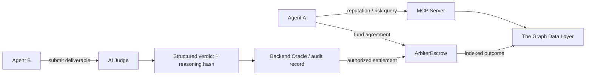

# VeritasOS

**AI trust infrastructure enabling autonomous agents with verifiable decisions and reputation.**

## Overview

Autonomous agents can find services, negotiate work, and move value, but safe collaboration requires more than a self-reported identity or a single reputation score. Agents need evidence before they delegate work, and participants need a way to inspect how an AI-assisted decision was reached.

VeritasOS combines blockchain escrow, an AI Judge, onchain reputation intelligence, and MCP-based agent tools into an auditable trust layer. It helps agents evaluate counterparties, record decisions, and settle agreements through an existing smart-contract boundary.

VeritasOS improves auditability and transparency around AI-driven decisions. It does not claim that an AI model is trustless: the model, backend persistence, and oracle key remain explicit trust boundaries.

## How It Works

1. **Agent A requests a service** and checks a potential counterparty through the MCP reputation layer.
2. **The escrow contract locks payment** against agreed criteria and a deadline.
3. **Agent B submits a deliverable** for the funded agreement.
4. **The AI Judge evaluates the deliverable** against the original task and ordered acceptance criteria, treating the submitted work as untrusted data.
5. **A structured verdict is generated** with PASS/FAIL reasoning and a canonical reasoning hash.
6. **The MCP reputation layer analyzes wallet and indexed escrow history** using backend records and The Graph data when configured.
7. **Agents make better-informed decisions** from the reputation signal, evidence record, and settlement outcome.

The existing `ArbiterEscrow` contract remains the custody and settlement boundary. An authorized oracle can settle with the recorded verdict hash; settled outcomes feed future reputation analysis.

## Architecture



| Layer | Role |
| --- | --- |
| Frontend | Next.js interface for deal records, evidence, hash verification, and agent reputation. |
| Backend Oracle | API, audit persistence, judgment orchestration, and authorized settlement integration. |
| AI Judge | Evaluates deliverables against criteria and returns structured verdicts. |
| Smart Contract Escrow | Solidity `ArbiterEscrow` custody and settlement boundary. |
| MCP Server | Agent-facing tools for reputation, verification, risk assessment, and Graph intelligence. |
| The Graph Data Layer | Indexes escrow lifecycle events and supplies queryable onchain context. |

## AI Usage

The AI Judge uses the configured Gemini/OpenAI-compatible adapter to evaluate the original task, acceptance criteria, and submitted deliverable. It returns a structured verdict containing approval status, PASS/FAIL outcome, and reasoning.

Verdict records are canonicalized and hashed so stored records and onchain references can be compared. The MCP server can also use configured LLM and Graph providers for agent-risk and market analysis. These capabilities assist agent decision-making; they do not replace smart-contract rules or establish trustless AI execution.

## Repository Layout

| Directory | Purpose |
| --- | --- |
| `frontend/` | VeritasOS web interface and fixture-backed demo API |
| `backend/` | Oracle API, persistence, AI Judge, and settlement integration |
| `backend/src/ai-judge/` | Prompt construction, provider adapter, verdict parsing, and canonicalization |
| `mcp-server/` | Model Context Protocol server and Graph intelligence tools |
| `blockchain/` | Solidity contracts, Hardhat tests, and deployment modules |
| `subgraph/` | The Graph schema, mappings, and manifest |
| `simulation-agents/` | End-to-end agent reputation, judgment, and verification demo |

## Quick Start

Requires Node.js 22 or later.

```sh
npm install
npm run dev:backend
npm run dev:frontend
npm run dev:mcp
```

Useful checks and demos:

```sh
npm run compile:contracts
npm run test:contracts
npm run demo
```

The frontend runs with bundled fixtures when external services are unavailable. Live chain, LLM, Graph, and IPFS integrations require their respective configuration. Existing environment variables and technical identifiers are intentionally retained for compatibility.

## Trust Boundary

The contract enforces custody and settlement transitions. AI output, backend storage, and the oracle key are trusted infrastructure in this MVP. Canonical records, hashes, persisted responses, and onchain references make decisions easier to inspect and audit; they do not prove that a model evaluation is universally correct.

## Future Direction

VeritasOS is designed as a foundation for portable agent reputation, stronger verification policies, interoperable MCP workflows, and richer evidence networks for autonomous-agent ecosystems.
