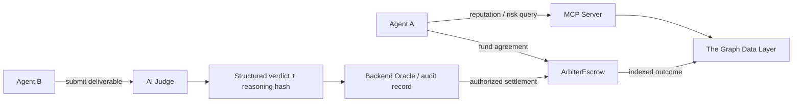

# VeritasOS

**AI trust infrastructure enabling autonomous agents with verifiable decisions and reputation.**

## Overview

Autonomous agents can find services, negotiate work, and move value, but safe collaboration requires more than a self-reported identity or a single reputation score. Agents need evidence before they delegate work, and participants need a way to inspect how an AI-assisted decision was reached.

VeritasOS combines blockchain escrow, an AI Judge, onchain reputation intelligence, and MCP-based agent tools into an auditable trust layer. It helps agents evaluate counterparties, record decisions, and settle agreements through an existing smart-contract boundary.

VeritasOS improves auditability and transparency around AI-driven decisions. It does not claim that an AI model is trustless: the model, backend persistence, and oracle key remain explicit trust boundaries.

## How It Works

1. **Agent A requests a service** and assesses a counterparty through `/trust`, the Trust Assessment REST API, or MCP `assess_agent_risk`.
2. **The escrow contract locks payment** against agreed criteria and a deadline.
3. **Agent B submits a deliverable** for the funded agreement.
4. **The AI Judge evaluates the deliverable** against the original task and ordered acceptance criteria, treating the submitted work as untrusted data.
5. **A structured verdict is generated** with PASS/FAIL reasoning and a canonical reasoning hash.
6. **The MCP reputation layer analyzes wallet and indexed escrow history** using backend records and The Graph data when configured.
7. **Agents make better-informed decisions** from the reputation signal, evidence record, and settlement outcome.

The existing `ArbiterEscrow` contract remains the custody and settlement boundary. An authorized oracle can settle with the recorded verdict hash; settled outcomes feed future reputation analysis.

## Architecture



| Layer | Role |
| --- | --- |
| Frontend | Next.js interface for deal records, evidence, hash verification, and agent reputation. |
| Backend Oracle | API, audit persistence, judgment orchestration, and authorized settlement integration. |
| AI Judge | Evaluates deliverables against criteria and returns structured verdicts. |
| Smart Contract Escrow | Solidity `ArbiterEscrow` custody and settlement boundary. |
| MCP Server | Agent-facing tools for reputation, verification, risk assessment, and Graph intelligence. |
| The Graph Data Layer | Indexes escrow lifecycle events and supplies queryable onchain context. |

## AI Usage

The AI Judge uses the configured Gemini/OpenAI-compatible adapter to evaluate the original task, acceptance criteria, and submitted deliverable. It returns a structured verdict containing approval status, PASS/FAIL outcome, and reasoning.

Verdict records are canonicalized and hashed so stored records and onchain references can be compared. The MCP server can also use configured LLM and Graph providers for agent-risk and market analysis. These capabilities assist agent decision-making; they do not replace smart-contract rules or establish trustless AI execution.

## Repository Layout

| Directory | Purpose |
| --- | --- |
| `frontend/` | VeritasOS web interface and fixture-backed demo API |
| `backend/` | Oracle API, persistence, AI Judge, and settlement integration |
| `backend/src/ai-judge/` | Prompt construction, provider adapter, verdict parsing, and canonicalization |
| `mcp-server/` | Model Context Protocol server and Graph intelligence tools |
| `blockchain/` | Solidity contracts, Hardhat tests, and deployment modules |
| `subgraph/` | The Graph schema, mappings, and manifest |
| `simulation-agents/` | End-to-end agent reputation, judgment, and verification demo |

## Quick Start

Requires Node.js 22 or later.

```sh
npm install
npm run dev:backend
npm run dev:frontend
npm run dev:mcp
```

Useful checks and demos:

```sh
npm run compile:contracts
npm run test:contracts
npm run demo
```

The existing docket and reputation pages support bundled fixtures. The new `/trust` page always calls the backend and never silently falls back to fixtures. Live chain, LLM, Graph, and IPFS integrations require their respective configuration. Existing environment variables and technical identifiers are retained for compatibility.

## Agent Trust Intelligence

```text
Frontend /trust -> same-origin REST proxy --+
REST POST /api/trust-assessment ------------+-> Trust Engine -> Nansen
MCP assess_agent_risk -> backend REST ------+                   |
                              normalized observations <-------+
                                      |
                         derived signals + risk factors
                                      |
                          structured LLM assessment
                                      |
                             HIRE / DO_NOT_HIRE
```

Nansen supplies runtime onchain intelligence. VeritasOS normalizes it into
bounded observations and risk factors, then asks the configured LLM to interpret
that evidence. MCP exposes the same engine to agents. The Graph remains an
additional indexed blockchain data source for the existing reputation and Graph
tools; it is not queried by this Nansen assessment and is not listed as its source.

The adapter uses the documented POST profiler `current-balance` and
`transactions` endpoints, not speculative wallet-profile routes. It samples the
first 100 rows from each endpoint, on one chain, with a 30-day transaction window.
Pagination, unknown valuations and unavailable reputation are disclosed. It does
not infer wallet age, owner identity, fraud or task competence from these records.
See [verified API contract](docs/nansen-api.md) and [baseline audit](docs/repository-audit.md).

### Run the vertical slice

After `npm install`, generate the existing Prisma client and initialize the local
database (no new database technology is introduced):

```sh
node node_modules/prisma/build/index.js generate --schema backend/prisma/schema.prisma
node node_modules/prisma/build/index.js migrate deploy --schema backend/prisma/schema.prisma
```

Set `DATABASE_URL=file:./dev.db` in your shell for those commands. Copy each
workspace's `.env.example` to its local environment file: backend and MCP use
`.env`; frontend uses `.env.local`. Examples select backend port 4000 and frontend
port 3000, with `ARBITRA_BACKEND_URL=http://localhost:4000` in frontend and MCP.
The backend loads its `.env` when started from its workspace.

For live assessment, configure backend `NANSEN_API_KEY`, `NANSEN_CHAIN=monad`
(or `ethereum`), `LLM_API_KEY`, `LLM_BASE_URL`, and `LLM_MODEL`. The existing
OpenAI-compatible chat-completions protocol is used with strict JSON schema;
the provider must support `response_format: json_schema`. Missing configuration
returns 500; failed upstream requests or malformed provider output return 502;
invalid input returns 400. There is no reputation-only fallback. This read-only
MVP endpoint has no application authentication; keep it on a trusted network or
place it behind an authenticated/rate-limited gateway before public exposure.

For an explicitly offline demonstration, set these **backend-only** values:

```dotenv
MOCK_NANSEN=true
MOCK_TRUST_LLM=true
```

These modes are independent. The UI and MCP report `MOCK DATA` for synthetic
Nansen-shaped input and `MOCK ASSESSMENT` when no LLM ran. The offline model
conservatively returns `UNKNOWN / DO_NOT_HIRE`; it is not an AI result. Tests also
exercise both HIRE and DO_NOT_HIRE through stubbed structured model responses.

Start `npm run dev:backend` and `npm run dev:frontend` in separate terminals, then
open `http://localhost:3000/trust`. MCP uses `npm run dev:mcp` and the existing
stdio JSON-RPC tool protocol. REST input:

```json
{
  "walletAddress": "0x...40 hex characters...",
  "taskContext": "Review a Solidity escrow contract",
  "counterpartyRole": "seller"
}
```

The response retains `assessment.recommendation` and `assessment.reasoning`,
with `riskLevel`, `trustSignals`, `riskFactors`, `dataSources`, `timestamp`,
`verdictHash`, normalized `intelligence`, and model/mode metadata. Signal values
are observed quantities, not trust scores. Uncalibrated numeric confidence was
removed. MCP preserves the full response plus compatibility recommendation and
reasoning aliases. Save the returned payload if an audit record is required;
this feature does not add durable assessment storage.

### Pre-Transaction

Counterparty → Nansen → Trust Assessment → HIRE / DO_NOT_HIRE.
The frontend displays the backend recommendation. HIRE links to the existing
escrow form with the assessed seller populated; it never signs or funds a deal
automatically. The assessment is advisory, not a contract-enforced hiring gate.

### Post-Transaction

Deliverable → existing AI Judge → PASS / FAIL → Verdict Hash → settlement.
The Judge remains separate from the Trust Engine: AI-assisted verification with
auditable decision records. Its existing canonical record and
`verdictReasoningHash` settlement path are preserved.

For both records, the hash provides an integrity commitment for the recorded
decision payload. It does not prove that the model was correct. It does not
independently prove what the model saw. Trust assessment hashes use the existing
sorted-key canonicalization and keccak256, now including reasoning, normalized
evidence, context, provenance and model metadata. To recompute, exclude the REST
`success` wrapper and `verdictHash` (and MCP compatibility aliases).

## Monad

Monad is the execution / escrow / settlement layer. The existing ERC-20
`ArbiterEscrow` handles funds, deliverable submission, authorized oracle decisions,
refunds and deterministic settlement. No contract rewrite is required.

This repository contains old local and Arc deployment records, **not a verified
Monad deployment**. The new Hardhat `monadTestnet` network targets chain 10143
and requires `MONAD_RPC_URL` and `MONAD_PRIVATE_KEY`. Supply a deployment
parameter file with your real public oracle address under
`ArbiterEscrowModule.oracleAddress` (there is no public-test-key default):

```sh
cd blockchain
npx hardhat ignition deploy ignition/modules/ArbiterEscrow.ts --network monadTestnet --parameters <your-parameters.json>
```

That module also deploys mock test tokens; they are not official USDC. After an
actual deployment, configure backend `ARBITER_RPC_URL`,
`ARBITER_ESCROW_ADDRESS`, `ARBITER_ORACLE_PRIVATE_KEY`, and settlement auth.
The oracle listener starts only when chain settings are complete; the Trust API
does not require a private key. Frontend opt-in uses
`NEXT_PUBLIC_CHAIN=monad-testnet`, `NEXT_PUBLIC_MONAD_RPC_URL`, and the actual
`NEXT_PUBLIC_ESCROW_ADDRESS` / six-decimal `NEXT_PUBLIC_USDC_ADDRESS`. The wallet
uses MON for gas and the configured ERC-20 for payment. Never reuse Arc addresses
on Monad. Arc remains supported when the chain opt-in is unset.

Nansen `monad` intelligence is separate from Testnet settlement; this feature does
not claim Nansen indexes those testnet transactions. The existing Arc subgraph is
preserved; Monad indexing requires a real deployment and a configured indexer.
See [official Monad network information](https://docs.monad.xyz/developer-essentials/testnet).

## Project Origins

VeritasOS evolved from an earlier Arbitra AI escrow and reputation prototype.
The existing Judge, escrow, canonical verdict records, MCP tools, Graph layer and
frontend are inherited work. The Monad Hackathon development extends that base
with Nansen-powered Trust Intelligence, a structured trust assessment workflow,
completion of the existing MCP trust tool, frontend integration and Monad-focused
execution configuration. This is not a claim that the whole project was built
from scratch during the Hackathon, or that live deployment is already complete.

## Validation

```sh
npm test --workspace=@arbiter/backend
npm test --workspace=@arbiter/mcp-server
npm test --workspace=@arbiter/frontend
npm run typecheck --workspace=@arbiter/frontend
npm run build --workspace=@arbiter/frontend
npm run test:contracts
npm run demo
npm run smoke:trust
```

`smoke:trust` requires built backend/MCP and frontend output. It starts the actual
backend and production Next server, uses explicitly mock providers, and checks
the frontend-to-backend HTTP path, validation, provenance and unavailable-backend
errors. Tests do not assert that paid Nansen or a live model was contacted.
Run the frontend build and smoke **sequentially**: both use `frontend/.next`.
The smoke consumes HTTP response bodies, clears request timers and waits for
child-process stdio to close. `node simulation-agents/src/run-trust-smoke.mjs
--exercise-failure-cleanup` deliberately fails after startup and must exit with
code 1; it checks cleanup without hiding test failures or forcing process exit.

## Trust Boundary

The contract enforces custody and settlement transitions. AI output, backend storage, and the oracle key are trusted infrastructure in this MVP. Canonical records, hashes, persisted responses, and onchain references make decisions easier to inspect and audit; they do not prove that a model evaluation is universally correct.

Nansen is a data source; the Trust Engine transforms observations; the LLM makes
a probabilistic assessment; AI Judge assists deliverable verification; backend
and oracle remain trusted execution boundaries; Monad executes contract rules.

## Future Direction

VeritasOS is designed as a foundation for portable agent reputation, stronger verification policies, interoperable MCP workflows, and richer evidence networks for autonomous-agent ecosystems.
